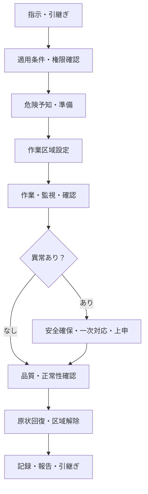

# ビルメンテナンス現場作業手順

## 1. 目的

本ディレクトリは、ビルメンテナンス業務のうち、清掃、衛生、設備及び警備の現場作業について、標準的な実施順序、判断、異常時対応、記録及び引継ぎを整理する。

[ビルメンテナンス業務カタログ](../building-maintenance-business-catalog.md)が「何を行う業務か」を定義するのに対し、本ディレクトリの現場作業手順は「現場で、どのように実施し、何を基準に判断し、誰へつなぐか」を定義する。

本書は特定の製品・システムの機能や製品カバレッジを評価するものではない。また、個別物件の作業標準書、メーカー手順書、警備計画、消防計画、法定様式等をそのまま置き換えるものではない。実際の運用では、契約仕様、現場条件、最新法令、メーカー指定及び権限規程へ適合させる。

## 2. 業務カタログとの関係

業務、手順及びチェックリストは、目的と粒度を分けて管理する。

| 層 | 主な問い | 内容 | ID例 |
|---|---|---|---|
| 業務カタログ | 何を行うか | 業務の目的、入力、成果物及び業務間の接続 | `BM-06-03` |
| 現場作業手順 | どう実施・判断するか | 実施順序、判断基準、権限、異常時対応及び記録 | `PROC-CLN-002` |
| チェックリスト | 今回何を確認したか | 実行時の確認項目、結果、測定値、時刻及び証跡 | `CHK-CLN-002` |

例えば、`BM-06-03 日常清掃を実施する`には、共用部清掃、トイレ清掃等の複数手順が対応する。一つの手順が、作業実施、結果記録、安全管理等の複数業務IDへ接続する場合もある。

```text
BM-06-03 日常清掃を実施する
    └── PROC-CLN-002 トイレ清掃
            └── CHK-CLN-002 トイレ清掃チェックリスト
```

手順ファイルには、中心となる業務を「主業務ID」、付随して実行される業務を「関連業務ID」として記載する。手順数を業務カタログの業務数として数えない。

## 3. 対象範囲

### 3.1 対象領域

| 区分 | 主な業務領域 | 主な対象 |
|---|---|---|
| 共通 | BM-03、04、05、12、13、17 | 引継ぎ、作業前確認、作業区域管理、異常上申、完了報告 |
| 清掃 | BM-06、13、15、17 | 日常清掃、定期・特別清掃、廃棄物、補充、品質検査 |
| 衛生 | BM-07、13、17 | 空気環境、水質、衛生設備、貯水槽、排水槽、防除、衛生報告 |
| 設備 | BM-08、09、10、13、14、17 | 運転監視、巡回点検、検針、操作、保守、異常対応、修繕・工事実施、復旧確認 |
| 警備 | BM-11、12、13、17 | 入退館・搬入出、鍵、定常警備、監視・駆付け、不審者・事故・災害対応、防災訓練 |

衛生管理（BM-07）は、空気環境、水質、給排水・空調衛生設備、貯水槽・排水槽及び防除の専門手順を持ち、必要に応じて清掃・設備・共通手順へ接続する。

### 3.2 対象外

- 営業、見積、契約、請求等の事務プロセスの詳細手順
- 製品機能、画面、データモデル及び製品カバレッジの評価
- 個別メーカー・型式だけに適用される操作説明
- 法令又は資格者判断を一般作業者へ代替させる手順
- 個別物件でのみ有効な連絡先、暗証番号、鍵番号等の機密情報

## 4. ディレクトリ構成

```text
02_field-procedures/
├── README.md
├── 00_common/
│   ├── PROC-COM-001_shift-handover.md
│   ├── PROC-COM-002_pre-work-safety-check.md
│   ├── PROC-COM-003_work-area-control.md
│   ├── PROC-COM-004_abnormality-escalation.md
│   └── PROC-COM-005_completion-reporting.md
├── 01_cleaning/
│   ├── README.md
│   └── PROC-CLN-xxx_*.md
├── 02_equipment/
│   ├── README.md
│   └── PROC-EQP-xxx_*.md
├── 03_security/
│   ├── README.md
│   └── PROC-SEC-xxx_*.md
└── 04_hygiene/
    ├── README.md
    └── PROC-HYG-xxx_*.md
```

本READMEでは構造と記述規則を定義する。各領域のREADMEでは、領域固有の分解軸、手順一覧、対象設備・場所、品質・判定の考え方を定義する。

チェックリスト、対応表及びテンプレートは、現場作業手順の代表例を作成して粒度を検証した後、次の独立ディレクトリとして追加する。

```text
docs/
├── 03_checklists/
├── 04_mappings/
└── 05_templates/
```

## 5. 手順IDとファイル名

### 5.1 ID体系

| 接頭辞 | 区分 | 例 |
|---|---|---|
| `PROC-COM` | 4領域に共通する手順 | `PROC-COM-002` |
| `PROC-CLN` | 清掃手順 | `PROC-CLN-002` |
| `PROC-HYG` | 衛生手順 | `PROC-HYG-003` |
| `PROC-EQP` | 設備手順 | `PROC-EQP-005` |
| `PROC-SEC` | 警備手順 | `PROC-SEC-004` |

- IDは一度公開した後に別の手順へ再利用しない。
- 手順名変更時も、対象と目的が同じであればIDを維持する。
- 対象、開始条件、完了条件又は必要権限が大きく異なる場合は手順を分割する。
- 建物用途、管理方式又は契約役割だけが異なる場合は、原則として新しいIDを発行せず、適用差分として記載する。

### 5.2 ファイル名

ファイル名は `<手順ID>_<英語の短い識別名>.md` とする。

例：`PROC-EQP-005_alarm-response.md`

## 6. 現場作業手順の共通ライフサイクル

清掃、衛生、設備及び警備の作業内容は異なるが、現場作業の基本的な進行は共通する。



各手順では、単に作業を順番に並べるだけでなく、次を明示する。

- どの状態なら作業を開始できるか
- 何を正常、要観察、異常、危険と判定するか
- 作業者が自ら実施できる操作・処置はどこまでか
- どの条件で中止、設備停止、退避、応援要請又は上申するか
- 誰が復旧・利用再開を判断するか
- 何を完了条件とし、どの証跡を残すか

## 7. 手順ファイルの標準項目

各手順ファイルは、原則として次の項目を持つ。

| 項目 | 記載内容 |
|---|---|
| 手順ID・手順名 | 一意なIDと作業者が理解できる名称 |
| 目的 | この手順で維持・回復・確認する状態 |
| 主業務ID | 業務カタログ上の中心業務 |
| 関連業務ID | 記録、安全、報告、台帳更新等の関連業務 |
| 適用対象 | 建物、区画、場所、設備、時間帯及び作業種別 |
| 適用除外 | この手順を使用してはならない条件 |
| 実施体制 | 実施者、責任者、立会者、資格要件及び単独作業可否 |
| 開始条件 | 作業指示、承認、入館、停止、周知等の前提 |
| 必要資料 | 契約仕様、図面、台帳、メーカー手順、過去記録等 |
| 資機材・保護具 | 工具、薬剤、測定器、通信手段、PPE等 |
| 作業前確認 | 危険予知、周辺影響、設備状態、第三者動線等 |
| 標準手順 | 実施順序と各工程の要点 |
| 判定基準 | 正常、要観察、異常、危険及び品質合格の条件 |
| 異常時対応 | 安全確保、一次対応、作業中止及び影響範囲確認 |
| 権限・上申 | 現場裁量の限界、報告先、承認者及び緊急権限 |
| 作業後確認 | 復旧、原状回復、置き忘れ、区域解除等 |
| 記録・証跡 | 時刻、実施者、結果、測定値、写真、異常、連絡履歴等 |
| 完了条件 | 作業完了と見なすための条件 |
| 引継ぎ | 未完了、要観察、次回確認、継続対応等 |
| 適用差分 | 用途、管理方式、契約役割、法令及び責任分界による差 |
| 関連文書 | チェックリスト、法令、仕様、他手順等 |
| 改訂履歴 | 変更日、変更理由、承認者等 |

手順内に個別物件の連絡先や閾値を直接固定せず、物件別設定を参照できる形を基本とする。ただし、安全な実行に不可欠で、共通基準として確定できる条件は手順本文へ明記する。

## 8. 判断・権限の記述規則

### 8.1 判定状態

判断基準は「異常時は報告する」のような抽象表現だけにせず、少なくとも次の状態へ分ける。

| 状態 | 意味 | 標準対応 |
|---|---|---|
| 正常 | 基準内で、予定どおり継続できる | 記録して継続・完了 |
| 要観察 | 直ちに危険ではないが、傾向確認や再確認が必要 | 再測定、期限付き観察、引継ぎ |
| 異常 | 基準外、不良又は機能低下がある | 一次対応、責任者への報告、是正登録 |
| 危険 | 人命、重大損傷、法令違反又は被害拡大のおそれがある | 作業中止、安全確保、退避、緊急連絡 |

数値基準がある場合は、単位、測定位置、測定条件、許容範囲及び再測定条件を記載する。外観・清掃品質等の定性的基準は、写真例、限度見本又は観察条件で再現性を補う。

### 8.2 権限レベル

[ビルオーナー・PM・FM・BM責任分界プロファイル](../owner-pm-fm-bm-responsibility-profiles.md)の意思決定レベルを参照し、手順ごとに現場裁量と上申条件を記載する。

| レベル | 現場手順上の扱い |
|---|---|
| L0 現場実行 | 承認済み手順どおりの作業、確認及び記録 |
| L1 現場裁量 | 承認済み範囲内の軽微な調整、一次対応、安全確保 |
| L2 運用変更 | 臨時運転、作業順変更、小修繕等。所定権限者の判断が必要 |
| L3 予算・契約変更 | 追加費用、契約外作業、停止を伴う対応。上位承認が必要 |
| L4 投資・重大リスク | 設備更新、長期停止、重大リスク受容。現場手順では決定しない |

緊急停止権と復旧・利用再開権は分けて記載する。人命保護や被害拡大防止のため作業者が停止できる場合でも、復旧・再開は別の権限者が判断することがある。

## 9. 領域別の分解方針

### 9.1 清掃

清掃手順は、対象場所、汚れ、材質、作業方式及び品質基準で分解する。

| 手順群 | 代表手順候補 | 主な関連業務 |
|---|---|---|
| 日常清掃 | 共用部清掃、トイレ清掃、給湯室清掃、外周清掃 | BM-06-03 |
| 廃棄物 | 回収、分別、集積、搬出 | BM-06-06 |
| 消耗品 | 残量確認、補充、在庫不足報告 | BM-06-07、BM-15 |
| 定期・特別清掃 | 床面洗浄、ワックス、カーペット、ガラス、高所 | BM-06-05 |
| 品質管理 | 作業者確認、責任者検査、再清掃 | BM-06-09〜11、BM-17 |

清掃固有の記載事項は、材質と薬剤・機材の適合、清潔・汚染区域、用具の使い分け、作業中表示、転倒防止、忘れ物・破損発見時の扱い及び什器の原状回復である。

### 9.2 設備

設備手順は、監視、現場確認、測定、操作、保守、異常対応、修繕・工事実施及び復旧確認で分解する。

| 手順群 | 代表手順候補 | 主な関連業務 |
|---|---|---|
| 運転監視 | 中央監視、運転値確認、警報確認 | BM-08-02〜03 |
| 巡回・検針 | 電気室・機械室等の巡回、各種メーター記録 | BM-08-04〜05、BM-09-02 |
| 運転操作 | 起動、停止、設定変更、切替え | BM-08-06〜08 |
| 日常保守 | 清掃、給油、増締め、消耗品交換 | BM-09-05 |
| 異常対応 | 警報確認、現場確認、応急処置、停止・隔離 | BM-08-09、BM-10 |
| 修繕・工事 | 着工確認、施工中管理、変更統制、自主検査 | BM-10-09 |
| 復旧確認 | 試運転、正常値確認、利用再開への引渡し | BM-10-08〜10 |

設備固有の記載事項は、対象設備・系統、測定点、正常範囲、前後設備への影響、操作権限、インターロック、ロックアウト等の安全措置、停止条件及び復旧条件である。メーカー手順や保安規程がある場合は、それを参照元とし、一般手順で上書きしない。

### 9.3 警備

警備手順は、勤務の連続性、本人・権限確認、初動、連絡及び証跡保全で分解する。

| 手順群 | 代表手順候補 | 主な関連業務 |
|---|---|---|
| 勤務開始・交代 | 装備、鍵、連絡事項、継続案件の引継ぎ | BM-05、BM-11、BM-13 |
| 入退館・鍵 | 受付、本人確認、物品・車両、入館証、貸出、返却、未返却対応 | BM-11-02〜03 |
| 定常警備 | 立哨・座哨、巡回、交通・混雑、開館・閉館 | BM-11-04 |
| 監視・駆付け | カメラ・警報監視、出動、到着、現地初動、引渡し | BM-11-05、BM-11-12 |
| 不審者・事故 | 声掛け、応援要請、負傷者保護、現場保全 | BM-11-06、BM-11-09 |
| 遺失物 | 受領、保管、照合、返還、届出・提出、期限管理 | BM-11-11 |
| 防災 | 防災設備確認、訓練、火災・地震・風水害、避難誘導 | BM-11-07〜09 |
| 勤務終了 | 記録確認、鍵・装備照合、次勤務者への引継ぎ | BM-11、BM-13 |

警備固有の記載事項は、単独判断の範囲、警察・消防・施設責任者への連絡条件、身体安全を優先する退避・応援要請、人物・時刻・場所・発言・映像等の記録及び事件・事故現場の保全である。実力行使、所持品確認、個人情報及び映像の取扱いは、法令、契約、警備計画及び教育内容に従う。

## 10. 既存分析プロファイルの適用

基本手順は共通化し、既存プロファイルによる差は手順内の「適用差分」又は別途作成する差分マトリクスで管理する。差分だけを理由に手順全体を複製しない。

| 分析軸 | 参照文書 | 現場手順へ反映する主な差 |
|---|---|---|
| 建物用途 | [建物用途プロファイル](../building-use-profiles.md) | 重要区画、衛生水準、営業時間、利用者配慮、停止影響 |
| 管理方式 | [管理方式・運用プロファイル](../management-operation-profiles.md) | 常駐・巡回、携行品、遠隔支援、到着目標、訪問間引継ぎ |
| 契約役割 | [契約役割プロファイル](../contract-role-profiles.md) | 元請け・再委託先の指示、実施、自主検査、検収、報告経路 |
| 法令義務 | [法令義務プロファイル](../statutory-duty-profiles.md) | 義務主体、資格、方法、周期、様式、行政報告、保存期間 |
| 責任分界 | [オーナー・PM・FM・BM責任分界](../owner-pm-fm-bm-responsibility-profiles.md) | 停止、復旧、利用制限、追加費用、リスク受容の決定・上申先 |

差分には、少なくとも適用条件、変更箇所、追加工程、削除可能工程、必要権限及び追加証跡を記載する。

## 11. 手順書とチェックリストの分離

手順書とチェックリストは相互参照するが、同一文書にはしない。

| 手順書 | チェックリスト |
|---|---|
| 目的、背景及び適用条件を説明する | 一回の実施対象と予定を示す |
| 実施方法と順序を説明する | 実施済み項目を記録する |
| 判断基準と分岐を説明する | 判定結果、測定値、時刻を記録する |
| 権限、停止、上申を説明する | 異常、写真、連絡実績を記録する |
| 教育、標準化及び改訂に使用する | 現場実行、完了確認及び証跡に使用する |

手順変更時は関連チェックリストへの影響を確認する。チェック項目を追加しただけで手順上の目的・判断・責任が不明な場合は、手順書を先に改訂する。

## 12. 完了状態と記録

次の状態は同一視しない。

1. 作業実施済み
2. 作業者確認済み
3. 技術・品質確認済み
4. 異常・不適合への対応方針決定済み
5. 是正完了済み
6. 契約上の検収・承認済み
7. 顧客・行政等への提出済み

各手順は、どの状態を完了条件とするかを明示する。異常を発見して所定の安全確保と上申を行った場合、現場作業自体は完了でも、異常案件又は是正案件は未完了として別に追跡する。

最低限の共通記録項目は次のとおりとする。

- 物件、棟、階、区画、設備又は巡回点
- 手順ID及び手順版
- 作業指示・計画の識別子
- 実施者、確認者、所属及び必要資格
- 開始・終了日時
- 実施結果、測定値、判定及び未実施項目
- 作業前後・異常箇所の写真等の証跡
- 異常、一次対応、停止・退避及び影響範囲
- 連絡先ではなく、連絡した役割、時刻、内容及び回答
- 残作業、要観察事項、次回期限及び引継ぎ先

## 13. 作成・レビュー方針

### 13.1 初期作成順

1. 共通手順を定義する。
2. 清掃、設備、警備それぞれのREADMEで分解軸と手順一覧を確定する。
3. 各領域から通常作業、異常分岐を含む作業、引継ぎを伴う作業を選び、代表手順を2〜3件作成する。
4. 代表手順からチェックリストを作成し、手順と実行記録の粒度を検証する。
5. 業務―手順―チェックリスト対応表と適用差分マトリクスを作成する。
6. 粒度と記述規則を見直した後、残りの手順へ展開する。

### 13.2 レビュー観点

- 業務カタログ上の主業務・関連業務が追跡できるか
- 作業者が開始条件、順序及び完了条件を判断できるか
- 正常、要観察、異常及び危険の基準が再現可能か
- 現場裁量、緊急停止、復旧・再開及び上申の権限が混同されていないか
- 元請け、再委託先、資格者、BM責任者、PM・FM等の役割が混同されていないか
- 常駐、巡回、遠隔監視及び駆付けの差が反映されているか
- 建物用途、利用者、第三者動線及び作業競合への影響を考慮しているか
- 法令、メーカー手順、契約仕様及び現場固有ルールとの優先関係が明確か
- 必要な記録、写真、測定値、連絡及び引継ぎが定義されているか
- チェックリストだけでは失われる判断理由が手順書に残っているか

## 14. 情報源と優先順位

標準手順を個別物件へ適用する際は、原則として次の情報を照合する。優先関係は一律ではないため、法令適合と安全を前提に、契約・権限上の責任者が決定する。

- 法令、政省令、告示、条例及び行政機関の指示
- 契約書、業務仕様書、警備計画、消防計画、保安規程及び安全衛生規程
- メーカーの取扱説明書、保守要領及び禁止事項
- 建物・設備台帳、図面、系統図、SDS、過去の点検・事故・修繕記録
- 建物用途、管理方式、契約役割及び責任分界の各プロファイル
- 本ディレクトリの標準手順
- 個別物件の作業標準、連絡網、閾値及びチェックリスト

矛盾、不明点又は現場実態との不一致を発見した場合は、作業者の推測で補完せず、作業を安全な状態に保って責任者へ確認し、必要に応じて手順・仕様・台帳を改訂する。

## 15. 今後の成果物

本READMEに続き、次を順次作成する。

- `00_common/`の共通手順
- `01_cleaning/README.md`及び代表清掃手順
- `02_equipment/README.md`及び代表設備手順
- `03_security/README.md`及び代表警備手順
- 現場作業手順テンプレート
- 業務―手順対応表
- 手順―チェックリスト対応表
- 建物用途、管理方式、契約役割、法令及び責任分界の差分マトリクス

初期成果物の目的は、全手順を網羅することではなく、清掃、設備及び警備で共通利用できる粒度・記述規則を検証し、業務カタログから現場実行まで追跡可能な構造を確立することである。
