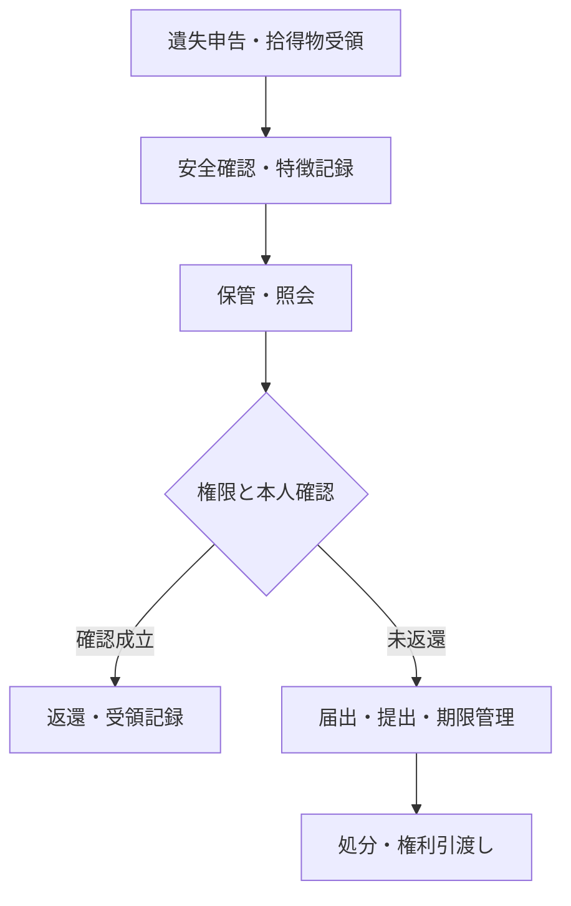
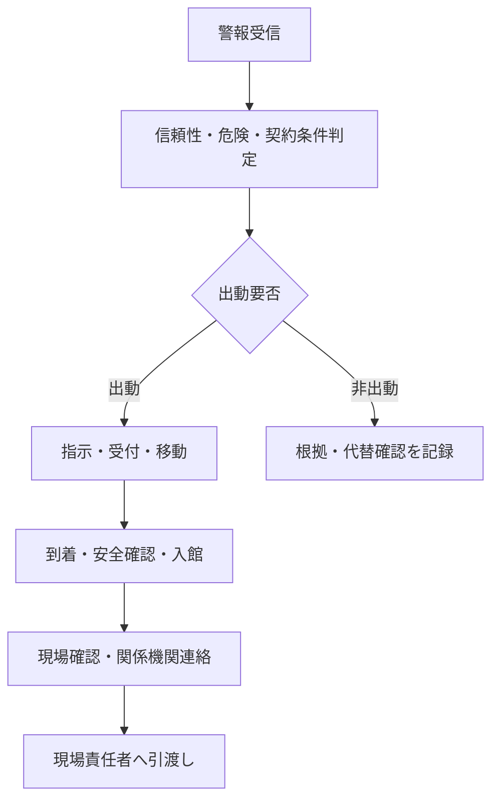
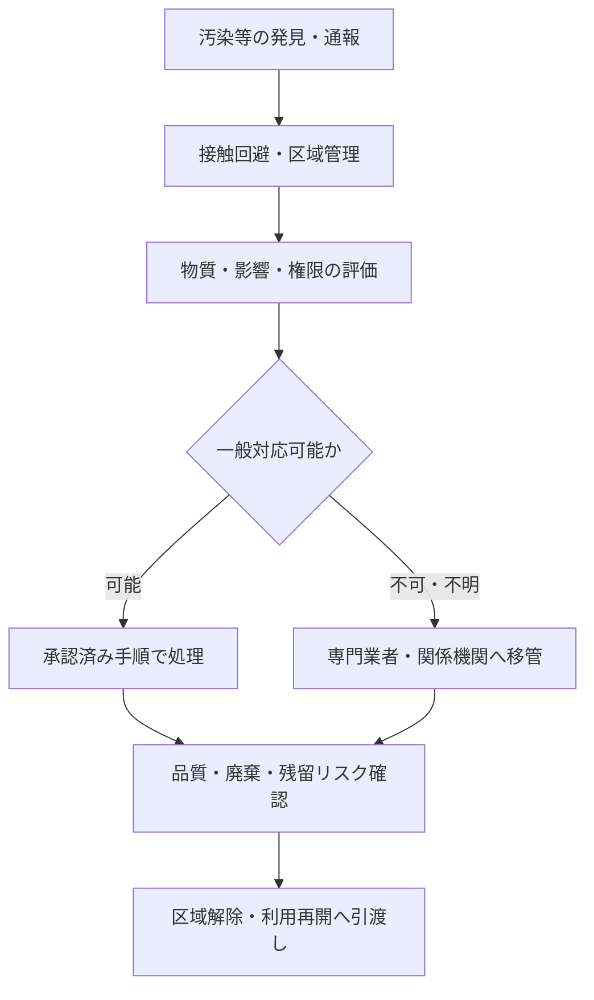

# 現場手順起点の独立業務ID候補検証

## 1. 目的

現場作業手順の整備で確認された7候補について、業務数を増やすことを目的とせず、既存業務と目的、開始条件、実施体制、判断・権限、成果物及び前後接続が独立するかを判定する。

本書は業務カタログの粒度判断を示す成果物であり、個別物件の手順、法令適用判定、製品機能又は製品カバレッジは扱わない。

## 2. 判定区分

| 判定 | 適用条件 |
|---|---|
| 既存業務内 | 目的と完了状態が既存業務と同じで、対象、測定項目、場所、用途、周期等の差を基準・台帳・適用条件で表現できる |
| 業務名・説明の拡張 | 既存業務の目的と完了状態は維持できるが、現在の名称・説明では対象範囲を誤解しやすい |
| 独立業務ID追加 | 固有の開始契機、判断・権限、継続管理対象又は成果物があり、既存業務の完了だけでは対応完了を判定できない |

場所、建物用途、契約役割、常駐・巡回又は法令適用だけの差では、業務IDを追加しない。

## 3. 判定結果

| 候補 | 判定 | 接続先 | 判定理由 |
|---|---|---|---|
| 物品・車両の出入を管理する | 業務名・説明の拡張 | `BM-11-02` | 人・物品・車両で照合対象と証跡は異なるが、申請・権限を照合し、許可された出入だけを成立させる目的と完了状態は共通する |
| 遺失物・拾得物を管理する | 独立業務ID追加 | `BM-11-11` | 拾得・遺失申告から返還、届出・提出、期限、処分まで物件の所在と保管責任を継続管理し、受付・事故初動だけでは完了しない |
| 機械警備の緊急駆付けを行う | 独立業務ID追加 | `BM-11-12` | 警報受信後に出動要否を判断し、移動・到着・入館・現場引渡しを時間管理する。監視確認又は事故初動だけでは到着責任とSLAを追跡できない |
| 建物・外構・植栽を点検・維持する | 既存業務内 | `BM-08-04`、`BM-09-01`〜`09` | 対象台帳と点検基準は設備と異なるが、巡回、日常・定期点検、記録、異常判定、軽微保守の流れと完了状態は共通する |
| 照度を測定する | 既存業務内 | `BM-09-02`〜`06` | 測定点、単位、機器、判定値の差であり、点検実施・測定値記録・異常判定の既存フローで追跡できる |
| 吹付け石綿等を点検する | 既存業務内 | `BM-09-03`・`04`、`BM-10-08` | 維持管理中の状態確認は定期・法定点検、解体・改修前の含有有無調査は工事手配の開始条件として区別できる。法令・資格差だけで横断業務を複製しない |
| 汚染・感染・有害物質へ対応する | 独立業務ID追加 | `BM-17-12` | 発見初動後も、評価、区域管理、専門手配、除染・回収・廃棄、品質確認、利用再開への引渡しを案件として追跡する。一般清掃、事故初動又は安全手順の完了だけでは終結しない |

## 4. 独立業務の代表フロー

### 4.1 BM-11-11 遺失物・拾得物を管理する

開始は遺失申告又は拾得物の受領である。完了は返還、警察等への提出、又は法令・物件ルールに基づく期限後処理のいずれかが成立し、物件の所在と保管責任が次の主体へ移った状態とする。

主な成果物は、遺失・拾得物台帳、特徴・日時・場所・取扱者の記録、保管履歴、照会・本人確認、届出・提出、返還・処分及び受領記録である。

### 4.2 BM-11-12 機械警備の緊急駆付けを行う

開始は機械警備又は遠隔監視の警報受信である。完了は、非出動判断と代替確認が記録された状態、又は出動者が現地初動を行って対応責任者へ引き渡した状態とする。警報受信、出動決定、現地到着、初動完了及び案件終結を同一視しない。

主な成果物は、警報・判定記録、出動指示、受付・移動・到着時刻、入館記録、現場状態、連絡・要請、処置及び引渡し記録である。

### 4.3 BM-17-12 汚染・感染・有害物質対応を管理する

開始は、通常清掃・巡回・工事・事故対応等で汚染、感染又は有害性が疑われ、一般作業の継続可否を判断する必要が生じた時点である。完了は、除染・回収・廃棄等の結果、残留リスク、区域状態及び証跡が確認され、所定の権限者へ区域解除・利用再開判断を引き渡した状態とする。

主な成果物は、発見・評価記録、区域・接触者管理、物質同定又は専門判断、対応計画、実施・測定・廃棄証跡、品質確認、残留リスク及び利用再開への引渡し記録である。

## 5. 既存業務で追跡する候補

### 5.1 人・物品・車両の出入

`BM-11-02`の業務名と説明を拡張する。人の本人・訪問先確認、物品の搬出許可・数量・封印、車両の運転者・車番・積載・経路等は、同じ業務に接続する対象別手順・記録項目として分離する。

### 5.2 建物・外構・植栽

`BM-08-04`と`BM-09-01`〜`09`の対象説明へ建築部位、工作物、外構及び植栽を明記する。設備別基準と同様に対象別点検基準を持てるため、対象種別ごとに業務IDを複製しない。

### 5.3 照度

`BM-09-02`〜`06`の点検・記録・判定へ接続する。照度計、測定点、時刻、点灯条件、単位、基準値等は点検基準と記録項目で管理し、測定項目ごとの業務IDは作らない。

### 5.4 吹付け石綿等

維持管理中の状態確認を`BM-09-03`・`04`へ、解体・改修前の石綿含有有無の事前調査と結果確認を`BM-10-08`へ接続する。両者は目的と法的条件が異なるが、点検管理と工事準備という既存業務の中で区別できるため、新しい横断業務は追加しない。詳細な対象、資格、方法、届出及び保存は法定業務マスターと個別作業計画を正とする。

## 6. 業務カタログ・手順への反映

| 反映対象 | 変更 |
|---|---|
| 業務カタログ | `BM-11-11`、`BM-11-12`、`BM-17-12`を追加し、合計181業務とする |
| 業務カタログ | `BM-11-02`の名称・説明、`BM-08-04`と`BM-09-01`〜`05`の対象・記録説明を拡張する |
| プロセスマップ | `BM-11-11`をP04・P05・P07、`BM-11-12`をP06、`BM-17-12`をP06・P08・P09へ接続する |
| 現場手順カバレッジ | BM-06〜11の対象を66業務へ更新し、`BM-11-11`・`12`を専門手順未作成として追跡する |
| 後続手順 | `BM-11-02`の物品・車両別手順、`BM-11-11`、`BM-11-12`の手順を警備手順整備Issueで作成する |
| 専門対応 | `BM-17-12`は共通初動`PROC-CLN-013`から接続し、物質・用途・法令別の専門計画で補完する |

## 7. 判断上の注意

- 業務ID追加は、ビルメンテナンス会社が常に法的義務主体又は実施者になることを意味しない。
- 遺失物、石綿、感染性物質、薬品、廃棄物等は、最新法令、所管機関、契約及び物件ルールにより実施者・期限・証跡を確認する。
- 工事前石綿事前調査は、維持管理中の目視確認で代替しない。
- 汚染発見時の初動完了は、専門除染、区域解除又は施設利用再開の完了を意味しない。

## 8. 参考資料

- [建築保全業務共通仕様書（国土交通省）](https://www.mlit.go.jp/gobuild/kijun_hozen_shiyousho.htm)
- [工事の元請業者のみなさまへ（石綿総合情報ポータルサイト）](https://www.ishiwata.mhlw.go.jp/business/prime-contractor)
- [遺失物法等の解釈運用基準（警察庁）](https://www.npa.go.jp/laws/notification/kanbou/kaikei/20231222ishitsu-kaishakuunyoukijyun.pdf)
- [業務―現場作業手順対応表](business-to-procedure-map.md)
- [現場作業手順カバレッジ](field-procedure-coverage.md)

## 9. 改訂履歴

| 版 | 改訂日 | 改訂内容 |
|---|---|---|
| 0.1 | 2026-07-25 | 7候補を判定し、独立3件、既存業務拡張1件、既存業務内3件として整理 |
