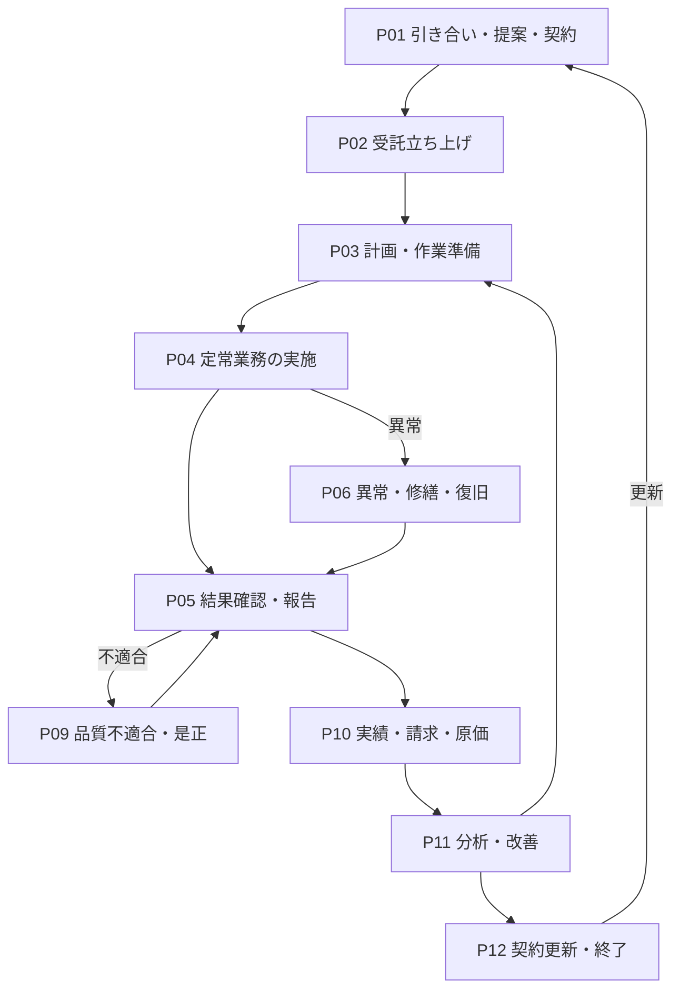
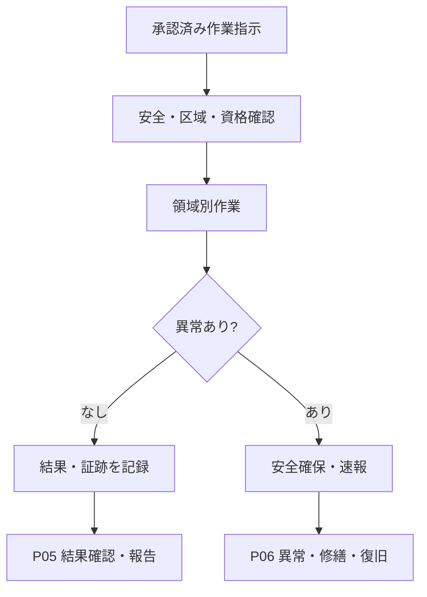

# ビルメンテナンス業務プロセスマップ v0.1

## 1. 目的

本書は、[ビルメンテナンス業務カタログ](../building-maintenance-business-catalog.md)の業務を、領域別の一覧から横断的な業務の流れへ接続する。

対象は、ビルメンテナンス会社が引き合いを受け、契約、立ち上げ、計画、実施、報告、請求及び改善を行うまでの標準的な業務である。特定製品の機能、個別物件の運用手順又は物件別帳票は扱わない。

本書のプロセスは典型的な接続を示す分析モデルである。実際の順序、実施主体、承認者及び法的義務主体は、契約、建物用途、管理方式、法令及び責任分界によって変わる。

## 2. 読み方

### 2.1 記述単位

| 要素 | 意味 |
|---|---|
| 開始契機 | プロセスを開始させる事象又は期限 |
| 業務 | 業務カタログの業務IDで表す活動 |
| 判断 | 後続経路を分ける業務上の判定 |
| 成果物・状態 | 次工程へ引き渡す情報、記録又は成立した状態 |
| 接続先 | 同一プロセスの次工程又は別の横断プロセス |

### 2.2 完了状態の分離

次の状態は同一視しない。

1. 作業を実施した
2. 作業者が結果を記録した
3. 技術・品質上の結果を確認した
4. 契約上の承認・検収を得た
5. 異常・不適合を是正した
6. 顧客又は行政へ報告した
7. 請求対象を確定した
8. 業務、設備又は施設の利用を再開した

## 3. 全体プロセス

次のプロセスは上図の各所から起動する。

- `P07 顧客依頼・苦情対応`：受付内容に応じてP03、P04、P06又はP09へ接続する。
- `P08 法定業務管理`：法令適用判定から計画、実施、報告、保存までを横断する。

## 4. 横断プロセス一覧

| ID | 横断プロセス | 主な開始契機 | 主な終端状態 |
|---|---|---|---|
| P01 | 引き合い・提案・契約 | 問い合わせ、入札、既存契約の見直し | 契約条件と受託範囲が確定した |
| P02 | 受託立ち上げ | 契約締結、受託範囲の追加 | 運用開始に必要な情報・体制・初期計画が揃った |
| P03 | 計画・作業準備 | 契約、周期、期限、追加依頼 | 実施可能な作業指示と準備が成立した |
| P04 | 定常業務の実施 | 作業予定、運転時刻、巡回・監視 | 作業結果又は異常情報が記録工程へ渡った |
| P05 | 結果確認・報告 | 作業完了、測定・点検結果 | 承認済み結果が提出され、提出状態を追跡できる |
| P06 | 異常・修繕・復旧 | 警報、点検異常、事故、顧客連絡 | 技術的復旧又は条件付き引渡しが成立した |
| P07 | 顧客依頼・苦情対応 | 問い合わせ、作業依頼、苦情 | 回答・対応結果が通知され、完了を追跡できる |
| P08 | 法定業務管理 | 適用条件の成立、法定期限、法改正 | 必要な報告・届出・証跡保存が完了した |
| P09 | 品質不適合・是正 | 品質検査、苦情、監査、事故 | 是正結果が確認され、再発防止へ接続した |
| P10 | 実績・請求・原価 | 締め日、作業承認、協力会社請求 | 顧客請求と原価が確定した |
| P11 | 分析・改善 | 月次・年次締め、傾向、重大事象 | 改善案が契約・計画・仕様へ反映された |
| P12 | 契約更新・終了 | 更新期限、解約通知、採算・品質見直し | 更新条件確定又は終了・引継ぎ完了 |

## 5. P01 引き合い・提案・契約

| 順序 | 業務ID | 活動・判断 | 主な成果物 | 接続 |
|---:|---|---|---|---|
| 1 | BM-01-01、02 | 案件を登録し、顧客要求・対象範囲・品質・周期・報告条件を確認する | 案件記録、要求事項 | 2 |
| 2 | BM-01-03 | 建物用途、規模、設備、現場条件、既存運用を調査する | 現地調査結果 | 3 |
| 3 | BM-01-04、BM-17-01 | 要求と調査結果から業務仕様・品質基準を設計する | 業務仕様案、品質基準案 | 4 |
| 4 | BM-01-05、06 | 作業量と原価を積算する | 数量内訳、原価見積 | 5 |
| 5 | BM-01-07、08 | 見積書・提案書を作成し提出する | 見積書、提案書 | 採否判断 |
| 6 | BM-02-01〜03 | 採用された条件、仕様、単価を契約情報として確定する | 契約情報、契約仕様、単価 | P02 |

不採用又は条件変更の場合は、要求、仕様、数量又は価格の該当工程へ戻る。契約前の技術案と、締結後の契約業務仕様を区別する。

## 6. P02 受託立ち上げ

| 順序 | 業務ID | 活動・判断 | 主な成果物 | 接続 |
|---:|---|---|---|---|
| 1 | BM-03-01〜03 | 建物・設備・図面・履歴・既存資料を収集する | 初期情報一式 | 2 |
| 2 | BM-14-01〜09 | 建物、区画、設備、構成、図面、仕様書、履歴、契約・保証を初期登録する | 各種台帳 | 3 |
| 3 | BM-03-04、BM-05-01〜08 | 責任者、担当者、資格者、協力会社、緊急連絡体制を構築する | 管理体制、連絡網 | 4 |
| 4 | BM-03-05、06、BM-17-05、08 | 通常・異常時の手順、帳票、安全条件、法令義務を定義する | 手順、帳票、義務一覧 | 5 |
| 5 | BM-03-07 | 契約期間の初期計画を作る | 初期計画 | 6 |
| 6 | BM-03-08 | 顧客・関係者と連絡、承認、報告、緊急対応方法を共有する | 運用合意、説明記録 | P03 |

情報不足、体制未確定又は法令上必要な資格者不在の場合は、運用開始可能とは判定せず、不足事項を担当・期限付きで管理する。

## 7. P03 計画・作業準備

| 順序 | 業務ID | 活動・判断 | 主な成果物 | 接続 |
|---:|---|---|---|---|
| 1 | BM-04-01、BM-06-02・04、BM-07-01、BM-09-01、BM-11-01 | 契約周期、法定期限、設備・清掃・警備条件から年間計画を作る | 年間計画 | 2 |
| 2 | BM-04-02、03 | 月間、週間、日次へ具体化する | 月間・日次計画 | 3 |
| 3 | BM-04-04〜06、BM-05-04 | 日程、担当、シフト、協力会社を確定する | 作業割当、作業依頼 | 4 |
| 4 | BM-15-02、04〜08 | 資材、部品、工具、計測器、校正状態を確認・手配する | 払出・発注・準備記録 | 5 |
| 5 | BM-04-07、08、BM-12-08 | 作業前連絡、入館・作業申請、利用者周知を行う | 承認済み申請、周知記録 | 6 |
| 6 | BM-17-06、11 | 危険を評価し、必要な作業区域と安全対策を設定する | 作業開始条件、安全対策 | 実施可否判断 |
| 7 | BM-04-09、10 | 実施不能、遅延又は未実施を再計画する | 変更計画、未実施理由 | 2又はP05 |

準備と安全条件が成立した作業だけをP04へ渡す。法定期限に影響する未実施はP08、顧客影響を伴う変更はP07にも接続する。

## 8. P04 定常業務の実施

### 8.1 共通入口・出口

### 8.2 領域別の主な流れ

| 領域 | 計画・条件 | 実施 | 記録・判定 | 主な分岐 |
|---|---|---|---|---|
| 清掃 | BM-06-01、02、04 | BM-06-03、05〜07 | BM-06-08、09 | 不良はP09、方法見直しはP11 |
| 衛生 | BM-07-01 | BM-07-02、04〜10 | BM-07-03、11 | 基準逸脱はP06又はP09、法定対象はP08 |
| 設備運転 | BM-08-01 | BM-08-02〜05、08 | BM-08-06、09 | 警報はBM-08-07からP06 |
| 点検・保守 | BM-09-01 | BM-09-02〜04、07、08 | BM-09-05、06、10 | 異常はP06、未実施はP03、法定対象はP08 |
| 警備・防災 | BM-11-01 | BM-11-02〜05、07、08、11 | BM-11-10 | 事故・事件・災害・緊急駆付けはBM-11-06、09、12からP06 |

勤務交代時はBM-05-10で未完了事項、異常、物品及び対応責任を引き継ぐ。作業終了だけではP05の結果確認、P09の是正又は施設利用再開まで完了したことにならない。

## 9. P05 結果確認・報告

| 順序 | 業務ID | 活動・判断 | 主な成果物 | 接続 |
|---:|---|---|---|---|
| 1 | BM-13-01〜04 | 開始・内容・写真・完了状態を記録し、管理者へ報告する | 作業記録、証跡 | 2 |
| 2 | BM-13-05 | 未入力、異常値、証跡不足、未実施を確認する | 確認結果 | 差戻し又は3 |
| 3 | BM-06-09、BM-09-10、BM-13-06 | 領域固有の技術・品質確認と横断的な承認を行う | 承認・差戻し記録 | 異常はP06、不適合はP09、承認は4 |
| 4 | BM-13-07、08 | 顧客向け・定期報告書へ編集する | 報告書 | 5 |
| 5 | BM-13-09、10 | 顧客へ提出し、受領・承認・差戻しを追跡する | 提出・受領記録 | P10 |
| 6 | BM-14-07・08、BM-17-09 | 作業・故障・修繕履歴と必要な証跡を保存する | 更新済み履歴、保存記録 | P10・P11 |

異常を認知した場合は、定期報告を待たずBM-13-11で速報・上申しP06へ接続する。

## 10. P06 異常・修繕・復旧

| 順序 | 業務ID | 活動・判断 | 主な成果物・状態 | 接続 |
|---:|---|---|---|---|
| 1 | BM-08-07、BM-09-06、BM-11-06・09、BM-12-01〜03、BM-13-11 | 警報、点検、事故、災害又は連絡から異常を認知・速報する | 異常記録、受領済み速報 | 2 |
| 1A | BM-11-12 | 機械警備の警報から出動要否を判断し、受付、移動、到着、現地初動及び引渡しを時系列で管理する | 出動判断、到着・初動・引渡し記録 | 現場異常は3、非出動・引渡し完了はP05 |
| 2 | BM-10-01、02 | 不具合を登録し、安全・法令・利用・設備影響から緊急度を判断する | 優先度、対応期限 | 3 |
| 3 | BM-10-03、BM-17-11・12 | 現場確認、停止、応急処置、利用制限、区域設定を行い、汚染・感染・有害物質が疑われる場合は専門対応へ移管する | 安全確保・隔離状態、専門対応引渡し | 4又はP08・P09 |
| 4 | BM-10-04、05 | 原因と修繕・交換・経過観察等の対応案を検討する | 原因仮説、対応案、残存リスク | 5 |
| 5 | BM-10-06、07 | 金額、工期、影響、リスクを示し、権限者の承認を得る | 見積、承認・却下・延期 | 承認は6、延期は監視・再判定 |
| 6 | BM-10-08、BM-15-05・06 | 人員、協力会社、部品、日程、許可を手配する | 施工・修繕準備 | 7 |
| 7 | BM-10-09 | 修繕・工事を実施し、変更・品質・安全を記録する | 修繕結果 | 8 |
| 8 | BM-10-10 | 動作、品質、安全を検査し、完成図書と設備状態を引き渡す | 技術的復旧又は条件付き引渡し | P05 |
| 9 | BM-10-11、BM-14-03〜10 | 修繕履歴、設備台帳、図面、保証、変更履歴を更新する | 更新済み台帳 | P11 |
| 10 | BM-10-12、13 | 再発防止と中長期修繕候補を検討する | 再発防止策、修繕計画案 | P11 |

緊急初動、技術的復旧、区域解除、施設利用再開、契約検収及び異常案件完了は別の判断である。延期・見送り時は、決定者、残存リスク、暫定対策、監視条件及び再判定期限を残す。

## 11. P07 顧客依頼・苦情対応

| 順序 | 業務ID | 活動・判断 | 主な成果物 | 接続 |
|---:|---|---|---|---|
| 1 | BM-12-01〜03 | 問い合わせ、作業依頼又は苦情を受け付ける | 受付記録 | 2 |
| 2 | BM-12-04、09 | 内容、緊急度、SLA、契約範囲を確認する | 分類、優先度、期限 | 3 |
| 3 | BM-12-05 | 責任を持つ担当又は窓口へ割り当てる | 担当・期限 | 4 |
| 4 | BM-12-06 | 受付、予定、遅延等の状況を連絡する | 状況連絡記録 | 対応経路 |
| 5 | 対応内容による | 計画作業はP03、現場作業はP04、不具合はP06、苦情・品質不良はP09へ渡す | 各プロセスの結果 | 6 |
| 6 | BM-12-07 | 対応結果、残課題、次の行動を報告する | 完了・継続回答 | 7 |
| 7 | BM-12-10 | 満足度・再発・未解決を確認する | 評価結果 | 完了又はP09・P11 |

受付完了、担当割当、現場対応、顧客回答及び案件完了を別状態として扱う。

## 12. P08 法定業務管理

| 順序 | 業務ID | 活動・判断 | 主な成果物 | 接続 |
|---:|---|---|---|---|
| 1 | BM-17-08、BM-14-01〜04 | 建物・用途・規模・設備・管理権原から法令義務の適用を判定する | 適用法令、義務主体、対象 | 2 |
| 2 | BM-05-02、07・08、BM-17-08 | 実施資格、登録・許可、委託可能範囲、報告名義を確認する | 実施体制、責任分界 | 3 |
| 3 | BM-04-01〜04、BM-09-01・09 | 周期、期限、行政報告日から計画し、未実施を管理する | 法定業務計画、期限管理 | 4 |
| 4 | BM-09-04、BM-07-01〜11、BM-11-07・08 | 対象法令に応じた点検、測定、清掃、訓練等を実施する | 点検・測定・訓練記録 | 5 |
| 4A | BM-17-12 | 汚染・感染・有害物質に法令上又は専門上の対応が必要な場合、義務主体、資格者、処理・廃棄及び証跡条件を確認して実施・手配する | 評価、対応・廃棄証跡、残留リスク | 5又はP09 |
| 5 | BM-09-05・06・10、BM-13-05・06 | 結果を記録・判定し、資格者・責任者が確認する | 判定・承認結果 | 適合は6、不適合はP06又はP09 |
| 6 | BM-13-07〜10、BM-17-09 | 顧客・行政向けに報告し、受理・補正と保存期間を管理する | 提出・受理記録、保存証跡 | 完了 |
| 7 | BM-17-10 | 顧客監査、社内監査、行政検査へ証跡を提示する | 監査記録、指摘 | 指摘はP09 |

法的義務主体、実施統括者、資格を持つ実施者、結果確認者及び行政報告者を分ける。契約上の委託によって法的義務が当然に移転したものとは扱わない。

## 13. P09 品質不適合・是正

| 順序 | 業務ID | 活動・判断 | 主な成果物 | 接続 |
|---:|---|---|---|---|
| 1 | BM-17-01・02、BM-06-09、BM-12-03、BM-17-07・10 | 品質検査、苦情、事故又は監査から基準未達を検出する | 検査・指摘結果 | 2 |
| 2 | BM-17-03 | 不適合の対象、影響、基準、証跡を登録する | 不適合記録 | 3 |
| 3 | BM-17-04・12、BM-06-10 | 応急是正、原因、恒久措置、専門対応、担当、期限を決めて実施する | 是正措置、再清掃、除染・処理等 | 4 |
| 4 | BM-17-02、BM-13-05・06 | 再検査し、是正の有効性と残課題を確認する | 適合・再差戻し判定 | 適合はP05、未適合は3 |
| 5 | BM-06-11、BM-10-12、BM-18-02・08・09 | 傾向と原因から手順、計画、保全方式を見直す | 再発防止・改善案 | P11 |

作業者の自己確認、独立した品質検査、是正実施、再検査及び不適合案件の完了を区別する。

## 14. P10 実績・請求・原価

| 順序 | 業務ID | 活動・判断 | 主な成果物 | 接続 |
|---:|---|---|---|---|
| 1 | BM-16-01 | 契約作業、追加作業、修繕・工事の承認済み実績を集計する | 作業実績集計 | 2 |
| 2 | BM-16-02・05 | 契約条件と実績を照合し、請求対象・漏れ・重複を確定する | 請求対象一覧 | 3 |
| 3 | BM-16-03・04 | 月額、回数、従量、追加作業等から金額を計算し請求する | 請求書、発行記録 | 4 |
| 4 | BM-16-06・07 | 協力会社への発注内容、実績、請求を検収する | 外注検収、支払対象 | 5 |
| 5 | BM-05-05、BM-15-03、BM-16-08 | 労務、材料、外注等の原価を集計する | 作業原価 | 6 |
| 6 | BM-16-09・10 | 物件・契約別採算と予算差異を確認する | 採算・差異分析 | P11・P12 |

作業完了又は報告提出だけで請求可能とはせず、契約上必要な承認・検収と請求条件を確認する。

## 15. P11 分析・改善

| 順序 | 業務ID | 活動・判断 | 主な成果物 | 接続 |
|---:|---|---|---|---|
| 1 | BM-18-01〜06、10 | 実施、品質、故障、人員、協力会社、採算及び経営指標を分析する | KPI、傾向、課題 | 2 |
| 2 | BM-10-12・13、BM-06-11、BM-05-09 | 再発防止、清掃方法、協力会社、修繕・更新候補を評価する | 改善・投資提案 | 3 |
| 3 | BM-18-07〜09 | 契約条件、作業計画、保全方式の変更案を作る | 変更案、効果見込み | 反映先判断 |
| 4 | BM-02-04・06、BM-04-09、BM-17-01・05 | 承認された改善を契約、計画、品質・安全基準へ反映する | 改訂済み仕様・計画 | P01、P03又はP12 |

分析結果の提示、改善案の承認、基準・計画の変更及び効果確認を別状態として扱う。

## 16. P12 契約更新・終了

| 順序 | 業務ID | 活動・判断 | 主な成果物 | 接続 |
|---:|---|---|---|---|
| 1 | BM-02-05 | 更新・終了時期を検出し、手続きを開始する | 更新対象、期限 | 2 |
| 2 | BM-02-06、BM-16-09・10、BM-18-02・06・07 | 実績、品質、採算、顧客要求から更新条件を検討する | 更新条件案 | 更新判断 |
| 3A | BM-02-04、BM-01-04〜08 | 更新する場合、仕様・単価・体制の変更を提案・合意する | 更新契約、変更履歴 | P01又はP02 |
| 3B | BM-02-07 | 終了する場合、通知、撤収、未完了事項、データ・鍵・資産を整理する | 終了計画、引渡し一覧 | 4 |
| 4 | BM-05-10、BM-14-01〜10、BM-17-09 | 情報、証跡、台帳、継続案件及び保管責任を引き継ぐ | 受領済み引渡し、契約終了記録 | 完了 |

解約通知、現場撤収、データ引渡し、未完了案件の責任移管及びアクセス権終了を分けて確認する。

## 17. 横断支援業務

横断支援業務は一度だけ実行される独立フローではなく、複数プロセスの前提・記録基盤として継続する。

| 支援領域 | 業務ID | 主な供給先 | 供給する情報・能力 |
|---|---|---|---|
| 人員・協力会社 | BM-05-01〜10 | P02、P03、P04、P06、P08、P10、P11 | 人員、資格、スキル、シフト、委託先、勤怠、評価、引継ぎ |
| 建物・設備情報 | BM-14-01〜10 | P01〜P06、P08、P11、P12 | 建物・区画・設備・系統・図面・仕様・履歴・保証・変更履歴 |
| 資材・在庫・購買 | BM-15-01〜09 | P03、P04、P06、P10 | 資材、在庫、入出庫、発注、検品、工具、校正、棚卸し |
| 品質・安全・法令 | BM-17-01〜11 | P01〜P09、P11、P12 | 品質基準、不適合、安全手順、リスク、法令、証跡、監査、区域管理 |

## 18. 業務カタログ全件の接続先

次の対応により、カタログの全業務を少なくとも一つの横断プロセス又は支援領域へ接続する。複数の接続先を持つ業務は、主な発生・利用箇所を併記する。

| 業務領域 | 業務ID | 主な接続先 |
|---|---|---|
| BM-01 営業・提案 | BM-01-01〜08 | P01、P12 |
| BM-02 契約管理 | BM-02-01〜03 | P01 |
|  | BM-02-04〜07 | P11、P12 |
| BM-03 業務立ち上げ | BM-03-01〜08 | P02 |
| BM-04 計画・スケジュール | BM-04-01〜10 | P03、P08 |
| BM-05 人員・協力会社 | BM-05-01〜08 | P02、P03、P08、横断支援 |
|  | BM-05-09 | P11、横断支援 |
|  | BM-05-10 | P04、P05、P12、横断支援 |
| BM-06 清掃 | BM-06-01〜07 | P03、P04 |
|  | BM-06-08 | P05 |
|  | BM-06-09〜10 | P09 |
|  | BM-06-11 | P11 |
| BM-07 衛生 | BM-07-01〜10 | P03、P04、P08 |
|  | BM-07-11 | P05、P08 |
| BM-08 設備運転 | BM-08-01〜06、BM-08-08 | P03、P04 |
|  | BM-08-07 | P06 |
|  | BM-08-09 | P04、P11 |
| BM-09 点検・保守 | BM-09-01〜04、BM-09-07〜09 | P03、P04、P08 |
|  | BM-09-05、BM-09-10 | P05、P08 |
|  | BM-09-06 | P06、P09 |
| BM-10 不具合・修繕 | BM-10-01〜11 | P06 |
|  | BM-10-12〜13 | P06、P11 |
| BM-11 警備・防災 | BM-11-01〜05、BM-11-07〜08、BM-11-11 | P03、P04、P07、P08 |
|  | BM-11-06、BM-11-09 | P06 |
|  | BM-11-10 | P05 |
|  | BM-11-12 | P06 |
| BM-12 テナント・顧客対応 | BM-12-01〜10 | P07、P03、P06、P09、P11 |
| BM-13 作業結果・報告 | BM-13-01〜10 | P05、P08、P10 |
|  | BM-13-11 | P06 |
| BM-14 建物・設備情報 | BM-14-01〜10 | P02、P04、P06、P08、P12、横断支援 |
| BM-15 資材・在庫・購買 | BM-15-01〜09 | P03、P04、P06、P10、横断支援 |
| BM-16 売上・請求・原価 | BM-16-01〜10 | P10、P11、P12 |
| BM-17 品質・安全・法令 | BM-17-01〜04、BM-17-07 | P09 |
|  | BM-17-05〜06、BM-17-11 | P03、P04、P06 |
|  | BM-17-08〜10 | P05、P08、P09 |
|  | BM-17-12 | P06、P08、P09 |
| BM-18 分析・改善・経営 | BM-18-01〜10 | P11、P12 |

## 19. 主要な業務間インターフェース

| 引渡し元 | 引渡し先 | 必須となる主な情報 | 成立条件 |
|---|---|---|---|
| P01 | P02 | 契約仕様、金額、周期、品質、報告、責任分界 | 受託範囲と開始日が確定している |
| P02 | P03 | 台帳、体制、資格、手順、帳票、初期計画 | 運用開始上の不足と担当・期限が識別されている |
| P03 | P04 | 作業指示、対象、日時、担当、資格、安全・申請条件 | 実施可否が確認されている |
| P04 | P05 | 実績、測定値、写真、異常、未実施理由 | 作業者の記録が完了している |
| P04・P05・P07・P08 | P06 | 事実、影響、緊急度、一次対応、残留リスク | 受領者と対応責任者が決まっている |
| P05 | P10 | 承認済み実績、追加作業、検収状態 | 契約上の請求条件を満たしている |
| P06・P09・P10 | P11 | 原因、品質、費用、停止、再発、採算 | 比較可能な履歴として保存されている |
| P11 | P03・P12 | 改善案、効果、費用、リスク、承認 | 変更先と決定者が明確である |
| P12 | P02又は終了先 | 更新条件又は台帳・証跡・未完了事項 | 受領確認と責任移管が成立している |

## 20. 変動要因との関係

本書は標準的な接続を示し、次の分析プロファイルが流れを上書き又は分岐させる。

- 建物用途：適用業務、基準、頻度、重要度及び停止可能時間を変える。
- 常駐・巡回管理：監視、受付、移動、引継ぎ、一次対応及びエスカレーションの流れを変える。
- 元請け・再委託：指示、実施、自己検査、受領、顧客報告及び費用処理の主体を分ける。
- 法定業務：義務主体、資格、周期、報告先、保存期間及び未実施時の扱いを追加する。
- オーナー・PM・FM・BM責任分界：要求、予算、技術判断、利用判断、投資判断、検収及びリスク受容の主体を分ける。

これらは業務を複製する軸ではなく、同じプロセスの適用条件、担当、判断点及び引渡し条件を変える軸として扱う。

## 21. 分析上の未確定事項

- P01の契約合意、P10の請求、P12の更新は顧客企業ごとの差が大きく、今後の調査対象である。
- P04は清掃・衛生・設備・点検・警備の代表接続を示しており、設備種別・作業種別ごとの技術手順を表すものではない。
- 災害対応はP06へ接続しているが、長期復旧、BCP及び建物利用再開の意思決定はBM単独業務の範囲外を含む。
- 法定業務は全国共通の代表類型を土台とし、自治体、特定行政庁及び設備条件による差を別途確認する必要がある。
- 業務間の接続は標準仮説であり、実務ヒアリングで開始契機、例外経路、成果物及び完了条件を検証する。

## 22. 改訂履歴

| 版 | 改訂日 | 改訂内容 |
|---|---|---|
| 0.1 | 2026-07-22 | 初版。全体ライフサイクル、12横断プロセス、全業務の接続先、主要インターフェース及び変動要因を整理 |
