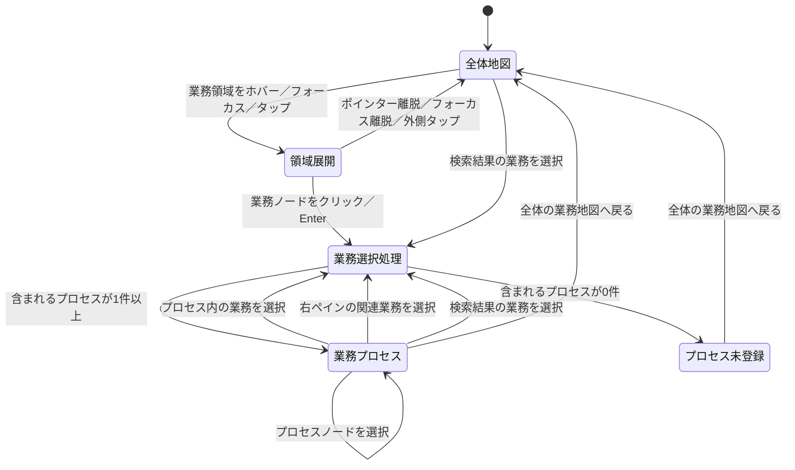

# 業務エクスプローラー再設計仕様

## 1. 目的

業務エクスプローラーは、業務カタログ正本に登録されたビルメンテナンス業務を、次の順序で理解するための画面とする。

1. 18業務領域から関心のある領域を見つける
2. 領域に属する業務ID単位の業務を選ぶ
3. 選択業務が含まれる業務プロセスを開始から終了まで確認する
4. 選択業務の詳細と関連業務を確認する
5. 同じ業務が含まれる別プロセスへ切り替える

業務領域、業務、業務プロセス、帳票、担当者、法令を同格のノードとして一つの図へ混在させない。

---

## 2. 用語

### 2.1 業務領域ノード

業務カタログ正本の`BM-01`から`BM-18`までの18業務領域を表す。

業務領域ノードは、個別業務を探すための分類であり、業務そのものではない。

### 2.2 業務ノード

`BM-09-06 点検異常を判定する`のような、業務カタログ正本の業務ID単位の業務を表す。

業務エクスプローラーで選択対象となる基本単位は業務ノードとする。

### 2.3 業務プロセス

複数の業務ノードを、開始から終了まで意味のある順序でつないだ業務シナリオを表す。

一つの業務ノードが複数の業務プロセスに含まれることを許容する。

### 2.4 プロセスノード

選択業務が含まれる業務プロセスを切り替えるための選択要素を表す。

プロセスノードは業務プロセス図の工程ではない。業務ノードと矢印で接続せず、プロセス図の上部に独立して配置する。

---

## 3. 中核機能

業務エクスプローラーの中核機能は次の4つとする。

1. 全体の業務地図
2. 選択業務が含まれる業務プロセス
3. 業務の詳細
4. 検索

4機能を同列の表示タブにはしない。全体地図から業務を選択し、業務プロセスと詳細へ移る構造とする。

```text
全体の業務地図
    ↓ 業務領域をホバー・フォーカス・タップ
領域内の業務ノードを展開
    ↓ 業務ノードを選択
選択業務が含まれる業務プロセス
    ＋
選択業務の詳細
```

---

## 4. 画面状態

### 4.1 全体地図状態

初期表示状態。

中央に18個の業務領域ノードを表示する。業務詳細ペインや業務プロセスは表示しない。

### 4.2 領域展開状態

一つの業務領域ノードへマウスオーバー、キーボードフォーカス、またはタッチ操作した状態。

対象領域に属する業務ノードを、業務領域ノードの周囲または専用の展開レイヤーへ表示する。

表示対象は業務カタログ正本に登録された当該領域の業務であり、エクスプローラー用に選定した「代表業務」ではない。

領域展開だけでは選択業務を変更しない。

### 4.3 業務プロセス状態

業務ノードを選択した状態。

全体地図を中央表示から外し、次を表示する。

- 選択業務が含まれるプロセスノード一覧
- 現在選択中の業務プロセス
- 選択業務の詳細ペイン

全体地図と業務プロセスは同時表示しない。

### 4.4 プロセス未登録状態

選択業務を含む業務プロセスが正本に登録されていない状態。

選択業務の詳細ペインは表示し、中央には「この業務を含む業務プロセスは未登録です」と表示する。

接続関係を無制限探索して業務プロセスを自動推測しない。

### 4.5 状態遷移図



---

## 5. 全体の業務地図

### 5.1 表現対象

全体地図は、業務カタログ正本の18業務領域を表す。

7つのライフサイクル段階を大分類ノードには使用しない。

```text
BM-01 業務領域
BM-02 業務領域
...
BM-18 業務領域
```

各業務領域ノードには、少なくとも次を表示する。

- 業務領域ID
- 業務領域名
- 所属業務数

### 5.2 業務領域ノードの操作

業務領域ノードは個別業務の選択対象ではなく、クリック不可とする。

役割は次の2つに限定する。

- 業務カタログの分類を示す
- 所属する業務ノードを展開する

操作は次のとおりとする。

- マウス：ホバーで展開
- キーボード：フォーカスで展開
- タッチ：タップで展開
- Enterやクリックで業務領域そのものを選択しない

### 5.3 展開する業務ノード

業務領域を展開した際は、その領域に属する業務ノードを表示する。

表示対象は業務カタログ正本の領域・業務の所属関係から導出する。エクスプローラー専用の代表業務マッピングを追加しない。

各業務ノードには次を表示する。

- 業務ID
- 業務名

業務ノードのみクリックまたはEnterで選択できる。

業務数が多く一度に周囲へ配置できない場合も、任意の一部だけを代表として抽出しない。領域に紐づく展開レイヤー、整列、スクロールなどにより全件へ到達できるようにする。

---

## 6. 業務選択処理

全体地図、業務プロセス、右ペイン、検索のどこから業務を選択しても、同じ業務選択処理を使用する。

### 6.1 入力

- 選択する業務ID
- 現在表示中の業務プロセスID。未表示の場合はなし

### 6.2 処理

1. 選択業務IDを更新する
2. 選択業務を含む業務プロセス一覧を取得する
3. 右ペインの業務詳細を更新する
4. 表示する業務プロセスを決定する

### 6.3 表示プロセスの決定

次の優先順位で決定する。

1. 現在表示中の業務プロセスに新しい選択業務が含まれる場合、そのプロセスを維持する
2. 維持できない場合、選択業務を含むプロセスの正本上の表示順で先頭のものを表示する
3. プロセスが0件の場合、プロセス未登録状態を表示する

「代表プロセス」という属性は追加しない。

正本上の表示順は、業務プロセス一覧の`order`または同等の並び順で明示する。

---

## 7. プロセスノード

### 7.1 目的

プロセスノードは、同じ選択業務が複数の業務プロセスに含まれることを示し、表示するプロセスを切り替えるために使用する。

### 7.2 配置

業務プロセス図の上部に「この業務を含むプロセス」として配置する。

```text
選択業務: BM-09-06 点検異常を判定する

この業務を含むプロセス
[点検結果の確認・報告] [点検異常から復旧まで] [事故対応]

────────────────────────────────
選択中の業務プロセス図
```

プロセスノードを業務プロセス図の線へ接続しない。

### 7.3 表示内容

プロセスノードには次を表示できる。

- プロセス名
- 開始から終了までの範囲を示す短い説明
- 含まれる業務数
- 表示中であることを示す状態

### 7.4 操作

プロセスノードをクリックまたはEnterすると、選択業務を維持したまま、中央の業務プロセス図を対象プロセスへ切り替える。

プロセスノードが1件だけの場合も、現在表示中のプロセス名は画面上で確認できるようにする。

---

## 8. 業務プロセス図

### 8.1 表示範囲

選択業務の前後1ホップだけではなく、選択中の業務プロセスを開始から終了まで表示する。

```text
開始
  ↓
点検を計画する
  ↓
点検を実施する
  ↓
点検値を記録する
  ↓
点検異常を判定する  ← 選択中
  ├─ 正常の場合 → 点検結果を承認する → 報告する → 完了
  └─ 異常の場合 → 不具合を受け付ける → 一次対応 → 復旧確認 → 完了
```

### 8.2 ノード

中央の業務プロセス図には、原則として業務ノードを表示する。

次の情報を業務ノードとして混在させない。

- 業務領域
- 業務プロセス
- 帳票・記録
- 担当者・組織
- 法令・基準

開始、完了、条件、別プロセスへの移行などの補助情報は、業務ノードとは視覚的に区別した短い日本語ラベルまたは操作要素で表す。

### 8.3 矢印

矢印は1種類だけとする。

```text
矢印 ＝ 次に進む
```

利用者へ線の色、太さ、破線、矢印形状の意味を覚えさせない。

条件分岐は線種ではなく、日本語で表示する。

- 正常の場合
- 異常の場合
- 承認された場合
- 不備がある場合

### 8.4 選択業務

選択業務をプロセス内で強調する。

強調には次を併用し、色だけに依存しない。

- `選択中`ラベル
- 枠線
- 背景
- 必要に応じた中央寄せまたは自動スクロール

### 8.5 業務ノードの選択

プロセス内の別業務ノードをクリックまたはEnterすると、その業務を新しい選択業務とする。

現在のプロセスに新しい選択業務が含まれる場合、表示プロセスは維持する。

---

## 9. 業務の詳細

選択業務の詳細は、業務プロセスとは別の右ペインへ表示する。

表示候補は次のとおりとする。

- 業務ID・業務名
- 概要
- 開始契機
- 完了条件
- 入力
- 成果物
- 実施者
- 判断者・承認者
- 法令・基準
- 作業手順
- チェックリスト・帳票
- 関連業務
- 参照元

帳票、担当者、法令などを中央の業務プロセス図へ混在させない。

### 9.1 関連業務

右ペインの関連業務は業務ID単位で表示する。

関連業務をクリックまたはEnterすると、共通の業務選択処理を呼び出す。

その結果、次を更新する。

- 選択業務
- 選択業務を含むプロセスノード一覧
- 表示中の業務プロセス
- 右ペインの業務詳細

---

## 10. 検索

検索は全体地図状態と業務プロセス状態の両方から利用できる共通機能とする。

初期版の主な検索対象は次とする。

- 業務ID
- 業務名
- 業務説明
- 18業務領域
- 業務プロセス名

### 10.1 業務検索結果

業務検索結果を選択すると、共通の業務選択処理を呼び出す。

### 10.2 プロセス検索結果

業務プロセス検索結果を選択する場合は、そのプロセスを開始から終了まで表示する。

右ペインへ表示する選択業務は、正本で明示された開始業務、またはプロセスの先頭業務とする。

---

## 11. 画面構成

### 11.1 全体地図状態

```text
┌──────────────────────────────────────────────────────────────┐
│ 業務・プロセスを検索                                         │
├──────────────────────────────────────────────────────────────┤
│                                                              │
│               ビルメンテナンス業務の18業務領域               │
│                                                              │
│   [BM-01] [BM-02] [BM-03] ... [BM-18]                       │
│                 ↑                                            │
│        ホバー・フォーカス・タップで所属業務を展開             │
│                                                              │
└──────────────────────────────────────────────────────────────┘
```

初期状態では空の詳細ペインを常設しない。

### 11.2 領域展開状態

```text
┌──────────────────────────────────────────────────────────────┐
│                                                              │
│      [BM-09-01 業務]     [BM-09-02 業務]                     │
│                 \        /                                   │
│             [BM-09 点検・保守管理]                            │
│                 /        \                                   │
│      [BM-09-06 業務]     [BM-09-10 業務]                     │
│                                                              │
└──────────────────────────────────────────────────────────────┘
```

業務領域ノードと業務ノードのクリック可能性を、見た目とカーソルだけに頼らず、説明文とアクセシブルな役割でも区別する。

### 11.3 業務プロセス状態

```text
┌──────────────────────────────────────────────────────────────┐
│ ← 全体の業務地図       業務・プロセスを検索                  │
│ 選択業務: BM-09-06 点検異常を判定する                        │
├──────────────────────────────────────────────────────────────┤
│ この業務を含むプロセス                                      │
│ [点検結果の確認・報告] [点検異常から復旧まで]                 │
├──────────────────────────────────────────┬───────────────────┤
│                                          │ 業務の詳細         │
│ 開始 → 計画 → 実施 → 記録 → 判定        │                   │
│                              ├ 正常       │ 概要              │
│                              └ 異常       │ 入力・成果物       │
│                                          │ 関連業務           │
└──────────────────────────────────────────┴───────────────────┘
```

---

## 12. 正本データと導出データ

### 12.1 業務領域と業務

業務領域と業務ノードは、業務カタログ正本を使用する。

エクスプローラー専用の代表業務マッピングは作成しない。

必要な導出データは次のとおりとする。

- 業務領域IDから所属業務ID一覧
- 業務IDから業務領域ID

### 12.2 業務プロセス正本

業務プロセスは、開始から終了までの順序を正本データとして定義する。

最低限必要な要素は次のとおりとする。

- プロセスID
- プロセス名
- 表示順
- 説明
- 開始業務
- 終了業務
- 業務ステップ
- 次工程
- 条件分岐ラベル
- 当該プロセスに含まれる業務ID一覧

概念例は次のとおりとする。

```yaml
id: inspection-abnormality-restoration
name: 点検異常から復旧まで
order: 20
entryBusinessId: BM-09-01
steps:
  - id: plan
    businessId: BM-09-01
    next: execute
  - id: execute
    businessId: BM-09-04
    next: judge
  - id: judge
    businessId: BM-09-06
    branches:
      - label: 正常の場合
        next: approve
      - label: 異常の場合
        next: receive-incident
```

`representative`属性は設けない。

### 12.3 業務からプロセスへの索引

業務プロセス正本から、次の索引を生成する。

```text
業務ID → その業務を含むプロセスID一覧
```

プロセスノード一覧と初期表示プロセスは、この索引とプロセスの表示順から決定する。

---

## 13. 既存実装の扱い

既存実装の再利用を前提条件にしない。

新しい情報構造と操作を単純に実現できる場合に限り、データ処理または小さなUI部品を再利用する。

既存の状態管理、画面構造、コンポーネント境界、描画ライブラリが再設計の妨げになる場合は削除または作り直す。

現在の次の構造は新設計の前提にしない。

- 1ホップの仕事の流れ
- `全体から見る`
- `関係から探す`
- 3表示タブ
- 下部ライフサイクル
- 7段階を中心とした全体地図
- 代表業務・代表プロセスの概念

React Flow、ELK、現在の検索、詳細パネル、URL・履歴同期も必須技術または必須部品とはしない。

---

## 14. URL・ブラウザ履歴

URL共有、再読み込み、ブラウザの戻る・進むによる状態復元は補助機能とする。

中核機能の完成後、必要性が確認できた範囲で対応する。

対応する場合も、次の状態程度に限定する。

- 選択業務ID
- 表示中の業務プロセスID

業務領域のホバー、フォーカス、展開状態は保持しない。

---

## 15. 業務エクスプローラー再設計で採用しない設計

本仕様の対象である業務エクスプローラーでは、次の設計を採用しない。

- 7つのライフサイクル段階を全体地図の大分類ノードにする
- エクスプローラー専用の代表業務を選定する
- 代表プロセス属性を追加する
- 業務領域ノードをクリックして業務選択する
- 全体地図と業務プロセスを同時表示する
- プロセスノードを業務プロセス図の線へ接続する
- 選択業務の前後1ホップだけを業務プロセスと呼ぶ
- 帳票、担当者、法令を中央の業務プロセス図へ混在させる
- 線の色、太さ、破線で意味を区別する
- ホバーだけで選択業務を確定する
- 接続関係を無制限探索して業務プロセスを自動推測する
- 既存実装を残すことを優先して新しい情報構造を歪める

---

## 16. 未確定事項

実装前または実装Issue内で次を確定する。

1. 18業務領域ノードの配置
2. 業務数が多い領域を展開する具体的レイアウト
3. 業務プロセス正本の初期対象範囲
4. 業務プロセス正本の保存形式
5. プロセスノードの表示情報と最大表示数
6. 分岐が多い業務プロセスの折りたたみ方法
7. タッチ端末で領域展開を閉じる操作
8. 初期版検索の対象範囲

未確定事項を理由に、代表業務や代表プロセスなどの新しい分類を追加しない。

---

## 17. 受け入れ基準

- 初期画面を見て、18業務領域から業務を探す画面だと理解できる
- 業務領域ノードが業務選択対象ではないことが分かる
- 業務領域へのホバー、フォーカス、タップで所属業務を確認できる
- 展開対象が業務カタログ正本の業務ID単位である
- 業務ノードのクリックまたはEnterで業務を選択できる
- 選択業務が含まれる業務プロセスを開始から終了まで確認できる
- 選択業務が含まれる複数プロセスをプロセスノードとして確認できる
- プロセスノードの選択で、選択業務を維持したままプロセスを切り替えられる
- プロセスノードが業務プロセス図の線へ混在しない
- プロセス内の業務ノード選択で、選択業務と詳細を更新できる
- 右ペインの関連業務選択で、同じ業務選択処理を実行できる
- 矢印の意味を「次に進む」だけで理解できる
- 業務詳細で入力、成果物、担当者、法令、手順を確認できる
- 全体地図と業務プロセスの両方から検索を利用できる
- プロセス未登録業務でも、業務詳細を確認できる
- マウス、キーボード、タッチで主要操作を完了できる
