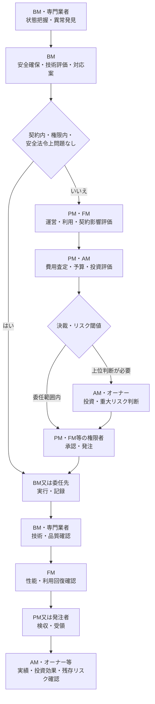
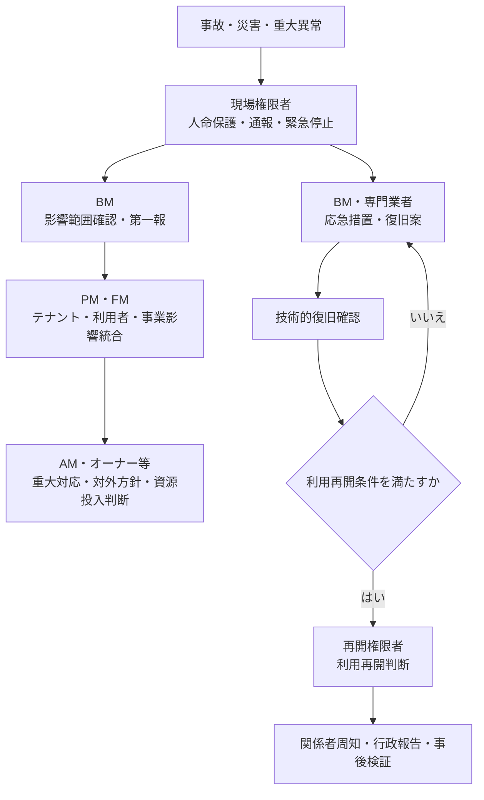

# オーナー・AM・PM・FM・BMの意思決定・責任分界 v1.0

## 1. 目的

本書は、建物管理に関する起案、技術評価、費用査定、承認、発注、実行、確認、検収及び報告が、オーナー、アセットマネジメント（AM）、プロパティマネジメント（PM）、ファシリティマネジメント（FM）、ビルメンテナンス（BM）の各機能間でどのように接続するかを整理する正本である。

特に、BMが建物・設備の状態から技術的に必要と判断した対応が、利用・運営、物件収支、投資及び重大リスクの観点で評価され、権限者の決定を経て実行・確認されるまでを追跡できる状態を作る。

本書は標準モデルであり、特定企業の組織図、職務権限規程又は単一のRACIを再現するものではない。個別案件では、契約書、仕様書、賃貸借契約、管理規約、社内権限規程、法令、条例及び行政運用を優先する。

## 2. 適用範囲と関連文書

### 2.1 適用範囲

本書は、次の判断を主な対象とする。

- 通常の保守・点検計画
- 不具合の一次対応
- 小修繕
- 高額修繕・設備更新
- 法定不適合の是正
- テナント・利用者要望への対応
- 災害・事故時の緊急対応
- 中長期修繕計画
- 委託仕様・予算の変更
- BM会社等の選定・評価

投資用不動産、自社利用施設、オーナー直接委託及び一組織が複数機能を兼ねる場合を代表パターンとして扱う。

### 2.2 関連文書

| 文書 | 本書との関係 |
|---|---|
| [オーナー・AM・PM・FM・BMの役割・業務レイヤー定義](./roles-and-layers.md) | 各機能の主目的、管理対象、意思決定範囲及びレイヤーを定義する |
| [役割別の業務領域と主要KPI](./business-domains-and-kpis.md) | `OWN-xx`、`AM-xx`、`PM-xx`、`FM-xx`、`BM-xx` の業務領域と評価観点を定義する |
| [ビルオーナー・PM・FM・BM責任分界プロファイル](../owner-pm-fm-bm-responsibility-profiles.md) | 既存の責任分界、権限委譲、緊急対応及び物件別テンプレートを提供する |
| [ビルメンテナンス契約役割プロファイル](../contract-role-profiles.md) | 委託者、元請け、再委託先等の契約上の責任を定義する |
| [ビルメンテナンス法令義務プロファイル](../statutory-duty-profiles.md) | 法的義務主体、実施者、資格者、報告者及び是正責任者を定義する |
| [ビルメンテナンス業務カタログ v1.5](../building-maintenance-business-catalog.md) | BM-01〜BM-18、181業務をBM機能の正本として定義する |

## 3. 適用原則

### 3.1 会社ではなく案件上の機能を割り当てる

「オーナー会社」「AM会社」「PM会社」「FM部門」「BM会社」という名称だけで責任を決めない。案件ごとに、実際に誰が次の機能を担うかを確認する。

- 所有目的、投資方針及び重大リスクを決める機能
- 資産運用計画、OPEX・CAPEX配分及び投資効果を評価する機能
- 個別物件の収支、賃貸運営、委託先及び発注を統括する機能
- 利用組織の事業要求、施設性能、サービス水準及びBCPを管理する機能
- 建物・設備の状態を把握し、作業を計画・実行・記録する機能

同一法人又は部署が複数機能を兼ねる場合も、機能別の権限、承認及び証跡は分けて記録する。

### 3.2 固定的な上下関係として扱わない

オーナーは所有資産に関する最終権限を保持するが、AM、PM、FM及びBMの関係は常に一方向の組織階層ではない。

- 投資用・賃貸不動産では、オーナーからAM、PM、BMへ投資・物件運営・維持管理の機能が接続しやすい。
- 賃貸ビルでは、貸主側PMとテナント側FMが賃貸借契約の境界を挟んで並立し得る。
- 自社利用施設では、オーナー機能とFM機能が同一組織にあり、独立したPM機能が存在しない場合がある。
- BMがオーナー又はFMから直接委託される場合がある。

### 3.3 委託と責任移転を同一視しない

作業又は管理業務を委託しても、次が当然に委託先へ移転するとは限らない。

- 法令上、所有者、管理者、占有者、設置者、管理権原者等に課される義務
- 投資、予算外支出、長期停止及び契約変更の最終決定権
- 契約に定めのない費用負担
- 重大な残存リスクを受容する権限
- 行政報告、利用制限又は再開に管理権原を要する判断

### 3.4 技術判断と投資・運営判断を分ける

BM又は専門業者が技術的必要性を評価できることと、費用を負担し、案件を承認し、残存リスクを受容できることは別である。

たとえば設備更新では、次を別成果物として管理する。

| 成果物 | 標準的な作成・評価機能 |
|---|---|
| 劣化状態、原因、故障可能性、残存寿命、修繕方式 | BM、専門業者 |
| 必要性能、利用制約、停止可能時間、事業影響 | FM |
| テナント影響、物件収支、契約、工期、発注条件 | PM |
| OPEX・CAPEX区分、投資効果、資産価値、年度配分 | AM |
| 最終投資判断、重大リスク受容、資本配分 | オーナー又は委任された権限者 |

## 4. 責任・権限の分類

責任分界では、少なくとも次の属性を別々に登録する。

| 属性 | 定義 | 主な証跡・根拠 |
|---|---|---|
| 方針責任 | 目的、優先順位、要求水準及び許容リスクを定める | 所有方針、FM戦略、物件運営方針、契約仕様 |
| 起案責任 | 判断対象を案件化し、選択肢、理由及び必要情報を揃える | 起案書、修繕提案、変更申請、予算要求 |
| 技術評価責任 | 状態、原因、方式、性能、安全及び技術リスクを評価する | 点検記録、診断、技術所見、比較表 |
| 費用査定責任 | 見積、単価、数量、予算、OPEX・CAPEX、投資効果を評価する | 見積査定、予算差異、投資評価、価格比較 |
| 最終決定・承認権 | 実施、延期、見送り、代替策又は条件を最終決定する | 決裁、承認記録、議事録、電子承認 |
| 発注権限 | 契約又は注文により第三者へ作業を依頼する | 契約書、注文書、発注記録 |
| 実行責任 | 承認された内容を作業、操作、調整又は連絡として実施する | 作業記録、操作履歴、連絡記録 |
| 確認責任 | 技術、品質、安全、利用又は契約の観点から結果を確認する | 検査記録、試運転、性能確認、レビュー |
| 検収・受領権限 | 契約上の成果を受領し、支払又は次工程へ進める | 検収書、受領記録、支払承認 |
| 報告責任・報告先 | 事実、判断、結果及び例外を必要な相手へ伝える | 速報、定期報告、事故報告、行政報告 |
| 費用負担 | 点検、修繕、更新、損害、追加作業等の費用を負担する | 契約、賃貸借条件、予算、保険、原因区分 |
| 法的義務 | 法令上の義務を履行し、必要な選任、届出、維持、報告等を行う | 法令、条例、行政通知、届出、選任記録 |
| 残存リスク受容 | 延期、暫定運用又は代替策後に残るリスクを認める | リスク受容記録、期限、監視条件、再判定日 |
| 緊急停止権 | 人命保護、法令遵守又は被害拡大防止のため直ちに停止する | 緊急手順、権限表、操作記録、第一報 |
| 利用再開判断 | 応急措置又は復旧後に設備・区画・建物の利用を再開する | 復旧確認、再開承認、利用条件、関係者周知 |

### 4.1 混同してはならない区分

| 区分 | 決定根拠 | 代表的な問い |
|---|---|---|
| 契約に基づく責任 | 契約書、仕様書、発注書 | 誰が誰に、何を、どの品質・期限で提供するか |
| 業務上の統括・実行責任 | 運用設計、手順、体制表 | 誰が調整し、誰が実際に実行するか |
| 社内の決裁権限 | 職務権限規程、予算規程、委任状 | 誰がどの金額・条件まで承認できるか |
| 法令上の義務 | 法令、条例、行政運用 | 法律上、誰が選任、維持、点検、届出、報告等を負うか |
| 費用負担 | 契約、賃貸借契約、原因区分、保険 | 誰の予算又は資金で支払うか |
| 技術的な判断能力 | 資格、専門性、設備知識、診断結果 | 何が必要で、どの方法が技術的に妥当か |
| リスク受容権限 | 所有方針、事業責任、権限規程 | 対応しない又は延期するリスクを誰が引き受けられるか |

「発注できる者」「費用を負担する者」「技術的に妥当性を判断する者」「法的義務を負う者」「最終リスクを受容する者」が同一とは限らない。

## 5. 標準的な意思決定フロー

### 5.1 平常時の標準フロー



各工程で差戻し、追加調査、再見積、条件付き承認又は見送りがあり得る。見送り又は延期時は、決定者、理由、残存リスク、暫定対策、監視条件及び再判定期限を記録する。

### 5.2 緊急時の標準フロー



緊急停止と利用再開は別権限とする。BMに緊急停止権があっても、長時間の利用停止、事業再開、対外公表又は残存リスク受容を単独で決定できることを意味しない。

### 5.3 判断レベル

| レベル | 判断例 | 標準的な決定機能 | 主な上申条件 |
|---|---|---|---|
| L0 定型実行 | 承認済み手順での点検、操作、記録 | BM | 手順外、異常、未実施 |
| L1 現場裁量 | 設定範囲内の運転調整、軽微な一次対応 | BM責任者 | 安全余裕低下、契約外、利用影響 |
| L2 運用変更 | 臨時運転、日程変更、小修繕 | PM又はFMから委任された権限者 | 予算外、停止、複数テナント影響 |
| L3 予算・契約変更 | 予算外修繕、仕様追加、停止工事 | PM、FM又はAMの権限者 | CAPEX、年度計画変更、重大影響 |
| L4 投資・重大リスク | 設備更新、大規模修繕、長期停止、重大リスク受容 | オーナー又は最終委任先 | 所有方針、法令、資産価値、事業継続 |

## 6. 各機能の標準的な関与

| 機能 | 標準的な責任・権限 | 主な成果物 | 原則として単独では決めない事項 |
|---|---|---|---|
| オーナー | 所有方針、資本配分、重大CAPEX、重大リスク受容、委任範囲及び最終説明責任 | 所有方針、承認済み予算、投資判断、リスク方針 | 現場の具体的作業方法、日常の運転操作 |
| AM | 投資戦略、資産運用計画、OPEX・CAPEX配分、投資効果、PM統制及びオーナー承認案件の起案 | 資産運用計画、投資評価、予算配分案、運用報告 | 現場の技術判定、利用部門の詳細運用 |
| PM | 物件収支、賃貸運営、テナント、BM等の委託先、契約、発注、検収及び物件報告の統括 | 物件予算、運営計画、発注、検収、月次報告 | 所有方針を超える投資、テナント側事業判断 |
| FM | 経営・事業要求の施設要求化、性能・サービス水準、利用調整、BCP、総施設コスト及び利用回復確認 | FM戦略、性能目標、サービス仕様、利用・再開条件 | 所有資産の売却等、貸主側賃貸条件、専門的な設備診断 |
| BM | 運転、点検、保守、清掃、警備、異常発見、一次対応、技術所見、作業実行、証跡及び速報 | 作業計画、点検・運転記録、技術提案、修繕履歴、報告書 | 予算外投資、契約変更、重大リスク受容、管理権原を要する再開判断 |

## 7. 所有・利用・契約形態別の代表パターン

### 7.1 パターンA：投資用・賃貸不動産

```text
オーナー機能 → AM機能 → PM機能 → BM機能
                         ↕
                 テナント側FM機能
```

| 機能 | 標準配置 | 主な判断 |
|---|---|---|
| オーナー | 投資家、所有法人、SPC、信託関係者等 | 投資方針、重大CAPEX、重大リスク、保有・売却 |
| AM | 資産運用受託者又は内部運用部門 | 資産運用計画、予算配分、投資評価、PM統制 |
| PM | 個別物件の運営受託者 | 物件収支、賃貸運営、BM調達、修繕統括、検収 |
| FM | 主要テナント又は利用組織側に存在し得る | 専有部、利用条件、事業影響、サービス要求 |
| BM | PM等からの受託者 | 現場実行、状態把握、一次対応、技術提案、報告 |

BMの技術提案は、PMが物件・契約・テナント影響を評価し、AMが投資・資産運用を評価したうえで、権限限度に応じAM又はオーナーが決定する。テナント側FMの要求は、賃貸借契約及び共用部・専有部の境界を通じてPMと調整する。

### 7.2 パターンB：AMを置かない賃貸不動産

```text
オーナー機能 → PM機能 → BM機能
```

PMがAMの一部に相当する予算案、投資案及び資産報告を作成する場合がある。ただし、PMが投資評価を実務上担っても、オーナーが留保した最終投資権限又は重大リスク受容まで当然に移るものではない。

### 7.3 パターンC：自社所有・自社利用施設

```text
経営・オーナー機能 → FM機能 → BM機能
```

| 機能 | 標準配置 | 主な判断 |
|---|---|---|
| 経営・オーナー | 経営会議、財務、資産所管等 | 施設方針、全社予算、重大投資、事業リスク |
| FM | 総務、管財、ファシリティ部門等 | 施設要求、サービス水準、総コスト、利用調整、BCP |
| BM | 内製現場組織又は外部受託者 | 運転・点検・保守、一次対応、技術提案、記録 |

独立したPM機能が存在しない場合、FMが契約・発注・検収及び予算統括を担い得る。自社利用施設では、賃貸収益よりも事業継続、利用者安全、生産性、施設総コスト及び環境性能が判断の中心になる。

### 7.4 パターンD：オーナー直接委託

```text
オーナー機能 → BM機能
```

オーナー側に、少なくとも次の受け皿機能が必要である。

- 技術提案を受けて運営・利用影響を評価する担当
- 予算、発注及び検収を行う権限者
- 法的義務主体、管理権原者及び行政報告名義を確認する担当
- 緊急時の連絡先、重大判断者及び利用再開判断者

中間機能が少ないため、BMへ過大な判断が集中しないよう、権限限度と上申条件を具体化する。

### 7.5 パターンE：同一組織が複数機能を兼ねる場合

同一法人又は部署がAM・PM、PM・FM、PM・BM等を兼ねる場合でも、次を機能別に分ける。

- 起案者と承認者
- 技術評価者と費用査定者
- 実施者と検収者
- 契約上の受託責任と法的義務主体
- 予算執行者と残存リスク受容者

自己検収又は利益相反を許容する条件、上位承認が必要な条件、監査方法及び代行順位を定める。

## 8. 代表判断ごとの責任・権限分界表

以下は標準モデルである。各セルは主な関与を示し、個別案件の契約、権限規程、法令及び管理権原により上書きする。

| 判断対象 | オーナー | AM | PM | FM | BM | 主な変動条件 |
|---|---|---|---|---|---|---|
| 通常の保守・点検計画 | 重要停止・予算方針 | 年度予算・資産方針との整合 | 契約・物件運営・テナント調整 | 利用条件・性能要求・停止可能時間 | 計画起案、技術具体化、実行、記録 | 法定周期、契約範囲、常駐・巡回、停止影響 |
| 不具合の一次対応 | 重大事象の方針・報告受領 | 資産影響が大きい場合に関与 | 物件全体・テナント・対外調整 | 利用者・事業影響の確認 | 発見、緊急度判定、安全確保、応急処置、速報 | 人命、法令、停止範囲、時間外、権限表 |
| 小修繕 | 通常は権限委譲 | 通常は予算枠管理 | 予算内承認、発注、検収 | 優先度・利用影響確認 | 技術評価、見積、実施、完了確認 | 金額閾値、専有・共用、契約内外、緊急性 |
| 高額修繕・設備更新 | 最終投資・重大リスク判断 | CAPEX配分、投資効果、資産価値評価 | 案件化、物件収支、工期、発注統括 | 要求性能、事業・利用影響、更新優先度 | 劣化診断、方式比較、技術提案、施工・技術確認 | OPEX・CAPEX、決裁金額、長期停止、保有方針 |
| 法定不適合の是正 | 法的義務・重大リスクに応じ決定 | 資産・投資影響を評価 | 適用・期限・委託・行政連絡を統括 | 利用制限・事業影響を調整 | 発見、証跡、技術的是正案、実施 | 義務主体、管理権原、報告名義、行政指示、使用停止 |
| テナント・利用者要望 | 重要方針・契約変更 | 収益・資産影響が大きい場合 | 賃貸借・物件運営・費用区分を判断 | 利用要求、サービス水準、事業影響を評価 | 受付、現場確認、実現方法・見積、実施 | 共用・専有、原状変更、費用負担、SLA、他テナント影響 |
| 災害・事故時の緊急対応 | 重大判断、対外方針、残存リスク受容 | ポートフォリオ・保険・資産影響 | 物件指揮、テナント・行政・委託先調整 | 人命・事業継続・利用者調整 | 通報、避難、緊急停止、現場確認、応急措置、速報 | 緊急計画、管理権原、災害種別、夜間、不在時代行 |
| 中長期修繕計画 | 投資枠、実施年度、保有方針 | CAPEX配分、投資効果、資産価値 | 工事時期、物件収支、賃貸影響 | 性能目標、事業優先度、ライフサイクル | 劣化・故障・残存寿命、概算、技術案 | 保有期間、更新バックログ、資金制約、用途変更 |
| 委託仕様・予算の変更 | 重要条件・予算枠承認 | 資産運用計画・費用効果 | 仕様・契約・物件予算を改定 | サービス・性能要求を提示 | 実績、工数、品質、原価、技術条件を提示 | 契約更新、SLA、法令改正、利用条件、価格変動 |
| BM会社等の選定・評価 | 重要委託方針・重大案件承認 | PM等の統制・資産横断評価 | 調達、契約、検収、委託先評価 | 要求・サービス・利用者評価に参加 | 提案・受託、自社及び再委託先の遂行管理 | 総合管理・業務別、再委託、利益相反、専門資格 |

## 9. 代表ケースの詳細フロー

### 9.1 高額修繕・設備更新

| 段階 | 責任・権限 | 標準的な主体 | 主な情報・成果物 |
|---|---|---|---|
| 1. 発見・起案準備 | 状態把握、一次安全確保 | BM | 点検値、故障履歴、写真、応急措置 |
| 2. 技術評価 | 原因、方式、残存寿命、停止条件、放置リスク | BM、専門業者 | 技術所見、方式比較、概算、工程条件 |
| 3. 利用・性能評価 | 必要性能、事業影響、停止可能時間、優先度 | FM | 性能要件、利用制約、BCP条件 |
| 4. 物件運営評価 | テナント、契約、工期、賃貸影響、発注方式 | PM | 工事計画、テナント調整、発注条件 |
| 5. 費用・投資評価 | OPEX・CAPEX、予算、投資効果、資産価値 | AM、PM、FM | 投資評価、予算案、感応度、代替案 |
| 6. 最終決定 | 実施年度、金額、条件、延期又は見送り | オーナー又は委任権限者 | 承認、条件、否決理由、リスク受容 |
| 7. 発注・実行 | 契約、工程、安全、施工 | PM又はFM、BM・工事会社 | 発注書、施工計画、作業記録 |
| 8. 確認・検収 | 技術、性能、利用回復、契約成果 | BM、FM、PM | 試運転、完了検査、検収、竣工資料 |
| 9. 事後評価 | 投資効果、残存リスク、計画更新 | AM、オーナー、PM、FM | 効果測定、資産・修繕計画更新 |

延期又は見送りは、対応しないことの技術判断ではなく、権限者によるリスク受容判断である。安全又は法令に反する状態を、単なる予算判断で許容できるとは限らない。

### 9.2 法定不適合の是正

| 段階 | 確認事項 | 標準的な主体 |
|---|---|---|
| 適用判定 | 根拠法令、用途・規模・設備・地域条件、義務主体 | PM又は発注者の法令統括、資格者、専門家 |
| 発見・判定 | 不適合内容、危険度、報告期限、使用制限 | BM、資格者、専門業者 |
| 第一報 | 法的義務主体、管理権原者、PM、FM、必要な行政機関への連絡 | 契約・法令で定める報告者 |
| 応急措置 | 停止、立入制限、代替運用、監視強化 | BM、FM、PMの緊急権限者 |
| 是正案 | 技術方式、期限、費用、停止、再検査 | BM、専門業者、PM、FM |
| 決定 | 法定期限、行政指示、費用、利用影響を踏まえた承認 | 法的義務主体、管理権原者又は委任権限者 |
| 実行・確認 | 是正、再検査、証跡、行政への補正・完了報告 | 実施者、資格者、報告名義人 |

「BMへ法定点検を委託した」ことだけでは、法的義務主体、選任者、行政報告名義、是正決定者又は費用負担者は確定しない。

### 9.3 災害・事故時の緊急対応

| 時点 | 主な判断 | 標準的な責任分界 |
|---|---|---|
| 発生直後 | 人命保護、通報、避難、初期消火、設備停止 | 現場にいるBM・防火管理者等が緊急手順に基づき実施 |
| 第一報 | 事実、被害、停止、暫定措置、支援要請 | BMからPM・FM等の緊急窓口へ速報 |
| 影響統合 | 建物、テナント、利用者、事業、資産への影響 | PMが物件影響、FMが人・事業影響、AMが資産影響を統合 |
| 重大判断 | 長期停止、追加資源、対外公表、保険、残存リスク | オーナー又は委任された危機対応権限者 |
| 復旧 | 応急復旧、恒久復旧、代替運用 | BM・専門業者が技術案、PM・FMが工程・利用を調整 |
| 再開 | 技術的安全、法令、利用条件、事業条件の確認 | 技術確認者と再開権限者を分ける |
| 事後 | 原因、再発防止、契約・計画・BCP見直し | 全機能が各責任範囲で実施 |

## 10. 責任分界を変動させる条件

| 変動要因 | 責任分界への主な影響 | 個別案件で確認する事項 |
|---|---|---|
| 投資用不動産／自社利用施設 | 投資収益・資産価値中心か、事業・利用価値中心かが変わる | AM・PMの有無、FMの権限、評価KPI |
| オーナー直轄／AM・PM経由 | 起案、費用査定、発注、報告の中間機能が変わる | 委任範囲、承認経路、上申先、代行順位 |
| FM部門の有無 | 利用要求、性能評価、BCP及び再開判断の担当が変わる | PM又はオーナー側の代替機能、テナント側FMとの境界 |
| 総合管理契約／業務別委託 | 統括・契約・検収の集約度が変わる | 元請け、別途発注先、作業間調整、責任空白 |
| 常駐管理／巡回管理 | 初動時間、現場裁量、遠隔指示、時間外体制が変わる | 緊急停止権、鍵・入館、一次対応範囲、応援体制 |
| 通常対応／緊急対応 | 事前承認中心から即時安全確保・事後報告へ切り替わる | 緊急権限、第一報期限、復旧・再開権限 |
| OPEX／CAPEX | 予算区分、承認者、評価期間及び会計処理が変わる | 会計方針、投資審査、年度配分、資産計上 |
| 金額別の決裁権限 | PM、FM、AM、オーナー間の最終承認者が変わる | 1件・累計・予算残額、例外条件、事後承認 |
| 共用部／専有部 | 管理権原、賃貸借、費用負担、周知及び発注者が変わる | 分界点、原状変更、貸主・借主負担、他区画影響 |
| 法令上の義務主体 | 契約上の委託先と別に、所有者・管理者・占有者等へ義務が残り得る | 根拠条項、義務主体、選任・届出・報告名義、是正責任 |
| 建物用途・規模・設備 | 法令、要求性能、停止影響、資格及び周期が変わる | 用途、面積、階数、収容人員、設備能力、所管行政庁 |
| 所有・管理権原の分割 | 同一建物内に複数の義務主体・決定者が存在し得る | 区分所有、信託、サブリース、複数テナント、統括管理 |

金額閾値だけで上申条件を定めず、安全、法令、事業影響、テナント影響、資産影響及び対外影響を組み合わせる。

## 11. 法的義務の扱い

### 11.1 法的義務主体は役割名から推定しない

オーナー、AM、PM、FM及びBMは本プロジェクト上の業務機能であり、法令上の主体名称ではない。法的義務は、法令ごとに所有者、管理者、占有者、設置者、事業者、管理権原者等を特定し、案件上の法人・部署・機能へ対応付ける。

### 11.2 建築物の維持保全

国土交通省の「建築物の適正な維持保全の推進について」は、建築物の所有者又は管理者が維持保全計画に基づき計画的に維持保全を行い、建築物を常時適法な状態に維持する考え方を示している。維持保全計画には、体制、点検、修繕、記録及び委託時の責任範囲等を具体化する必要がある。

したがって、BMが点検・修繕を実施する場合も、所有者又は管理者側で維持保全方針、委託範囲、確認方法及び是正判断を定める。

参照：[国土交通省「建築物の適正な維持保全の推進について」](https://www.mlit.go.jp/notice/noticedata/sgml/100/81000117/81000117.html)、[国土交通省「建築物の維持保全に関する準則」](https://www.mlit.go.jp/notice/noticedata/pdf/201703/00006633.pdf)

### 11.3 防火・防災管理

消防庁は、多数の人を収容する防火対象物について、管理権原者に防火管理者を選任し、防火管理上必要な業務を行わせる義務があると説明している。管理権原が分かれる建物では、部分ごとの管理権原者及び統括防火管理の関係を確認する。

したがって、防火管理者又はBM会社が実務を担っていても、管理権原者、選任・届出者、消防計画上の指揮命令及び全体統括を別属性として保持する。

参照：[総務省消防庁「予防課―防火管理・防災管理の充実強化」](https://www.fdma.go.jp/about/organization/post-12.html)、[総務省消防庁「令和6年版消防白書―防火管理制度」](https://www.fdma.go.jp/publication/hakusho/r6/chapter1/section1/para2/68008.html)

### 11.4 建築物衛生管理

厚生労働省は、特定建築物の所有者、占有者その他の者で維持管理について権原を有する者に、建築物環境衛生管理基準に従って維持管理する義務があると説明している。また、契約等により維持管理権限を与えられた者が権原者となるには、基準遵守、技術者意見の尊重及び改善命令への対応等に必要な権限を与えられ、自らの判断と責任で維持管理できることが必要とされる。

したがって、「所有者だから常に義務主体」「BMへ委託したからBMが義務主体」と一律に決めず、実際の維持管理権限、契約、管理範囲及び行政への届出を確認する。

参照：[厚生労働省「建築物環境衛生管理基準について」](https://www.mhlw.go.jp/bunya/kenkou/seikatsu-eisei10/index.html)、[厚生労働省「特定建築物の維持管理について権原を有する者の解釈等について」](https://www.mhlw.go.jp/web/t_doc?dataId=00tb5759&dataType=1&pageNo=1)

### 11.5 法的義務を記録する属性

| 属性 | 内容 |
|---|---|
| 根拠法令・条項 | 法律、政省令、告示、条例、行政通知 |
| 適用条件 | 用途、規模、設備、能力、収容人員、所在地等 |
| 法的義務主体 | 所有者、管理者、占有者、設置者、事業者、管理権原者等 |
| 管理権原・対象範囲 | 建物全体、共用部、専有部、設備、時間帯等 |
| 選任・届出者 | 管理者、主任技術者等の選任及び行政届出を行う者 |
| 実施者・資格者 | 点検、測定、検査、訓練等を行う者 |
| 結果確認者 | 不適合、未実施、報告内容を確認する者 |
| 行政報告名義・提出者 | 所定名義で報告し、受理・補正を管理する者 |
| 是正決定者 | 是正方法、期限、費用、使用制限及び再検査を決める者 |
| 記録・保存責任 | 証跡を所定期間保存し、監査・行政対応できる状態にする者 |

本書は個別案件への法的判断を行わない。実案件では最新の法令、条例、所管行政庁の運用及び必要に応じ専門家見解を確認する。

## 12. 固定的なRACIとして誤読しないための注意事項

1. 一つのセルに一つの組織名を置くだけでは、法的義務、費用負担、リスク受容及び緊急権限を表現できない。
2. 同じ判断でも、平常、異常、災害、復旧及び契約終了で責任分界が変わる。
3. 同じ法人が複数機能を兼ねても、起案、承認、実行及び検収を区別する。
4. 技術評価者が最終決定者とは限らない。反対に、最終決定者が技術評価を単独で代替できるわけではない。
5. 費用負担者と発注者、発注者と検収者、検収者と利用再開判断者は別になり得る。
6. 「相談」「共有」「承認済み」等の曖昧な状態名を避け、何を確認し、どの効果が生じたかを記録する。
7. 委任は対象、限度、有効期間、再委譲、代行及び証跡が定義されて初めて責任分界として機能する。
8. 本書の表は代表パターンであり、契約又は法令の根拠なしに実案件へそのまま転記しない。

## 13. 個別案件で確認すべき項目

### 13.1 案件・主体

- [ ] 所有形態、法的所有者、経済的受益者及び最終承認者
- [ ] 投資用、賃貸、自社利用又は複合の利用形態
- [ ] オーナー、AM、PM、FM、BMの各機能を担う法人・部署・役職
- [ ] 一つの組織が複数機能を兼ねる範囲
- [ ] 建物、棟、共用部、専有部及び設備系統の境界
- [ ] 管理権原者、法的義務主体及び行政報告名義

### 13.2 契約・費用・発注

- [ ] 契約当事者、元請け、再委託先及び別途発注先
- [ ] 契約範囲、仕様、SLA、成果物及び検収基準
- [ ] 通常作業、追加作業、小修繕及び工事の区分
- [ ] OPEX・CAPEX及び会計方針
- [ ] 共用部・専有部、貸主・借主及び原因別の費用負担
- [ ] 発注権限、支払承認、予算残額及び契約変更権限

### 13.3 判断・権限

- [ ] 方針、起案、技術評価、費用査定、最終決定、発注、実行、確認、検収及び報告の担当
- [ ] 金額、安全、法令、停止時間、事業影響及び対外影響の権限限度
- [ ] 事前承認、事後承認又は報告のみの区分
- [ ] 延期・見送り時のリスク受容者、暫定対策、監視条件及び再判定日
- [ ] 緊急停止権、第一報期限、復旧判断及び利用再開判断
- [ ] 不在時の代行順位、再委譲可否及び時間外連絡先

### 13.4 法令・記録

- [ ] 適用法令、条例、所管行政庁及び確認日
- [ ] 選任、届出、点検、測定、訓練、報告、保存及び是正の各義務
- [ ] 資格者、登録事業者及び行政報告名義
- [ ] 作業完了、技術確認、性能回復、契約検収及び是正完了の状態区分
- [ ] 判断根拠、承認、差戻し、例外及び変更履歴の証跡
- [ ] 所有者・管理会社・契約・用途・設備・法令変更時の見直し手順

## 14. 物件別責任分界マスター

物件別の責任分界は、組織図又はRACI図だけでなく、次の属性を持つマスターとして管理する。

| 属性 | 内容 |
|---|---|
| 分界ID | 責任分界を一意に識別するID |
| 対象 | 物件、棟、区画、設備、業務、判断事項 |
| フェーズ | 平常、異常、災害、復旧、契約終了等 |
| 案件機能 | オーナー、AM、PM、FM、BM、専門業者等 |
| 実担当 | 法人、部署、役職、担当者、連絡先 |
| 責任・権限属性 | 本書第4章の15属性 |
| 権限限度 | 金額、安全、法令、停止、事業・テナント影響等 |
| 上申条件 | 上位判断が必要となる条件 |
| 費用・会計区分 | 負担者、予算、OPEX・CAPEX、保険等 |
| 法的義務 | 根拠、義務主体、管理権原、報告名義、資格 |
| 緊急時 | 停止権、第一報、代行、復旧・再開権限 |
| 根拠 | 契約、仕様書、賃貸借契約、規程、法令、議事録等 |
| 有効期間 | 開始日、終了日、見直し日 |
| 例外 | 時間外、特定テナント、特定設備、暫定運用等 |

## 15. 既存業務領域との接続

代表判断は、既存の業務領域へ次のように接続する。

| 判断対象 | 上位側の主な接続 | BM側の主な接続 |
|---|---|---|
| 通常の保守・点検計画 | PM-05、FM-05 | BM-04、BM-08、BM-09、BM-17 |
| 不具合・小修繕 | PM-05、PM-07、FM-05 | BM-10、BM-12、BM-13、BM-14 |
| 高額修繕・設備更新 | OWN-03、OWN-04、AM-04、AM-05、PM-07、FM-05 | BM-10、BM-14、BM-17、BM-18 |
| 法定不適合 | OWN-04、PM-08、FM-07 | BM-07、BM-09、BM-11、BM-17 |
| テナント・利用者要望 | PM-03、PM-05、FM-04 | BM-04、BM-06〜BM-12、BM-13 |
| 災害・事故 | OWN-04、AM-07、PM-08、FM-07 | BM-10、BM-11、BM-13、BM-17 |
| 中長期修繕計画 | OWN-03、OWN-05、AM-04、AM-05、PM-07、FM-05 | BM-10、BM-14、BM-18 |
| 委託仕様・予算変更 | OWN-03、AM-04、AM-06、PM-04〜PM-06、FM-06 | BM-01、BM-02、BM-16、BM-18 |
| BM会社等の選定・評価 | OWN-06、AM-06、PM-06、FM-04 | BM-01、BM-02、BM-05、BM-17、BM-18 |

BMから上位側への情報は、単なる報告書ではなく、次の判断材料として構造化する。

- 対象設備・場所・業務ID
- 現在状態、基準、異常及び影響範囲
- 緊急度、安全・法令・利用・資産への影響
- 技術的な選択肢、前提、制約及び推奨理由
- 概算費用、停止条件、工期、必要資格・専門業者
- 対応しない場合の残存リスクと監視条件
- 必要な承認、発注、周知、行政報告及び期限

## 16. 見直しトリガー

- 所有者、AM、PM、FM又はBMの変更
- 契約更新、仕様変更、再委託又は組織改編
- テナント入退去、用途変更、区画変更又は管理権原変更
- 大規模修繕、設備更新、新設備導入又は長期停止
- 予算・会計方針又は決裁権限の変更
- 法令改正、行政指摘、監査指摘又は報告様式変更
- 事故、災害、重大不具合、未実施又はSLA逸脱
- 権限超過、承認遅延、二重指示、自己検収又は責任空白の発生

## 17. 参考資料

### 17.1 リポジトリ内正本

- [オーナー・AM・PM・FM・BMの役割・業務レイヤー定義](./roles-and-layers.md)
- [役割別の業務領域と主要KPI](./business-domains-and-kpis.md)
- [ビルオーナー・PM・FM・BM責任分界プロファイル](../owner-pm-fm-bm-responsibility-profiles.md)
- [ビルメンテナンス契約役割プロファイル](../contract-role-profiles.md)
- [ビルメンテナンス法令義務プロファイル](../statutory-duty-profiles.md)
- [ビルメンテナンス業務カタログ v1.5](../building-maintenance-business-catalog.md)

### 17.2 公式資料

- [国土交通省「建築物の適正な維持保全の推進について」](https://www.mlit.go.jp/notice/noticedata/sgml/100/81000117/81000117.html)
- [国土交通省「建築物の維持保全に関する準則」](https://www.mlit.go.jp/notice/noticedata/pdf/201703/00006633.pdf)
- [総務省消防庁「予防課―防火管理・防災管理の充実強化」](https://www.fdma.go.jp/about/organization/post-12.html)
- [総務省消防庁「令和6年版消防白書―防火管理制度」](https://www.fdma.go.jp/publication/hakusho/r6/chapter1/section1/para2/68008.html)
- [厚生労働省「建築物環境衛生管理基準について」](https://www.mhlw.go.jp/bunya/kenkou/seikatsu-eisei10/index.html)
- [厚生労働省「特定建築物の維持管理について権原を有する者の解釈等について」](https://www.mhlw.go.jp/web/t_doc?dataId=00tb5759&dataType=1&pageNo=1)

---

本書は標準的な業務分析モデルであり、個別案件の法的判断、契約解釈又は詳細な決裁金額を示すものではない。実案件では、最新の法令、条例、行政情報、契約及び社内規程を確認する。
