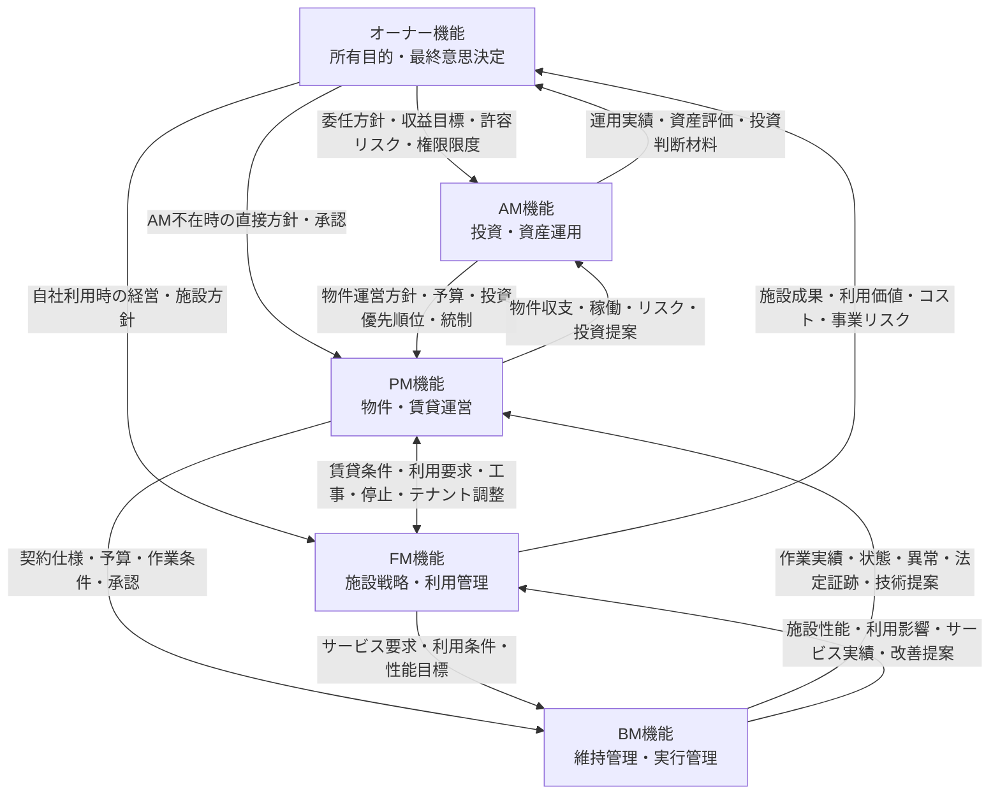

# オーナー・AM・PM・FM・BMの役割・業務レイヤー定義 v1.0

## 1. 目的

本書は、ビルメンテナンス業務に接続するオーナー、アセットマネジメント（AM）、プロパティマネジメント（PM）、ファシリティマネジメント（FM）、ビルメンテナンス（BM）を、会社の上下関係ではなく、**主目的、管理対象、意思決定範囲、計画期間が異なる業務機能**として定義する。

本書は、後続の次の分析に共通して使用する正本である。

- 役割別の業務領域と主要KPIの整理
- 起案、評価、承認、実行、報告の責任分界
- 上位業務と既存BM-01〜BM-18の接続
- 代表シナリオとGitHub Pagesへの統合

詳細な業務一覧、固定的なRACI、個別契約の法的判断は本書では確定しない。

## 2. 適用原則

### 2.1 組織ではなく機能を定義する

本書の「オーナー」「AM」「PM」「FM」「BM」は法人名、部署名、契約上の商号ではなく、案件内で担われる機能を表す。

一つの法人・部署が複数機能を兼ねる場合があり、反対に一つの機能が複数組織へ分割される場合もある。したがって、役割を特定するときは会社種別ではなく、次を確認する。

- 何を最適化する役割か
- どの管理対象について判断するか
- どの予算・契約・リスクを承認できるか
- 誰から要求を受け、誰へ結果を報告するか
- どの期間の計画を作成・更新するか

### 2.2 「業務レイヤー」は固定的な会社序列ではない

業務レイヤーは、意思決定の抽象度と管理対象の粒度を示す。オーナーは所有資産に関する最終権限を保持するが、PMとFMの関係を常に上下関係として扱わない。

- PMは主として、投資対象又は賃貸不動産の物件収支、賃貸運営、契約履行を管理する。
- FMは主として、施設を利用する組織の経営・事業要求、利用価値、施設性能を管理する。
- 賃貸ビルでは、貸主側PMとテナント側FMが契約境界を挟んで並立し得る。
- 自社利用施設では、オーナー機能とFM機能が同一組織にあり、PM機能が独立して存在しない場合がある。

### 2.3 委託と責任移転を同一視しない

業務を委託しても、次が当然に委託先へ移転するとは限らない。

- 所有者、管理者、占有者、設置者等に課される法令上の義務
- 投資、予算外支出、保有・売却等の最終決定権
- 契約に定めのない費用負担
- 重大なリスクの受容
- 管理権原を必要とする判断

個別案件では、契約書、仕様書、賃貸借契約、管理規約、権限規程、法令及び行政運用を優先する。

### 2.4 本書における記述区分

| 区分 | 意味 |
|---|---|
| 根拠定義 | リポジトリ内の既存成果又は行政機関・業界団体の公開資料で確認できる内容 |
| 標準モデル | 複数の根拠定義を接続し、本プロジェクトで共通利用するために整理した一般モデル |
| 変動事項 | 所有形態、利用形態、契約、権限規程、法令等により案件ごとに変わる内容 |

## 3. 用語定義

| 用語 | 本書における定義 | 主に最適化する対象 |
|---|---|---|
| オーナー | 建物又は不動産資産を所有し、保有目的、投資方針、予算枠、重大リスク及び最終的な資産判断を定める機能 | 所有目的、資産価値、収益、資本配分、重大リスク |
| AM | オーナー、投資家又は資産所有者から委任を受け、投資方針を資産・ポートフォリオの運用計画へ展開し、取得、保有、投資、売却及びPM統制を行う機能 | 投資成果、ポートフォリオ、資産価値、キャッシュフロー、リスク |
| PM | オーナー又はAM等から委託を受け、個別不動産の収益向上と契約履行を目的に、賃貸運営、物件収支、テナント及び委託先を統括する機能 | 個別物件の収益、稼働、賃貸運営、予算執行、契約履行 |
| FM | 企業・団体等の組織活動のため、施設とその環境を経営戦略的に企画、管理、活用し、利用価値と施設関連資源を最適化する機能 | 事業活動、利用者価値、施設性能、利用効率、総施設コスト |
| BM | 契約仕様、運用条件及び法定基準に基づき、建物・設備の運転、点検、保守、清掃、警備、修繕、記録・報告等を計画・実行・管理する機能 | 建物・設備状態、作業履行、現場品質、安全、保全実績 |

### 3.1 用語上の留意点

- オーナーは単一の自然人・法人に限らず、SPC、信託受益者、共有者等を含み得る。法的所有者、経済的受益者、最終承認者が異なる場合は別属性で管理する。
- AMは主に投資用不動産で明確に現れる機能であり、自社利用施設で常に独立して置かれるとは限らない。
- PMにはリーシング、賃貸借管理、物件収支、テナント対応、BM等の委託先統括が含まれ得るが、契約範囲は案件ごとに異なる。
- FMは単なる設備保守又は総務庶務の別名ではなく、経営・事業要求と施設の企画、利用、運営維持、評価を接続する機能である。
- BMは現場作業だけでなく、受託業務の営業、契約、立ち上げ、計画、人員、報告、請求、品質及び改善を含む。本プロジェクトでは既存BM-01〜BM-18をBM機能の正本として維持する。

## 4. 業務レイヤーの標準モデル

### 4.1 全体像



この図は要求と報告の代表的な接続を示す標準モデルであり、契約階層を固定するものではない。FMがBMを直接契約する場合、PMがFM相当の業務を兼ねる場合、AMがPMへ直接指示せずオーナー承認を経由する場合等がある。

### 4.2 レイヤーの意味

| レイヤー | 中心となる問い | 代表的な判断単位 |
|---|---|---|
| 所有・最終意思決定 | なぜ保有するか。どの価値・収益・リスクを受容するか | ポートフォリオ、資産、保有期間、資本配分 |
| 投資・資産運用 | どの資産へ、いつ、いくら投資し、どの運営方針で成果を出すか | ポートフォリオ、個別資産、年度事業計画、取得・売却・CAPEX |
| 物件・賃貸運営 | 個別物件の収益、稼働、テナント、予算及び委託先をどう管理するか | 物件、賃貸借契約、テナント、年間・月間予算 |
| 施設戦略・利用管理 | 組織活動に必要な施設、サービス、性能及び利用環境をどう実現するか | 施設群、棟、区画、利用部門、サービス水準 |
| 維持管理・実行管理 | 定められた仕様と基準を、誰が、いつ、どの手順で実施し、何を記録するか | 建物、設備、作業、要員、日次・月次・年次計画 |

## 5. 役割定義

### 5.1 役割定義表

| 役割 | 主目的 | 主な管理対象 | 主な意思決定 |
|---|---|---|---|
| オーナー | 所有目的の達成と、資産価値・収益・安全・法令・レピュテーション等の最終的なバランスを取る | 所有ポートフォリオ、資産・物件、資本、重大リスク、委任関係 | 保有・売却・建替え・用途転換、投資方針、年間予算枠、重大CAPEX、委任範囲、重大リスク受容 |
| AM | オーナー方針を投資・資産運用計画へ展開し、ポートフォリオ及び資産単位の成果を最大化する | 投資ポートフォリオ、個別資産、キャッシュフロー、資産評価、PM等の委託先 | 取得・売却案、事業計画、予算配分、投資優先順位、PM選定・評価、オーナー承認案件の起案 |
| PM | 個別不動産の収益、稼働、賃貸運営及び契約履行を統括する | 資産・物件、賃貸借契約、テナント、物件収支、BM・専門業者 | リーシング施策、賃貸条件案、物件予算執行、委託先選定・発注・検収、テナント対応、修繕提案 |
| FM | 経営・事業要求を施設要求へ変換し、施設群・利用環境・サービスを総合的に最適化する | 施設ポートフォリオ、棟・施設、区画、利用部門、サービス、施設コスト | FM戦略、施設需要、拠点・スペース方針、サービス水準、利用条件、BCP優先順位、改善・更新提案 |
| BM | 契約仕様、運用条件及び法定基準に基づき、維持管理業務を安全・確実・効率的に遂行する | 建物、設備、作業、要員、協力会社、資材、記録・証跡 | 作業計画、要員配置、手順、権限内の運転調整・一次対応、異常判定、技術的な修繕・改善提案 |

### 5.2 成果物、報告先及び計画期間

| 役割 | 主な成果物 | 主な報告先・説明先 | 主な計画期間 |
|---|---|---|---|
| オーナー | 所有・投資方針、権限規程、承認済み予算、投資判断、重大リスク判断 | 投資家、取締役会、経営層、金融機関、法的義務に応じた行政等 | 建物ライフサイクル、保有期間、中長期、年度 |
| AM | ポートフォリオ戦略、資産運用計画、年度事業計画、資金・投資配分、取得・売却・CAPEX提案、運用報告 | オーナー、投資家、運用会社の意思決定機関等 | 保有期間、中長期、年度、四半期・月次レビュー |
| PM | 物件運営計画、リーシング計画、物件予算、収支・稼働報告、テナント対応記録、委託先評価、修繕提案 | AM、オーナー、貸主側意思決定者、テナント等 | 年度、四半期、月次、日次の運営管理 |
| FM | FM戦略、中長期施設計画、施設需要・スペース計画、サービス仕様、BCP・環境計画、施設性能評価 | 経営層、事業部門、利用部門、オーナー又は施設責任者 | 建物ライフサイクル、中長期、年度、日常サービス |
| BM | 年間・月間・日次計画、作業記録、点検結果、運転日誌、事故・異常報告、法定証跡、修繕見積・技術提案 | 契約上の委託者、PM、FM、オーナー側担当者、元請け等 | 年次、月次、週次、日次、作業単位、緊急時即時 |

### 5.3 他役割との主な接続

| 役割 | 主な上流接続 | 主な下流・並列接続 |
|---|---|---|
| オーナー | 投資家、経営戦略、法令上の義務 | AMへの委任、PM・FMの直接統括、重大投資・リスク承認 |
| AM | オーナーの投資方針、収益目標、許容リスク | PMへの運営方針・予算、専門家への評価依頼、オーナーへの判断材料 |
| PM | オーナー又はAMの物件方針・予算 | FMとの利用・工事調整、BM・専門業者への仕様・発注・検収、テナント対応 |
| FM | 経営戦略、事業計画、利用部門要求 | PMとの賃貸・工事調整、BM・サービス事業者への要求、利用部門へのサービス提供 |
| BM | PM・FM・オーナー等からの契約仕様、運用条件、作業承認 | 協力会社・専門業者の統括、現場実施、状態・実績・異常・提案の報告 |

## 6. AMの位置付けと境界

### 6.1 オーナーとAMの委任関係

ARESの用語定義では、AMは投資家又は資産所有者等から委託を受け、資産のマネジメント計画、購入・売却、管理方針、PM会社の選定・管理等を行う機能として整理されている。

本書では、オーナーとAMの境界を次のように定義する。

| オーナーに留保する標準的機能 | AMへ委任し得る標準的機能 |
|---|---|
| 所有目的、最終的な投資方針、許容リスク、権限限度の設定 | 投資方針を資産運用計画・年度事業計画へ展開 |
| 取得、売却、建替え、重大CAPEX等の最終承認 | 市場・資産分析、取得・売却・投資案件の起案と評価 |
| AMの選任、評価、解任 | PM等の選定、指示、評価及び是正 |
| 委任できない又は留保した法的義務・重大リスク判断 | 予算執行管理、運用実績・リスクの監視と報告 |
| 投資家・経営層に対する最終説明責任 | オーナーが判断するための情報、選択肢及び推奨案の提示 |

**変動事項:** 実際の決裁権限、金額閾値、契約締結名義、資金移動権限、法令上の位置付けは、委任契約、運用規程、権限規程及び対象スキームにより異なる。

### 6.2 AMとPMの境界

| 観点 | AM | PM |
|---|---|---|
| 最適化単位 | ポートフォリオ及び資産価値 | 個別物件の収益・稼働・運営 |
| 主な問い | 保有方針に照らして投資すべきか。資本をどこへ配分するか | 物件をどう運営し、収益・稼働・契約品質を改善するか |
| 主要計画 | 資産運用計画、投資計画、取得・売却計画 | 物件運営計画、リーシング計画、物件予算、BM運営計画 |
| 投資案件 | 投資効果・資産価値・保有戦略から評価し、承認又はオーナーへ起案 | 劣化、テナント、運営、工期、費用等を整理して案件化・提案 |
| 委託先管理 | PMを選定・評価・統制 | BM・専門業者を選定・発注・監督・検収 |
| 報告 | オーナー・投資家へ資産運用成果を報告 | AM・オーナーへ物件運営成果を報告 |

AMとPMの境界は「計画を作る側／実行する側」だけでは区別できない。両者とも計画・評価を行うが、**AMは投資・資産運用の観点、PMは個別物件運営の観点**を中心とする。

### 6.3 単一物件管理とポートフォリオ管理

- 単一物件でも、取得・保有・投資・売却を判断するAM機能は成立し得る。
- 複数物件では、資本配分、リスク分散、物件間比較、売買優先順位等のポートフォリオ管理がAMの重要機能となる。
- PMは原則として個別物件を中心に管理するが、複数物件を束ねる統括PM又はエリア管理機能を持つ場合がある。
- 複数物件の運営統括が直ちにAMになるわけではなく、投資方針、資本配分、取得・売却判断への関与で区別する。

### 6.4 AMが存在しない場合

AM機能が独立組織として存在しない場合、次のように配置され得る。

- オーナーの資産管理部門・経営層がAM機能を直接担う。
- PMが年度事業計画や投資提案の一部を担うが、オーナーが留保した最終投資判断までは当然に移らない。
- 自社利用施設では、投資採算・資本配分を経営企画・財務・FM等が分担し、投資用不動産型のAMを置かない。

「AM会社がいない」ことと「投資・資産運用の判断が不要である」ことは同義ではない。

## 7. 投資用不動産と自社利用施設の違い

### 7.1 投資用・賃貸不動産の標準モデル

```text
オーナー／投資家
  ↓ 委任・投資方針
AM
  ↓ 物件方針・予算・統制
PM
  ↓ 契約仕様・発注・検収
BM・専門業者
```

主な評価軸は、資産価値、キャッシュフロー、収益、稼働、賃貸条件、投資回収及び売却可能性である。FMは、貸主側の施設性能・サービス企画としてPM等が兼ねる場合と、テナント企業側の利用組織機能として別に存在する場合がある。

### 7.2 自社利用施設の標準モデル

```text
経営層／所有者機能
  ↓ 経営・事業方針
FM
  ↓ 施設戦略・サービス要求・利用条件
BM・専門業者
```

主な評価軸は、事業継続性、生産性、利用者満足、施設利用率、品質、安全、環境性能及び総施設コストである。独立したPMが存在しない場合、賃貸借管理、施設予算、工事管理、委託先管理等をFM、総務、管財、不動産部門等が分担する。

### 7.3 賃借施設を利用する企業

テナント企業は建物を所有しなくてもFM機能を持つ。貸主側PMとテナント側FMは、次を接続する。

- 賃貸借契約と管理規則
- 専有部・共用部の責任範囲
- 工事、入退去、停電・断水、設備停止の調整
- 室内環境、利用時間、セキュリティ、BCP等の要求
- 不具合、苦情、改善要求及び費用負担

この場合、PMとFMは同じ階層の別機能として契約境界を調整し、どちらかが常に上位となるわけではない。

## 8. 管理対象階層との関係

### 8.1 管理対象階層

```text
投資ポートフォリオ
  └ 資産・物件
      └ 棟・施設
          └ 区画・テナント・利用部門
              └ 設備
                  └ 作業
```

### 8.2 役割別の主な対象範囲

| 管理対象 | オーナー | AM | PM | FM | BM |
|---|---|---|---|---|---|
| 投資ポートフォリオ | 所有方針・資本配分を最終決定 | 運用、比較、資本配分案 | 原則は対象外。物件情報を提供 | 自社施設群を施設ポートフォリオとして扱う場合あり | 原則は対象外。複数契約の実績を集約する場合あり |
| 資産・物件 | 保有・売却・投資を決定 | 資産運用計画と成果を管理 | 物件収支・賃貸運営を管理 | 施設価値・利用要求との整合を管理 | 契約対象物件の実行状況を管理 |
| 棟・施設 | 重大投資・リスクを承認 | 投資効果・資産影響を評価 | 建物運営・委託先を統括 | 施設性能・サービス・利用条件を統括 | 運転、点検、清掃、警備、修繕等を実施・管理 |
| 区画・テナント・利用部門 | 重要方針・例外を承認 | 収益・価値への影響を評価 | 募集、契約、入退去、窓口を管理 | スペース、利用要求、利用者サービスを管理 | 作業調整、問い合わせ、不具合対応等を実施 |
| 設備 | 重大更新を承認 | CAPEX効果・リスクを評価 | 予算化、発注、テナント影響を統括 | 性能要求、事業影響、更新優先度を評価 | 台帳、運転、点検、保守、異常、修繕履歴を管理 |
| 作業 | 原則として直接管理しない | 原則として直接管理しない | 契約、予算、品質、完了を統括 | サービス要求・利用影響を確認 | 計画、要員、手順、実施、記録、一次判定を管理 |

役割の管理対象は排他的ではない。同じ設備更新でも、オーナーは投資承認、AMは資産価値・投資効果、PMは物件運営・予算、FMは事業影響・施設性能、BMは技術状態・施工条件を扱う。

## 9. 計画期間の比較

| 計画期間 | オーナー | AM | PM | FM | BM |
|---|---|---|---|---|---|
| 建物ライフサイクル全体 | 保有目的、建替え、用途転換、出口方針 | 長期価値・出口戦略を評価 | 長期修繕・賃貸影響の情報を提供 | 施設需要、長寿命化、将来利用を計画 | 劣化・故障・保全履歴を提供 |
| 保有期間・中長期 | 資本配分、投資方針、リスクを決定 | 資産運用計画、投資・売却シナリオを管理 | 中長期修繕、リーシング、運営改善を提案 | FM戦略、拠点、スペース、BCP、環境計画を管理 | 中長期修繕に必要な技術情報を蓄積・提案 |
| 年度 | 年間方針・予算枠を承認 | 年度事業計画・投資予算を策定・管理 | 物件予算・運営計画・委託計画を策定 | 年度FM計画・サービス計画を策定 | 年間点検・清掃・訓練・保守計画を策定 |
| 月次・週次・日次 | 重大例外を判断 | 実績・リスクをモニタリング | 収支、稼働、テナント、委託先を管理 | 利用状況、サービス、工事・停止を調整 | 作業、要員、運転、異常、報告を管理 |
| 緊急時 | 重大リスク・事業継続・費用の最終判断 | 資産・ポートフォリオ影響を評価 | テナント、契約、復旧、対外連絡を統括 | 人命、事業影響、利用継続・代替策を判断 | 安全確保、停止、一次対応、速報、復旧作業を実施 |

計画期間は役割ごとに一つへ固定されない。上位役割も緊急時判断を行い、BMも中長期修繕へ情報・提案を提供する。違いは、各期間での**主たる判断目的**にある。

## 10. 要求・委託・報告関係

### 10.1 上流から下流へ流れる情報

| 接続 | 主な要求・委任内容 |
|---|---|
| オーナー → AM | 所有・投資方針、目標、許容リスク、保有期間、資本制約、権限限度 |
| オーナー → PM | AM不在時の物件方針、予算、賃貸方針、承認条件 |
| オーナー／経営層 → FM | 経営戦略、事業計画、働き方、BCP、環境・安全方針、施設コスト方針 |
| AM → PM | 資産運用計画、物件目標、予算、投資優先順位、報告要件、承認基準 |
| PM ↔ FM | 賃貸条件、施設利用要求、工事、停止、入退去、費用区分、テナント調整 |
| PM → BM | 契約仕様、予算、品質基準、作業条件、提出物、承認・エスカレーション条件 |
| FM → BM | サービス水準、利用時間、性能目標、事業影響、優先設備、利用者対応条件 |

### 10.2 下流から上流へ戻る情報

| 接続 | 主な実績・報告内容 |
|---|---|
| BM → PM | 作業実績、設備状態、不具合、法定証跡、未実施、費用、修繕・更新提案 |
| BM → FM | 施設性能、サービス実績、利用影響、事故・異常、改善提案、事業継続上の制約 |
| PM → AM | 物件収支、稼働、賃貸状況、予算差異、委託先評価、リスク、投資提案 |
| PM → オーナー | AM不在時の物件運営実績、承認依頼、重大事象、予算・契約上の判断材料 |
| FM → 経営層／オーナー | 利用者価値、施設利用、総施設コスト、BCP、環境性能、施設投資の提案 |
| AM → オーナー | ポートフォリオ・資産運用実績、資産評価、キャッシュフロー、リスク、投資・売却提案 |

### 10.3 情報伝達上の原則

- 上流役割は目的、優先順位、制約及び承認基準を明示する。
- 下流役割は実績だけでなく、状態、差異、将来リスク、選択肢及び推奨案を報告する。
- BMの技術提案をPM・FM・AM・オーナーがそれぞれ異なる目的で評価できるよう、技術状態、利用影響、費用、収益・価値影響を分けて扱う。
- 緊急時は通常の承認経路と異なるため、停止権限、速報先、暫定復旧、事後承認を事前に定義する。

## 11. 役割が独立して存在しない場合の機能配置

| 独立して存在しない役割 | 標準的な代替配置 | 移転しない又は要確認の事項 |
|---|---|---|
| オーナー | 法的所有者、受益者、共有者、経営層等へ分散しても、所有・最終判断機能自体は残る | 法令上の義務主体、最終承認者、費用負担者、リスク受容者を特定する |
| AM | オーナーの資産管理・経営企画・財務部門が直接担う。PMが分析・起案の一部を補助する場合もある | 取得・売却、資本配分、重大投資の最終判断は委任範囲を確認する |
| PM | オーナー又はAMが物件・賃貸運営を直接担う。自社利用施設ではFM・総務・管財等へ分散し得る | 賃貸運営、物件収支、テナント窓口、BM契約・検収の責任者を明示する |
| FM | 経営企画、総務、管財、不動産、各事業部門が施設要求・利用管理を分担する。PMやBMが一部サービス調整を担う場合もある | 経営・事業要求の定義、利用部門間調整、施設戦略の決定主体は利用組織側に残る |
| BM | オーナー、PM又はFMの自社要員が運転・点検・清掃等を内製する | 実行機能は消滅せず、要員、資格、手順、品質、記録、法令対応を管理する必要がある |

役割名が組織図にない場合でも、その機能を誰が担うかを確認する。機能の未配置は、判断漏れ、契約境界の空白、報告先不明、法令対応漏れにつながる。

## 12. 既存BM業務カタログの位置付け

[ビルメンテナンス業務カタログ v1.5](../building-maintenance-business-catalog.md)のBM-01〜BM-18、181業務は、本モデルの**維持管理・実行管理レイヤー**として継続利用する。

既存カタログは、BM事業者が顧客から建物管理業務を受託し、営業・提案、契約、立ち上げ、計画、実施、記録、報告、請求、品質管理及び改善を行う範囲を整理している。上位レイヤーの業務を既存181業務へ混在させず、後続Issueで次を接続する。

- 上位役割がBMへ渡す目的、要求、予算、承認条件
- BMが上位役割へ返す実績、状態、リスク、技術提案
- 上位の投資・賃貸・施設利用判断とBM-01〜BM-18の対応関係
- BM会社自身の売上・原価管理と、物件側のOPEX・CAPEX・資産評価の区別

既存BM業務IDは変更せず、上位役割の業務領域IDとの接続キーとして使用する。

## 13. 上位業務領域IDの採番規則

### 13.1 接頭辞

| 接頭辞 | 対象機能 |
|---|---|
| `OWN-xx` | オーナー機能 |
| `AM-xx` | アセットマネジメント機能 |
| `PM-xx` | プロパティマネジメント機能 |
| `FM-xx` | ファシリティマネジメント機能 |
| `BM-01`〜`BM-18` | 既存ビルメンテナンス業務領域。継続利用し、再採番しない |

### 13.2 採番ルール

1. 上位IDは役割別の**業務領域**を識別し、詳細業務、手順、成果物又は組織を識別しない。
2. 形式は半角英大文字の接頭辞、ハイフン、2桁連番とする。例示形式は `AM-xx` であり、`xx` には2桁番号を設定する。具体的な領域名と番号は#90で確定する。
3. 番号は表示順や組織階層そのものを意味しない。名称変更又は並び替えがあっても、領域の意味が同じならIDを維持する。
4. 分割・統合で廃止したIDは別領域へ再利用しない。後続成果物では旧IDと後継IDの対応を管理する。
5. 他文書からの参照、責任分界、BM接続マップ、代表シナリオでは、名称だけでなくIDを主キーとして使用する。
6. 一つの業務領域を複数役割が共同で担う場合でも、目的と責任が異なるなら役割別IDを付与し、接続関係で表現する。
7. 会社・部署・契約ごとの実担当はIDに埋め込まず、別の役割割当として管理する。

## 14. 標準モデルと変動事項

### 14.1 標準モデルとして固定する事項

- 役割は会社ではなく機能として扱う。
- オーナーは所有目的、委任範囲及び最終的な資産判断を定める。
- AMは投資・資産運用、PMは個別物件・賃貸運営、FMは施設戦略・利用管理、BMは維持管理・実行管理を主目的とする。
- PMとFMを固定的な上下関係として扱わない。
- 既存BM-01〜BM-18を維持管理・実行管理レイヤーとして維持する。
- 委託と法的義務、最終決定権、費用負担、リスク受容の移転を同一視しない。
- 上位業務領域には役割別の安定IDを付与する。

### 14.2 案件ごとに確認する変動事項

- 法的所有者、経済的受益者、最終承認者の一致・不一致
- AM、PM、FM、BMの有無、兼務、分割及び再委託
- 契約当事者、指揮命令、発注・検収、報告経路
- 予算区分、金額閾値、OPEX・CAPEX判断、費用負担
- 賃貸用、自社利用、複合用途、区分所有等の所有・利用形態
- 共用部、専有部、テナント設備、持込設備等の責任範囲
- 法令上の義務主体、選任者、実施資格、行政報告名義
- 平常時と緊急時の停止権限、暫定運用、事後承認
- 計画期間、報告周期、KPI・KRI及び要求水準

## 15. 後続Issueでの利用方法

### 15.1 #90 役割別の業務領域と主要KPI

- 本書の主目的、管理対象及び意思決定範囲を領域分割の境界として使用する。
- `OWN-xx`、`AM-xx`、`PM-xx`、`FM-xx`の具体的な業務領域IDを確定する。
- 同じ名称の業務でも、評価目的が異なる場合は役割別に区別する。

### 15.2 #91 意思決定・責任分界

- 本書の役割を、起案、技術評価、費用査定、承認、実行、報告へ展開する。
- 法的義務、費用負担、リスク受容、緊急停止権をRACIと別に扱う。

### 15.3 #92 上位業務とBM-01〜BM-18の接続

- 上位業務領域IDと既存BM領域・業務IDを安定キーとして接続する。
- 要求、委託、実績報告、異常報告、承認、改善提案等の接続種別を区別する。

### 15.4 #93 代表シナリオとPages実装

- 本書の標準モデルと変動事項を、空調設備更新、法定不適合是正、災害復旧等のシナリオで具体化する。
- Pagesでは業務レイヤーを上下の会社序列として誤読させず、投資管理系と施設利用系がBM実行業務へ接続する構造を示す。

## 16. 調査根拠

### 16.1 リポジトリ内の既存成果

| 資料 | 本書での利用 |
|---|---|
| [ビルオーナー・PM・FM・BM責任分界プロファイル](../owner-pm-fm-bm-responsibility-profiles.md) | 組織と機能の分離、責任区分、オーナー・PM・FM・BMの既存定義 |
| [ビルメンテナンス契約役割プロファイル](../contract-role-profiles.md) | 委託者、元請け、再委託先の契約階層と、統括・実施・確認・承認の区別 |
| [ビルメンテナンス法令義務プロファイル](../statutory-duty-profiles.md) | 法的義務主体、契約責任、実施者、報告名義及び費用負担の分離 |
| [ビルメンテナンス業務カタログ v1.5](../building-maintenance-business-catalog.md) | BM-01〜BM-18、181業務の維持管理・実行管理レイヤーとしての位置付け |

### 16.2 外部公開資料

| 資料 | 確認した事項 |
|---|---|
| [不動産証券化協会「アセットマネジメント」](https://www.ares.or.jp/learn/glossary/am.html) | 資産所有者等からの委託、資産運用計画、取得・売却、管理方針、PM会社の選定・管理 |
| [不動産証券化協会「プロパティマネジメント」](https://www.ares.or.jp/learn/glossary/pm.html) | 所有者・AM等からの委託、投資対象不動産の収益向上、テナント管理、建物管理、予算計画 |
| [日本ファシリティマネジメント協会「FMとは」](https://jfma.or.jp/whatsFM/index.html) | 組織活動のために施設と環境を総合的に企画・管理・活用する経営活動、戦略・業務管理・実務の各レベル |
| [国土交通省「建築物の適正な維持保全の推進について」](https://www.mlit.go.jp/notice/noticedata/sgml/100/81000117/81000117.html) | 所有者・管理者による維持保全計画、実施体制、委託、情報伝達、意思決定方法及び責任範囲の明確化 |
| [国土交通省「建築保全業務共通仕様書」](https://www.mlit.go.jp/gobuild/kijun_hozen_shiyousho.htm) | 運転・監視、点検・保守、清掃、環境測定、警備等の保全実行業務の標準範囲 |
| [厚生労働省「ビルメンテナンス業」職業能力評価基準](https://www.mhlw.go.jp/stf/newpage_09767.html) | 清掃、衛生、設備、管理サービス、保安、業務管理等から成るBM業務の多様性 |

### 16.3 根拠とモデルの区別

- 外部資料の定義をそのまま会社序列へ置き換えず、本プロジェクトの管理対象階層と既存BMカタログへ接続した部分は標準モデルである。
- 「オーナー→AM→PM→BM」は投資用不動産の代表構成であり、すべての建物に適用される固定構成ではない。
- 自社利用施設、賃借施設、複合用途、区分所有、公共施設等では、FM、PM及びオーナー機能の配置が変わる。
- 本書は一般的な業務分析モデルであり、個別案件の法的責任又は契約解釈を確定するものではない。
