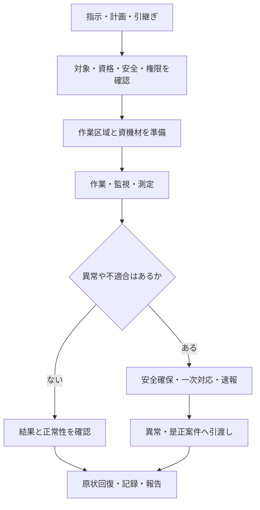

清掃、設備点検、警備では、扱う対象も技術も異なります。しかし、仕事を安全に始め、結果を次の担当へ渡すまでの基本構造には共通点があります。

:::note[このページで分かること]
現場作業がどこから始まり、異常時にどこへ分岐し、何をもって現場での仕事が終わるのかを理解できます。
:::

## 現場作業の入口と出口

この流れは、個別作業の具体的な手順ではありません。清掃なら材質と薬剤、設備なら系統と操作権限、警備なら本人確認と初動など、領域固有の条件が加わります。

## 始める前に確認すること

現場へ着いたことだけでは、作業を始められるとは限りません。少なくとも次を確認します。

| 観点 | 確認すること |
|---|---|
| 指示 | 対象、範囲、日時、品質、完了条件が明確か |
| 体制 | 必要人数、資格、責任者、連絡先となる役割が揃うか |
| 安全 | 危険源、第三者動線、停止・隔離、保護具を確認したか |
| 権限 | 操作、区域設定、作業中止、追加作業を誰が判断できるか |
| 情報 | 図面、台帳、過去記録、メーカー手順、申送りを確認したか |
| 資機材 | 工具、薬剤、部品、測定器が適合し、使用可能か |

条件が足りなければ、無理に着手せず、延期、再手配、上申などへ切り替えます。

## 作業中は「実施」と「観察」を同時に行う

現場作業では、指示された項目をこなすだけでなく、周囲の変化を観察します。例えば清掃中の漏水、設備巡回中の異臭、警備巡回中の避難経路の障害物は、当初の作業対象外でも見過ごせません。

観察結果は、次の四状態で考えると整理しやすくなります。

| 状態 | 意味 | 主な対応 |
|---|---|---|
| 正常 | 基準内で予定どおり続けられる | 記録して継続する |
| 要観察 | 直ちに危険ではないが傾向確認が必要 | 再確認時期と引継ぎ先を決める |
| 異常 | 基準外、不良、機能低下がある | 一次対応し、責任者へ報告する |
| 危険 | 人命や重大損傷、被害拡大のおそれがある | 中止、隔離、退避、緊急連絡を行う |

現場担当者が安全確保のため停止できても、設備の復旧、区域の利用再開、追加費用の承認まで決められるとは限りません。

## 現場作業の終了と案件の完了は違う

作業後は、置き忘れや仮設物を確認し、設備や什器を所定の状態へ戻し、作業区域を解除します。その後、実施範囲、時刻、担当者、測定値、写真、異常、未実施、連絡内容を記録します。

異常を発見して安全確保と速報を行った場合、現場担当者の今回作業は終了できても、異常案件は未完了です。修繕、再検査、顧客説明、利用再開などが別に続きます。

## 五つの現場領域

| 領域 | 主に維持する状態 | 次のページ |
|---|---|---|
| 清掃 | 美観、清潔、安全に利用できる状態 | [清掃管理](./cleaning/) |
| 衛生 | 空気、水、排水、害虫等の衛生状態 | [衛生管理](./hygiene/) |
| 設備運転 | 建物利用に合わせて設備が動く状態 | [設備運転管理](./equipment-operation/) |
| 点検・保守 | 劣化や異常を見つけ、機能を維持する状態 | [点検・保守管理](./inspection-and-maintenance/) |
| 警備・防災 | 人、物、建物の安全と緊急時の初動体制 | [警備・防災管理](./security-and-disaster-prevention/) |

これらを支えるのが、[人員・協力会社管理](./staffing-and-contractors/)、[資材・在庫管理](./materials-and-inventory/)、[作業結果・報告管理](./records-and-reports/)です。

## まとめ

- 現場作業は、承認済みの指示と実施条件を受け取って始まります。
- 実施中は作業対象だけでなく、周囲の異常や影響も観察します。
- 異常時は安全確保と速報を優先し、異常・是正案件へ引き渡します。
- 作業実施、記録、確認、案件解決、利用再開は別の状態です。

## さらに詳しく

- [現場作業手順をIDから調べる](./reference/field-procedures/)
- [チェックリストをIDから調べる](./reference/checklists/)
- [現場作業手順の設計原本](https://github.com/tsumasaki-kurageya/property-management-pdm/blob/main/docs/02_field-procedures/README.md)
- [業務プロセスマップ P04・P05](https://github.com/tsumasaki-kurageya/property-management-pdm/blob/main/docs/04_mappings/business-process-map.md)

最終確認日：2026年7月22日。記載状態：分析用原本に基づく標準モデル。個別作業では、物件の手順、契約、法令、メーカー情報等を確認する必要があります。
