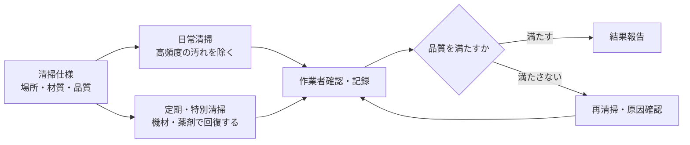

清掃管理は、汚れを取る作業だけではありません。場所の用途、床や壁の材質、利用時間に合わせて、美観、衛生、安全を維持し、品質を継続的に確認する仕事です。

:::note[このページで分かること]
日常清掃と定期・特別清掃の違い、廃棄物・消耗品・品質確認を含む清掃管理の全体像を理解できます。
:::

## 主な対象

- 玄関、廊下、階段、エレベーターホールなどの共用部
- トイレ、給湯室、洗面などの衛生区画
- 執務室、店舗、客室など契約で定めた専用部
- 床、カーペット、ガラス、外壁など材質ごとの対象
- 廃棄物、資源物、館内集積所
- トイレットペーパー、石けん等の消耗品

## 周期の異なる仕事を組み合わせる

日常清掃は、毎日または高い頻度で発生する汚れやごみを取り除きます。定期・特別清掃は、床洗浄、ワックス、カーペット洗浄、ガラス清掃など、専門機材や薬剤、利用制限を伴うことがある作業です。

## 典型的な作業

1. 当日の対象、立入条件、利用状況、注意事項を確認する。
2. 用具、薬剤、保護具を準備し、必要なら作業中表示や区域設定を行う。
3. 材質と汚れに合う方法で清掃し、什器や周囲への影響を確認する。
4. 廃棄物を分別して館内の指定場所へ運び、消耗品を補充する。
5. 汚れ残り、濡れ、破損、置き忘れ、什器の位置を確認する。
6. 実施箇所、時刻、担当者、異常、未実施理由を記録する。

館内でごみを回収することと、敷地外へ廃棄物を収集運搬することは別です。後者には廃棄物の種類、排出事業者の責任、委託契約、許可等の確認が必要です。

## 判断が必要な場面

| 場面 | 主な判断 |
|---|---|
| 材質・薬剤 | 変色、腐食、滑り等を起こさない組合せか |
| 利用者動線 | 作業区域を設定するか、時間や順序を変えるか |
| 忘れ物・破損 | 触れてよいか、現状を保全して誰へ連絡するか |
| 汚染 | 用具を分けるか、通常清掃で扱わず専門対応へ回すか |
| 品質不良 | その場で再清掃するか、方法・頻度・仕様を見直すか |
| 廃棄物 | 回収・分別の契約範囲と、許可が必要な館外運搬を区別できるか |

## 作られる記録・証跡

作業場所、実施時刻、担当者、清掃方法、消耗品補充、廃棄物量、写真、異常・破損、未実施箇所、品質確認、再清掃結果などを残します。定期清掃では、使用機材・薬剤、作業区域、開始前後の状態も重要です。

## 前後の業務

清掃仕様と計画を受けて作業し、結果は管理者の確認、顧客報告、品質管理へ渡ります。漏水や設備故障を発見した場合は清掃記録だけに残さず、[作業結果・報告管理](./records-and-reports/)から異常対応へ速報します。

## 建物や管理方式による違い

病院、食品施設、ホテル、商業施設、オフィスでは、清潔・汚染区域、利用者への配慮、営業時間、品質基準が異なります。巡回型や時間限定配置では、訪問間の汚れや消耗品切れを誰が検知し、臨時対応を判断するかを定めます。

## 関連する業務IDと詳細資料

- 主な業務ID：BM-06-01〜11、BM-15-02〜05、BM-17-02
- [清掃の現場作業手順](https://github.com/tsumasaki-kurageya/property-management-pdm/tree/main/docs/02_field-procedures/01_cleaning)
- [清掃チェックリスト](https://github.com/tsumasaki-kurageya/property-management-pdm/tree/main/docs/03_checklists/01_cleaning)
- [業務カタログ BM-06](https://github.com/tsumasaki-kurageya/property-management-pdm/blob/main/docs/building-maintenance-business-catalog.md#bm-06-清掃管理)

最終確認日：2026年7月22日。記載状態：標準モデル。具体的な方法と品質基準は、建物用途、契約仕様、材質、利用状況等に依存します。
