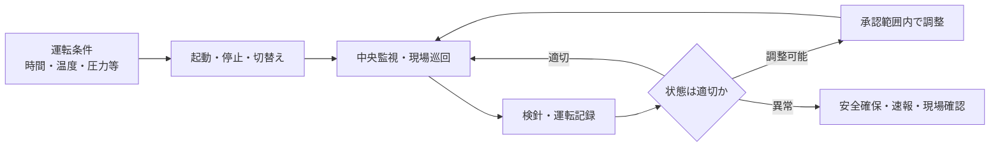

設備運転管理は、空調、電気、給排水などの設備を、建物の利用状況に合わせて動かし続ける仕事です。設備が動いているかだけでなく、安全、快適性、使用量、異常の兆候を監視します。

:::note[このページで分かること]
監視、巡回、検針、操作、運転調整がどのように連携し、警報から異常対応へ分岐するかを理解できます。
:::

## 主な対象

- 受変電、非常電源、照明などの電気設備
- 熱源、空調機、換気、中央監視などの空調設備
- 給水、排水、ポンプ、貯水槽などの給排水設備
- エレベーター、防災設備等との連携状態
- 電気、水道、ガス、熱量等の使用量

## 運転は監視と調整の循環

中央監視装置は広い範囲を継続確認できますが、通信断、センサー対象外、設定不良があります。異音、異臭、漏れ、振動など現場でしか分からない兆候があるため、遠隔監視と現場巡回は役割が異なります。

## 典型的な作業

1. 当日の利用時間、天候、イベント、停止作業、申送りを確認する。
2. 承認済みの条件に従って設備を起動、停止、切り替える。
3. 中央監視装置の状態、警報、計測値を確認する。
4. 機械室、電気室、屋上等を巡回し、五感と計器で状態を見る。
5. 電気、水道、ガス、温度、圧力、電流等を読み取り記録する。
6. 利用状況や外気条件に応じて、許可された範囲で設定を調整する。
7. 警報や異常値があれば、影響を確認し、安全確保と速報を行う。

## 判断が必要な場面

| 場面 | 主な判断 |
|---|---|
| 警報 | 誤報・一過性か、現場確認や停止が必要か |
| 設定変更 | 現場裁量の範囲か、運用変更の承認が必要か |
| 異常値 | 測定誤差、負荷変動、劣化・故障のどれか |
| 停止 | 影響範囲、代替手段、安全性、利用者周知が揃うか |
| 復帰 | 原因と正常性を確認したか、利用再開の判断者は誰か |

緊急停止の権限と復旧・利用再開の権限は分けます。安全確保のため停止できても、原因未確認のまま元へ戻してよいとは限りません。

## 作られる記録・証跡

運転時間、設定値、測定値、警報、操作履歴、巡回結果、検針値、異音・異臭・漏れ、調整理由、連絡、未復旧事項を運転日誌等へ残します。値だけでなく、時刻、測定点、単位、運転条件が必要です。

## 前後の業務

運転計画、シフト、引継ぎを受けて開始し、記録は[作業結果・報告管理](./records-and-reports/)とエネルギー分析へ渡ります。異常は修繕・復旧へ、劣化の兆候は[点検・保守管理](./inspection-and-maintenance/)へ接続します。

## 建物や管理方式による違い

24時間利用、病院、データセンター、ホテルなどでは停止影響と冗長性が大きく異なります。常駐管理は現場確認へ移りやすく、巡回・遠隔管理は受信、一次判定、出動、入館、現地確認を分けて設計します。

## 関連する業務IDと詳細資料

- 主な業務ID：BM-08-01〜09、BM-05-10、BM-13-11
- [設備の現場作業手順](https://github.com/tsumasaki-kurageya/property-management-pdm/tree/main/docs/02_field-procedures/02_equipment)
- [設備チェックリスト](https://github.com/tsumasaki-kurageya/property-management-pdm/tree/main/docs/03_checklists/02_equipment)
- [業務カタログ BM-08](https://github.com/tsumasaki-kurageya/property-management-pdm/blob/main/docs/building-maintenance-business-catalog.md#bm-08-設備運転管理)

最終確認日：2026年7月22日。記載状態：標準モデル。具体的な操作は設備、保安規程、メーカー手順、資格・権限に依存します。
