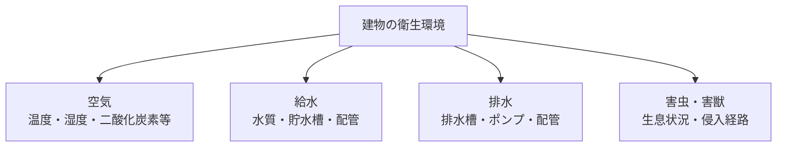

衛生管理は、建物を利用する人が健康的に過ごせる環境を維持する仕事です。空気、水、排水、害虫・害獣など、目に見えにくい状態を測定、点検、清掃し、基準からの逸脱を見つけます。

:::note[このページで分かること]
衛生管理の対象、測定・点検・清掃・防除の違いと、基準逸脱時のつなぎ方を理解できます。
:::

## 主な対象

空調設備そのものを動かす仕事は設備運転管理ですが、その結果として室内空気環境が適切かを測る仕事は衛生管理です。同じ設備や測定値を扱っても、目的と判断基準が異なります。

## 典型的な作業

1. 建物用途、規模、対象区域、適用される基準、測定周期を確認する。
2. 測定地点、時刻、条件、使用機器を決める。
3. 空気環境や水質を測定し、給排水・空調衛生設備を点検する。
4. 必要な周期で貯水槽・排水槽を清掃し、害虫・害獣の生息状況を調査する。
5. 基準値、前回値、利用者からの申告と照合し、正常・要観察・異常を判定する。
6. 是正内容、再測定、報告、帳簿保存まで追跡する。

## 判断が必要な場面

| 場面 | 主な判断 |
|---|---|
| 適用条件 | 建物がどの法令・基準の対象になるか |
| 測定条件 | 地点、時刻、機器、利用状況が比較可能か |
| 基準逸脱 | 再測定で確認するか、直ちに設備調整・利用制限へつなぐか |
| 清掃・防除 | 停止、断水、薬剤使用、立入制限、専門業者の手配が必要か |
| 責任 | 実施者、建築物環境衛生管理技術者、所有者等の役割を区別できるか |

法定対象では、測定作業を実施しただけで完了とは限りません。対象・資格・周期を満たし、義務主体が結果を確認し、必要な届出や帳簿保存を行うところまで管理します。

## 作られる記録・証跡

対象区域、測定地点、日時、測定条件、使用機器、測定値、判定、設備状態、清掃・防除内容、異常、是正、再測定結果、報告先、帳簿保存を記録します。計測器の校正状態も結果の信頼性に関わります。

## 前後の業務

年間計画、法定周期、利用者の申告等を受けて実施します。空気や水の異常は、[設備運転管理](./equipment-operation/)による設定調整、[点検・保守管理](./inspection-and-maintenance/)による設備確認、異常・修繕、顧客周知へつながります。

## 建物や管理方式による違い

病院、宿泊施設、学校、商業施設などでは、対象設備、利用者、停止影響、要求水準が異なります。常駐管理では変化を継続観察しやすい一方、巡回管理では訪問間の異常を誰が通報し、いつ臨時訪問するかを決める必要があります。

## 関連する業務IDと詳細資料

- 主な業務ID：BM-07-01〜11、BM-09、BM-13、BM-17-08〜10
- [法令義務プロファイル](https://github.com/tsumasaki-kurageya/property-management-pdm/blob/main/docs/statutory-duty-profiles.md)
- [業務カタログ BM-07](https://github.com/tsumasaki-kurageya/property-management-pdm/blob/main/docs/building-maintenance-business-catalog.md#bm-07-衛生管理)

最終確認日：2026年7月22日。記載状態：標準モデル。法令適用、項目、周期、資格、保存期間は建物条件や法改正等により変わるため、個別確認が必要です。
