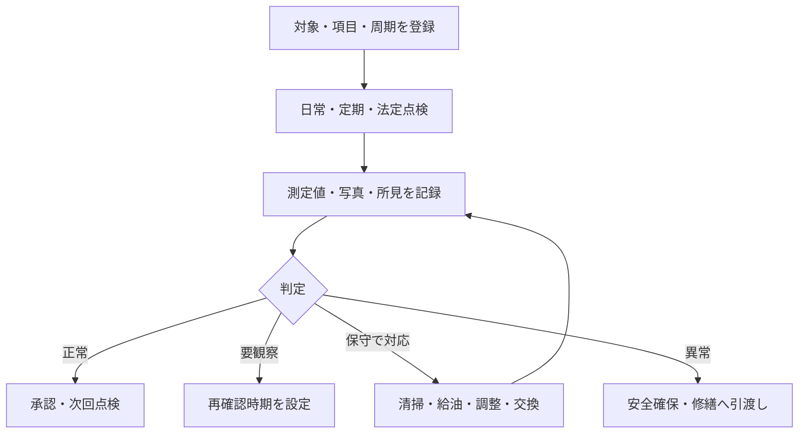

点検・保守管理は、設備や建物部位の状態を確かめ、劣化や故障の兆候を見つけ、機能を維持する仕事です。「点検した」「保守した」「修繕した」は同じ意味ではありません。

:::note[このページで分かること]
日常点検、定期点検、法定点検、保守、修繕の違いと、異常発見後の流れを理解できます。
:::

## 似ている仕事を区別する

| 仕事 | 主な目的 | 代表例 |
|---|---|---|
| 日常点検 | 日々の変化や明らかな異常を早く見つける | 外観、音、漏れ、計器値の確認 |
| 定期点検 | 定めた周期で状態・機能を詳しく確認する | 月次、半年、年次の機能確認 |
| 法定点検 | 法令の適用条件、資格、周期、報告等を満たす | 消防用設備等点検、定期報告等 |
| 保守 | 性能や状態を維持する | 清掃、給油、調整、消耗品交換 |
| 修繕 | 発生した不具合・損傷を回復する | 故障部品交換、漏水箇所補修 |

## 点検結果は次の仕事を決める

点検は「チェック欄を埋めること」ではなく、観察・測定した状態から次の行動を決める仕事です。判定基準、過去値、設備の重要度、停止影響を併せて見ます。

## 典型的な作業

1. 設備台帳から対象、点検項目、周期、前回結果、履歴を確認する。
2. 資格、停止、立会い、安全措置、測定器を準備する。
3. 外観、動作、計測値、保護機能等を確認する。
4. 必要な清掃、給油、調整、消耗品交換を許可範囲内で行う。
5. 正常、要観察、異常、危険を判定し、写真や数値を残す。
6. 管理者または有資格者が結果を確認し、次回、是正、修繕を決める。
7. 未実施や期限超過があれば、理由と再計画を管理する。

## 判断が必要な場面

| 場面 | 主な判断 |
|---|---|
| 適用 | 点検対象、法令、契約、メーカー基準のどれが適用されるか |
| 判定 | 基準値内でも過去傾向から要観察とすべきか |
| 保守範囲 | その場の調整・交換でよいか、修繕承認が必要か |
| 停止 | 点検のために設備・区域を止められる条件が揃うか |
| 未実施 | 延期可能か、法定期限や安全上の問題があるか |

法定点検は、ビルメンテナンス会社がすべての法的義務を負うとは限りません。所有者・管理者等の義務主体、資格を持つ実施者、手配・進捗・証跡を管理する受託者を区別します。

## 作られる記録・証跡

設備・部位、点検項目、日時、実施者・資格、測定値、単位、判定、写真、保守内容、使用部品、異常、未実施理由、承認、次回期限を残します。法定対象では所定様式、行政報告、保存期間も管理します。

## 前後の業務

設備台帳、年間計画、作業指示を受けて実施します。結果は承認、設備履歴、顧客報告へ渡り、異常は不具合・修繕・復旧へ接続します。保守部品は[資材・在庫管理](./materials-and-inventory/)と連携します。

## 建物や管理方式による違い

設備の重要度、用途、冗長性、停止可能時間によって点検方法が変わります。巡回管理では訪問周期で必要な点検頻度を満たせるか、緊急出動で予定作業が抜けた場合にどう再計画するかが重要です。

## 関連する業務IDと詳細資料

- 主な業務ID：BM-09-01〜10、BM-10、BM-14、BM-17-08〜10
- [設備の現場作業手順](https://github.com/tsumasaki-kurageya/property-management-pdm/tree/main/docs/02_field-procedures/02_equipment)
- [法令義務プロファイル](https://github.com/tsumasaki-kurageya/property-management-pdm/blob/main/docs/statutory-duty-profiles.md)
- [業務カタログ BM-09](https://github.com/tsumasaki-kurageya/property-management-pdm/blob/main/docs/building-maintenance-business-catalog.md#bm-09-点検保守管理)

最終確認日：2026年7月22日。記載状態：標準モデル。法定業務の対象・資格・周期・報告先は個別条件に応じて確認が必要です。
