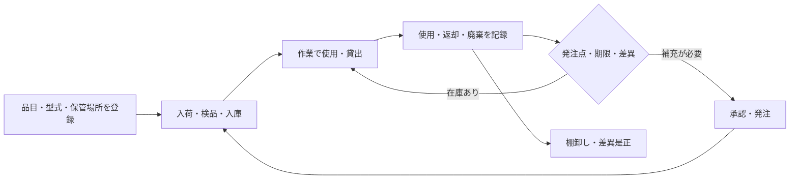

資材・在庫管理は、清掃用消耗品、設備部品、工具、計測器を、必要な時に正しく使える状態へ保つ仕事です。数量があるだけでなく、型式、品質、保管、使用期限、校正、所在まで確認します。

:::note[このページで分かること]
登録、入出庫、発注、検品、棚卸しの循環と、工具・計測器を別に管理する理由を理解できます。
:::

## 主な対象

- 清掃用具、薬剤、衛生消耗品
- フィルター、ベルト、ランプ、パッキン等の交換部品
- 保護具、養生材、表示用品
- 工具、測定器、貸出品
- 倉庫、現場保管庫、車両等の保管場所
- 仕入先、単価、納期、対応設備

## 在庫は使用実績と調達をつなぐ

## 典型的な業務

1. 品名、型式、単位、対応設備、仕入先、保管条件を登録する。
2. 入荷品の数量、型式、破損、期限等を検品して入庫する。
3. 作業への払出し、使用、返却、廃棄を記録する。
4. 発注点、予定作業、緊急予備品、納期から補充時期を判断する。
5. 工具・測定器の貸出、返却、所在、損傷を管理する。
6. 計測器の校正期限と使用可否を管理する。
7. 棚卸しで帳簿数量と実在庫を照合し、差異原因を確認する。

## 判断が必要な場面

| 場面 | 主な判断 |
|---|---|
| 互換性 | 型式、材質、性能が対象設備・作業に適合するか |
| 発注 | 通常補充か、緊急調達か、契約・予算承認が必要か |
| 代替品 | 安全性、品質、保証への影響を誰が承認するか |
| 計測器 | 校正期限内で、測定範囲・精度が適切か |
| 差異 | 記録漏れ、紛失、破損、廃棄のどれか |

在庫不足は作業延期につながりますが、未承認の代替部品や期限切れ計測器で実施する理由にはなりません。安全や品質に関わる場合は、作業計画の変更として上申します。

## 作られる記録・証跡

品目台帳、在庫数、保管場所、ロット・期限、入出庫、使用作業、発注、納期、検品、貸出・返却、校正、棚卸し差異を記録します。高額品や安全に関わる品目は、承認と使用履歴の追跡性が重要です。

## 前後の業務

作業計画と点検・清掃の使用実績から需要を受け取り、必要な資材・工具を各現場作業へ渡します。購入実績は仕入れ・原価管理へ、欠品や不適合品は再計画・品質是正へ接続します。

## 建物や管理方式による違い

常駐管理では現場倉庫を持つ場合があります。巡回管理では複数物件の共通倉庫、車載品、訪問前の積込み、緊急部品の配送を管理します。設備の重要度、調達期間、代替運転の有無で予備品水準が変わります。

## 関連する業務IDと詳細資料

- 主な業務ID：BM-15-01〜09、BM-06-07、BM-09-07〜08、BM-16-03〜04
- [業務カタログ BM-15](https://github.com/tsumasaki-kurageya/property-management-pdm/blob/main/docs/building-maintenance-business-catalog.md#bm-15-資材在庫購買管理)
- [業務プロセスマップ](https://github.com/tsumasaki-kurageya/property-management-pdm/blob/main/docs/04_mappings/business-process-map.md)

最終確認日：2026年7月22日。記載状態：標準モデル。適正在庫、承認額、調達方法、保管条件は契約・物件・品目に依存します。
