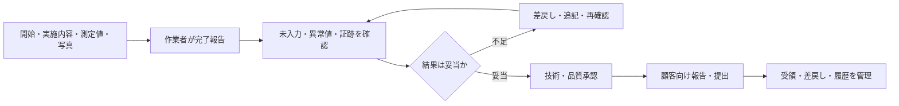

作業結果・報告管理は、現場で起きたことを後から確認できる情報へ変え、管理者、顧客、次の担当へ渡す仕事です。作業者が「終わりました」と伝えるだけでは、品質確認や契約上の報告は完了しません。

:::note[このページで分かること]
作業記録、技術・品質確認、承認、顧客報告、履歴保存の違いと、異常速報を定期報告から分ける理由を理解できます。
:::

## 現場の事実を次の判断へ渡す

異常を認知した場合は、この順序で定期報告書が完成するのを待ちません。確認済みの事実、影響、緊急度、残留リスク、必要な判断を速報し、対応責任者へ引き渡します。

## 主な対象

- 作業開始・終了、実施項目、測定値、使用部品
- 作業前後や異常箇所の写真・動画
- 未実施、異常、一次対応、要観察事項
- 日報、週報、月報、年次報告書
- 顧客への提出、受領、承認、差戻し
- 作業・点検・故障・修繕等の履歴

## 典型的な業務

1. 作業者が対象、時刻、内容、結果、異常、証跡を記録する。
2. 管理者が未入力、異常値、写真不足、未実施を確認する。
3. 領域固有の技術・品質基準に照らして承認または差し戻す。
4. 顧客指定の粒度・様式へ編集し、定期報告書を作成する。
5. 顧客へ提出し、受領、承認、差戻しを追跡する。
6. 設備・作業履歴や法令上必要な証跡を所定の場所・期間で保存する。

## 判断が必要な場面

| 場面 | 主な判断 |
|---|---|
| 記録不足 | 追記でよいか、現場再確認・再作業が必要か |
| 異常値 | 入力誤りか、設備・環境の異常か |
| 承認 | 記録形式だけでなく、技術・品質上妥当か |
| 速報 | 定期報告を待たず誰へ、どの事実を伝えるか |
| 顧客報告 | 契約範囲、個人情報、機密、未確定情報をどう扱うか |
| 保存 | どの台帳・案件へ関連付け、いつまで保持するか |

作業者、確認者、承認者、顧客の検収者は同じとは限りません。また、報告書提出済みでも、顧客受領、差戻し対応、請求条件の成立は別に追跡します。

## 作られる記録・証跡

物件、棟、階、区画、設備、作業指示、手順版、実施者・確認者、開始・終了、測定値、単位、写真、判定、異常、連絡、残作業、承認、提出・受領を記録します。速報では発信時刻だけでなく、受領者、指示、対応担当、次の行動と期限を残します。

## 前後の業務

清掃、衛生、設備、警備等の結果を受け取り、顧客報告、建物・設備台帳、請求・原価、品質・改善へ渡します。異常・不適合は通常の報告経路から分岐し、修繕・是正案件として完了まで追跡します。

## 建物や管理方式による違い

顧客指定様式、提出周期、検収条件、保存期間は契約や法令で異なります。常駐管理では口頭・内線の依頼も記録へ残し、巡回管理では未確認箇所、訪問間の要観察、次回までの残作業を明確にします。

## 関連する業務IDと詳細資料

- 主な業務ID：BM-13-01〜11、BM-14-07〜10、BM-17-09
- [業務プロセスマップ P05](https://github.com/tsumasaki-kurageya/property-management-pdm/blob/main/docs/04_mappings/business-process-map.md#9-p05-結果確認報告)
- [重要業務分析](https://github.com/tsumasaki-kurageya/property-management-pdm/blob/main/docs/04_mappings/critical-business-analysis.md)
- [共通の完了報告手順](https://github.com/tsumasaki-kurageya/property-management-pdm/blob/main/docs/02_field-procedures/00_common/PROC-COM-005_completion-reporting.md)
- [業務カタログ BM-13](https://github.com/tsumasaki-kurageya/property-management-pdm/blob/main/docs/building-maintenance-business-catalog.md#bm-13-作業結果報告管理)

最終確認日：2026年7月22日。記載状態：標準モデル。承認、提出、保存の条件は契約・法令・顧客指定に依存します。
