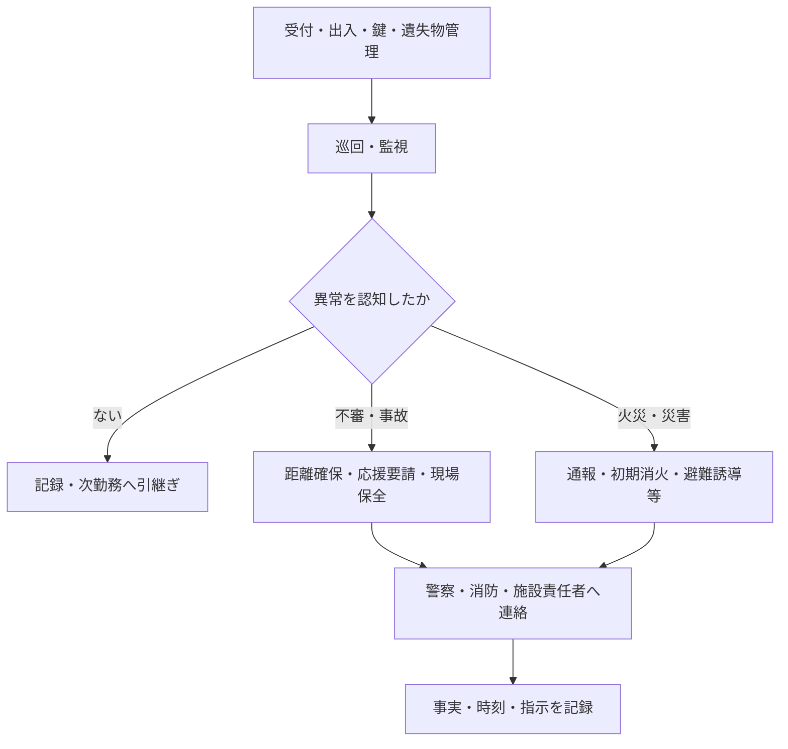

警備・防災管理は、建物を利用する人、物、施設の安全を守る仕事です。平常時の受付、出入、鍵、巡回、監視、遺失物管理を続けながら、警報、事故・事件・災害時には緊急駆付け、安全確保、通報・避難などの初動へ切り替えます。

:::note[このページで分かること]
平常時の警備と緊急時対応のつながり、警備員が判断できる範囲、記録と引継ぎの重要性を理解できます。
:::

## 主な対象

- 来館者、従業員、作業業者、搬入・搬出物、車両の出入
- 鍵、入館証、アクセスカード、警備装備
- 遺失物・拾得物の受領、保管、返還、届出・提出
- 建物内外、重要区画、施錠、火気、避難経路
- 監視カメラ、防犯・火災等の警報設備
- 不審者、不審物、盗難、負傷者、設備事故
- 火災、地震、風水害等の災害と防災訓練

## 平常時から緊急時へ切り替わる

実際の初動は警備計画、消防計画、教育内容、現場状況に従います。身体安全を優先し、単独で危険へ接近することを前提にしません。

## 典型的な作業

1. 勤務開始時に継続案件、警戒事項、鍵、装備を前任者と照合する。
2. 人、物品、車両の対象、目的、許可権限及び出入条件を確認して記録する。
3. 鍵やカードの貸出・返却を管理し、未返却・紛失へ対応する。
4. 計画した経路を巡回し、施錠、火気、障害物、異常を確認する。
5. カメラや警報を監視し、必要に応じて緊急駆付け、現場確認や連絡を行う。
6. 遺失申告・拾得物を受け付け、保管、照会、返還、届出・提出等の状態を管理する。
7. 事故・事件・災害時に、安全確保、通報、応援要請、避難誘導等を行う。
8. 事実、時刻、場所、人物、連絡、指示、継続事項を記録し引き継ぐ。

## 判断が必要な場面

| 場面 | 主な判断 |
|---|---|
| 本人・権限確認 | 入館・鍵貸出を認められる根拠が揃うか |
| 物品・車両 | 搬出入の許可、対象、数量、運転者、車番、経路等が一致するか |
| 警報 | 映像・現場確認が必要か、先に通報すべきか |
| 緊急駆付け | 出動が必要か、単独進入できるか、到着前に警察・消防等へ要請するか |
| 遺失物・拾得物 | 安全に受領できるか、誰が保管・返還・届出・提出を判断するか |
| 不審者・不審物 | 接近せず区域を確保し、誰へ応援要請するか |
| 負傷者・事故 | 救命・二次災害防止・現場保全をどう両立するか |
| 災害 | 通常の指揮・通信・出動が機能しない場合に何を優先するか |

実力行使、所持品確認、個人情報、映像の取扱いは、法令、契約、警備計画、教育内容に従います。受付担当や設備担当が警備業務の一部を支援する場合も、権限を同一視しません。

## 作られる記録・証跡

人・物品・車両の出入、鍵・カード貸出、遺失物・拾得物、巡回経路と時刻、監視結果、警報、出動・到着、事故・災害、人物・場所・発言、映像識別情報、通報・連絡、指示、引継ぎを記録します。推測と確認済み事実を分けることが重要です。

## 前後の業務

警備計画、シフト、消防計画、勤務引継ぎを受けて開始します。異常時は安全確保と速報を行い、施設責任者、警察・消防、異常・修繕対応へ接続します。勤務終了時は未解決事項と責任を次勤務へ渡します。

## 建物や管理方式による違い

有人警備、機械警備、巡回警備は別の方式です。常駐警備は現場確認や避難誘導へ移りやすい一方、機械・巡回警備では警報受信、映像確認、通報、出動条件、到着までの現地対応を明確にします。災害時には道路・通信の途絶も考慮します。

## 関連する業務IDと詳細資料

- 主な業務ID：BM-11-01〜12、BM-05-10、BM-13-11、BM-17
- [警備の現場作業手順](https://github.com/tsumasaki-kurageya/property-management-pdm/tree/main/docs/02_field-procedures/03_security)
- [警備チェックリスト](https://github.com/tsumasaki-kurageya/property-management-pdm/tree/main/docs/03_checklists/03_security)
- [業務カタログ BM-11](https://github.com/tsumasaki-kurageya/property-management-pdm/blob/main/docs/building-maintenance-business-catalog.md#bm-11-警備防災管理)

最終確認日：2026年7月22日。記載状態：標準モデル。具体的な初動と権限は、警備・消防計画、契約、法令、教育内容に依存します。
