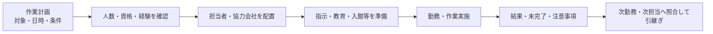

現場作業は、作業予定だけでは実施できません。必要な人数、資格、経験、勤務時間を満たす人を配置し、協力会社を含む指揮・連絡・引継ぎを成立させる必要があります。

:::note[このページで分かること]
人員配置と協力会社管理の目的、資格・教育・引継ぎが現場品質と安全にどう関わるかを理解できます。
:::

## 主な対象

- 作業員の所属、連絡先、勤務可能場所
- 保有資格と有効期限、技能、経験
- 常駐、巡回、夜間、休日のシフト
- 法定教育、安全教育、現場教育
- 協力会社の対応業務、資格、契約、地域、実績
- 欠員、交代、担当変更、緊急時の代替体制

## 計画を実行可能な体制へ変える

担当者名を割り当てただけでは不十分です。資格期限、単独作業の可否、立会い、移動時間、休憩、同時作業、緊急対応との競合などを確認します。

## 典型的な業務

1. 作業に必要な人数、資格、技能、時間帯、立会い条件を整理する。
2. 社員と協力会社の情報、勤務可能枠、契約範囲を照合する。
3. シフトと担当を決め、指揮命令、報告経路、緊急連絡体制を伝える。
4. 必要な教育、入館申請、鍵・装備、資料を準備する。
5. 欠員、遅延、緊急出動があれば代替配置または作業再計画を行う。
6. 勤務交代・担当変更時に、状態、継続案件、物品、権限、次の行動を照合する。
7. 協力会社の品質、納期、安全、報告等を評価し、次の選定へ反映する。

## 判断が必要な場面

| 場面 | 主な判断 |
|---|---|
| 資格 | 法令・契約・社内基準上、誰が何を実施・確認できるか |
| 欠員 | 代替配置、範囲縮小、延期のどれが安全か |
| 再委託 | 委託可能な範囲か、元請けの指示・検収責任は何か |
| 引継ぎ | 受領者が理解し、責任移管を受けられる状態か |
| 評価 | 個人の印象ではなく、品質・安全・納期・証跡で判断できるか |

情報を送っただけでは引継ぎ成立とは限りません。受領者が内容を照合し、未解決事項の担当、期限、上申条件を受け取ったことを記録します。

## 作られる記録・証跡

人員・資格・教育台帳、シフト、担当表、入退勤、協力会社台帳、委託・発注情報、作業指示、引継ぎ記録、欠員対応、評価結果などを残します。資格や教育には有効期限と適用業務の対応が必要です。

## 前後の業務

契約仕様、年間・月間計画、作業条件を受けて体制を整え、各現場領域へ人員を渡します。作業結果、事故、品質、原価は人員配置や協力会社評価へ戻ります。

## 建物や管理方式による違い

常駐管理では物件内の人数、交代、休憩、欠員補充が中心です。巡回管理では担当エリア、移動時間、訪問枠、車両、携行品、鍵、複数物件の優先順位が加わります。時間外は監視センターやオンコール、協力会社へ切り替わる場合があります。

## 関連する業務IDと詳細資料

- 主な業務ID：BM-05-01〜10、BM-04-05〜08、BM-17-05〜07
- [重要業務分析：勤務・担当引継ぎ](https://github.com/tsumasaki-kurageya/property-management-pdm/blob/main/docs/04_mappings/critical-business-analysis.md)
- [契約役割プロファイル](https://github.com/tsumasaki-kurageya/property-management-pdm/blob/main/docs/contract-role-profiles.md)
- [業務カタログ BM-05](https://github.com/tsumasaki-kurageya/property-management-pdm/blob/main/docs/building-maintenance-business-catalog.md#bm-05-人員協力会社管理)

最終確認日：2026年7月22日。記載状態：標準モデル。雇用、警備業務の指揮命令、再委託、資格等の具体条件は個別確認が必要です。
