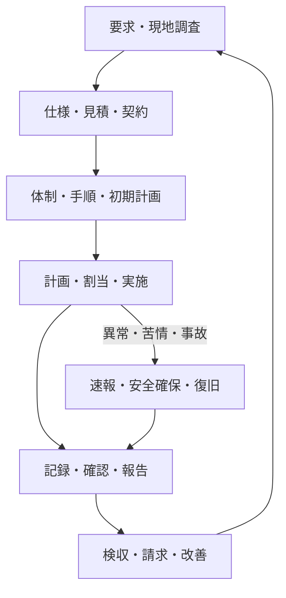

現場で清掃、点検、設備操作などを行うためには、その前に仕事の範囲、責任、体制、予定を決める必要があります。実施後にも、結果の確認、顧客報告、請求、改善が続きます。異常や苦情が起きたときは、通常の流れから分岐して、安全確保や復旧を優先します。

:::note[この章で分かること]
現場作業を成立させる管理業務と、予定どおり進まない場合の例外処理を、契約前から案件完了までの流れで理解できます。
:::

## 現場作業の外側にも仕事がある

### 図の読み方

要求と現地条件を仕様・見積・契約へ変え、体制と初期計画を整えてから、個別作業を計画・割当します。実施結果は記録、確認、報告、検収、請求へ進み、改善結果が次の要求・仕様へ戻ります。異常・苦情・事故があれば、通常の締め処理を待たずに速報、安全確保、復旧へ分岐し、収束後に記録・報告の流れへ合流します。

図の根拠：P01〜P12、特にBM-01〜04、BM-13、BM-16〜18。主な成果物は調査結果、契約仕様、管理体制、作業計画、作業記録、承認・報告、検収・請求、改善案です。

前工程で曖昧さを残すと、後工程で「契約に含まれるか」「誰が判断するか」「何をもって完了か」が分からなくなります。反対に、記録や原価などの実績は、次の計画や契約更新へ戻されます。

## この章の読み方

| 段階 | 確認する問い | ページ |
|---|---|---|
| 仕事を定める | 何を、どの条件で受託するのか | [営業・現地調査・業務仕様・見積](./operations/pre-contract-and-specification/) |
| 境界を決める | 誰が何を行い、判断し、受け取るのか | [契約と責任分界](./operations/contracts-and-responsibilities/) |
| 開始可能にする | 運用開始までに何を揃えるのか | [管理体制の構築と業務立ち上げ](./operations/startup/) |
| 実施を統制する | 予定変更や未実施をどう扱うのか | [計画・割当・変更・未実施管理](./operations/planning-and-unperformed-work/) |
| 結果を渡す | 記録を誰が確認し、何を報告するのか | [作業記録の確認・承認・月次報告](./operations/records-approval-and-reporting/) |
| お金を確定する | 追加作業をどう検収・請求するのか | [追加作業・検収・請求・原価管理](./operations/additional-work-billing-and-costs/) |
| 異常を収束させる | 発見から復旧・利用再開までどう進むのか | [点検異常から修繕・引渡しまで](./incidents/abnormality-to-restoration/) |
| 人と組織へ応答する | 苦情、事故、災害で何が変わるのか | [苦情・要望・事故・災害への対応](./incidents/complaints-accidents-and-disasters/) |

## 通常系と例外系を同時に管理する

管理業務は、予定どおり終わった仕事だけを扱うものではありません。次のような状態を見つけ、後続の責任者と期限を決めることも重要です。

- 必要な図面や資格者が揃わず、開始できない
- 天候や入館制約によって作業を延期した
- 記録不足や品質不良によって結果を差し戻した
- 点検で異常が見つかり、修繕へ分岐した
- 契約外の追加作業となり、費用承認が必要になった
- 技術的には復旧したが、区域をまだ利用再開できない

「未完了であること」自体より、未完了が見えず、担当・期限・暫定措置が決まっていない状態が問題になります。

## まとめ

- 契約、立ち上げ、計画、報告、請求は、現場作業を成立させる一連の業務です。
- 差戻し、未実施、異常などの例外は、担当・期限・次の行動を持つ管理状態へ移します。
- 作業実施、技術確認、契約上の検収、請求、施設利用再開は別々に確認します。

## さらに詳しく

- [ビルメンテナンス業務プロセスマップ](https://github.com/tsumasaki-kurageya/property-management-pdm/blob/main/docs/04_mappings/business-process-map.md)
- [重要業務分析](https://github.com/tsumasaki-kurageya/property-management-pdm/blob/main/docs/04_mappings/critical-business-analysis.md)

最終確認日：2026年7月22日。記載状態：分析用原本に基づく標準モデル。実際の順序、分担、承認条件は契約・物件・管理方式によって変わります。
