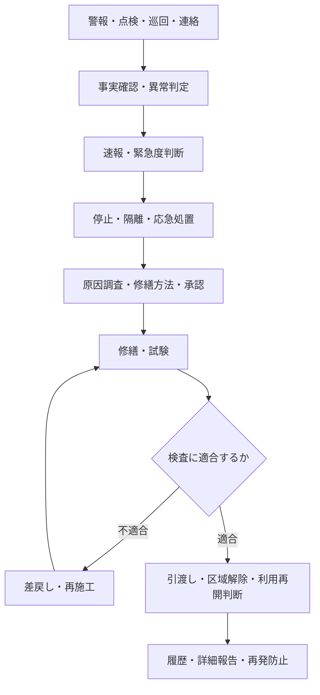
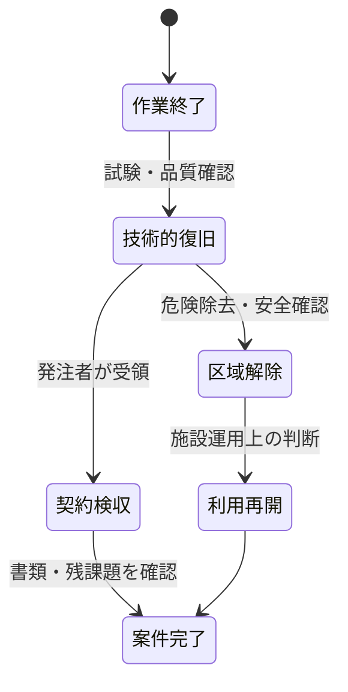

異常は、点検だけでなく、警報、巡回、顧客・利用者からの連絡、事故などから見つかります。認知後は、原因を完全に特定することより先に、人命・安全、被害拡大、建物利用への影響を判断し、必要な初動を始めます。

:::note[このページで分かること]
異常の判定、速報、緊急度判断、安全確保、原因調査、修繕、完了検査と引渡しを、誰の判断でどの状態へ進めるか理解できます。
:::

## 異常から利用再開まで

### 図の読み方

警報・点検・巡回・連絡から異常を認知したら、原因の完全特定を待たず、事実確認、緊急度判断、速報、安全確保を進めます。原因調査と承認後に修繕・試験を行い、不適合なら再施工へ戻します。適合後も、技術的復旧、区域解除、契約上の引渡し、施設の利用再開をそれぞれ判断し、最後に履歴と再発防止へつなげます。

図の根拠：P06、BM-08-07、BM-09-06、BM-10-01〜13、BM-13-11、BM-17-11。主な成果物・状態は異常記録、速報受領、優先度、安全確保状態、対応案・承認、修繕記録、検査結果、引渡し、利用再開判断、更新済み履歴です。

## 点検結果を異常として扱うか

点検者は、測定値、基準値、過去値、目視、音・臭いなどから一次判定します。境界値、断続的な現象、複数設備にまたがる影響など、判断できない場合は「正常」とせず追加確認へ回します。

| 判定 | 意味 | 次の行動 |
|---|---|---|
| 正常 | 基準内で通常運用できる | 記録して継続 |
| 要観察 | 即時対応不要だが傾向確認が必要 | 再確認時期・担当を決める |
| 要是正 | 機能・品質低下があり対応が必要 | 不具合案件化・計画修繕 |
| 緊急 | 人命、重大損傷、利用停止のおそれ | 速報、安全確保、緊急対応 |

判定には根拠と後続経路を記録し、異常の場合は対応責任者が受領したことを確認します。

## 緊急度判断と速報

緊急度は、故障の大きさだけでなく、人的安全、停止範囲、建物利用、法令、被害拡大、代替手段の有無で判断します。情報が不足していても、危険が疑われる場合は現場確認と速報を並行します。

速報では、確認済みの事実、発生場所・時刻、影響、一次対応、残るリスク、必要な判断、次の更新予定を伝えます。送信しただけでなく、対応責任者が受領し、初動担当と期限が決まって速報完了です。

## 一次対応は恒久復旧ではない

一次対応では、接近して安全かを確認し、設備停止、隔離、応急処置、利用制限、関係者連絡を行います。目的は原因の完全解消ではなく、危険や被害の拡大を抑えた暫定状態を成立させることです。

暫定状態には次を残します。

- 停止・制限した設備や区域
- 実施した応急措置と有効期限
- 残存リスクと監視条件
- 次の調査・修繕担当と期限
- 利用者への周知内容

## 原因調査から修繕へ

原因と影響を調べ、修理、部品交換、設備更新、経過観察などから方法を検討します。恒久修繕では、見積、顧客承認、人員・部品・日程、作業許可、資格、安全、周辺影響を整えてから実施します。

緊急度が下がっても、応急状態を放置してよいわけではありません。恒久対応を行わない判断にも、根拠、承認、監視条件、再評価時期が必要です。

## 五つの状態を分ける

作業者が終了を申告しても、試運転や品質確認が未実施なら技術的復旧ではありません。設備が正常でも、作業区域に危険や仮設物が残れば区域解除できません。技術的復旧と施設の利用再開を判断する人が異なることもあります。

完了検査で不備があれば再施工へ差し戻します。条件付き引渡しでは、残る事項、担当、期限、利用条件を明示します。引渡し後は、設備台帳、図面、修繕履歴、保証情報を更新します。

## 関連する重要業務

- **BM-09-06 点検異常を判定する**：定常点検から異常経路を分ける。
- **BM-10-02 不具合の緊急度を判断する**：初動期限、連絡先、停止・避難の要否を決める。
- **BM-10-03 一次対応を行う**：被害拡大を抑え、暫定状態を成立させる。
- **BM-13-11 異常を速報・上申する**：対応責任を引き渡す。
- **BM-17-11 作業区域を設定・解除する**：安全と利用の境界を管理する。
- **BM-10-10 完了検査・引渡しを行う**：復旧、検収、区域解除、利用再開を分けて確定する。

主な業務ID：BM-09-06、BM-10-01〜13、BM-13-11、BM-17-11。

## まとめ

- 異常認知後は、原因特定を待たず、緊急度判断・速報・安全確保を進めます。
- 一次対応は暫定状態であり、残存リスク、監視条件、恒久対応を追跡します。
- 作業終了、技術的復旧、契約検収、区域解除、利用再開、案件完了は別の状態です。

次は[苦情・要望・事故・災害への対応](../complaints-accidents-and-disasters/)で、設備不具合以外の受付と緊急対応を見ます。

## さらに詳しく

- [業務プロセスマップ P06](https://github.com/tsumasaki-kurageya/property-management-pdm/blob/main/docs/04_mappings/business-process-map.md)
- [重要業務分析](https://github.com/tsumasaki-kurageya/property-management-pdm/blob/main/docs/04_mappings/critical-business-analysis.md)

最終確認日：2026年7月22日。記載状態：標準モデル。緊急度区分、操作権限、利用再開権限は物件・契約・事象によって異なります。
