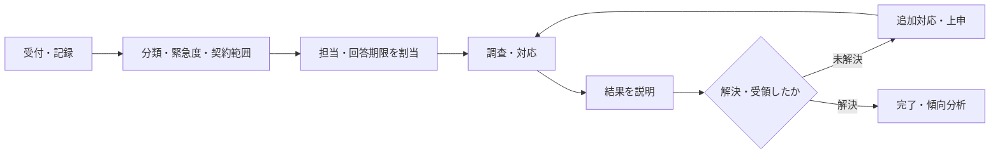

ビルメンテナンスの予定外業務は、設備警報だけから始まるわけではありません。暑い、汚れている、騒音がするなどの要望・苦情、けが、盗難、火災、地震など、さまざまな入口があります。受付時点で内容と緊急度を見極め、適切な経路へつなぎます。

:::note[このページで分かること]
問い合わせ・依頼・苦情を記録して回答まで追う流れと、事故・災害で人命・安全を優先する初動、通常の是正・改善へ戻す方法を理解できます。
:::

## 入口は違っても受付で確認することがある

| 種類 | 例 | 最初に重視すること |
|---|---|---|
| 問い合わせ | 作業予定、設備の使い方 | 正しい情報と回答担当 |
| 要望・作業依頼 | 温度調整、追加清掃 | 対象、期限、契約内外 |
| 苦情 | 清掃不良、騒音、対応態度 | 事実、影響、期待、一次回答 |
| 事故・事件 | けが、漏水、盗難、不審者 | 救護、安全確保、通報、現場保全 |
| 災害 | 火災、地震、風水害 | 人命、避難、通報、被害拡大防止 |

受付では、発生時刻、場所、連絡者、事実、影響、写真等を記録します。感情や推測を否定せず受け止めつつ、確認済み事実とは分けます。

## 通常の依頼・苦情対応

受付番号を付けただけでは対応は始まりません。担当者と回答期限を決め、依頼者へ受付・着手・延期・完了などの状態を連絡します。契約外の作業は、緊急性を確認したうえで見積・承認経路へつなぎます。

苦情では、表面的な再作業だけでなく、品質基準未達、手順、配置、設備状態、説明不足などの原因を確認します。繰り返す事象は、不適合・是正や計画改善へ移します。

## 事故・災害では順序が変わる

事故・災害時は、通常の受付完了や費用承認より、人命と安全を優先します。現場の消防計画、緊急手順、権限、関係機関の指示に従い、可能な範囲で次を並行して行います。

1. 救護、避難、通報、設備停止、立入制限を行う。
2. 二次災害を防ぎ、現場と重要な証拠を保全する。
3. 対応責任者、顧客側権限者、必要な関係機関へ速報する。
4. 人、設備、区域、業務への影響を継続確認する。
5. 交代要員、協力会社、物資、利用者周知を手配する。
6. 状況更新、復旧、利用再開を権限者が判断する。

現場担当者が退避や緊急停止を行えても、建物全体の利用再開や対外発表まで判断できるとは限りません。

## 速報は短く、更新できる形にする

速報には、確認済みの事実、発生時刻・場所、人的・施設影響、実施した初動、残る危険、必要な支援、次回更新予定を含めます。原因や責任を早期に断定せず、更新のたびに時刻と情報源を残します。

詳細報告では、時系列、原因調査、対応結果、利用影響、費用、再発防止を整理します。速報と詳細報告で情報が変わった場合は、どの時点で何が判明したかを追えるようにします。

## 完了は相手と案件の両方で確認する

依頼者へ結果を連絡しても、技術的な問題や是正案件が残ることがあります。反対に設備を復旧しても、苦情への説明や事故報告が終わっていない場合があります。

| 確認対象 | 完了条件の例 |
|---|---|
| 受付対応 | 担当・期限が決まり、依頼者へ伝えた |
| 現場対応 | 必要な作業・安全措置を実施した |
| 利用者対応 | 結果・制約・今後を説明し、受領を確認した |
| 異常・事故案件 | 復旧、報告、是正、残課題の責任が確定した |
| 改善 | 原因と再発防止を計画・手順・教育へ反映した |

## 条件による違い

常駐管理では現場が直接受付・初動できる場合があります。巡回・遠隔監視では、現地到着までの利用者誘導、鍵、夜間連絡、協力会社の駆け付けが重要です。建物用途によって、人命優先の動線、停止できない設備、避難支援、対外連絡の条件も変わります。

## 関連する重要業務

このページでは、**BM-10-02 緊急度判断**、**BM-10-03 一次対応**、**BM-13-11 異常速報・上申**、**BM-17-11 作業区域の設定・解除**を、設備不具合以外の入口から利用します。

主な業務ID：BM-11-06・09〜10、BM-12-01〜10、BM-13-11、BM-17-03〜04・07・11。

## まとめ

- 問い合わせ、依頼、苦情、事故、災害は入口と優先順位が異なります。
- 事故・災害では、人命、安全確保、通報、被害拡大防止を通常手続きより優先します。
- 相手への回答完了と、技術・是正案件の完了を分けて追跡します。

## さらに詳しく

- [業務カタログ BM-11・BM-12](https://github.com/tsumasaki-kurageya/property-management-pdm/blob/main/docs/building-maintenance-business-catalog.md#bm-11-警備防災管理)
- [警備・防災の現場業務](../../field-work/security-and-disaster-prevention/)
- [業務プロセスマップ P07・P09・P12](https://github.com/tsumasaki-kurageya/property-management-pdm/blob/main/docs/04_mappings/business-process-map.md)

最終確認日：2026年7月22日。記載状態：標準モデル。具体的な通報、避難、指揮、対外連絡は施設の計画・法令・権限に従います。
