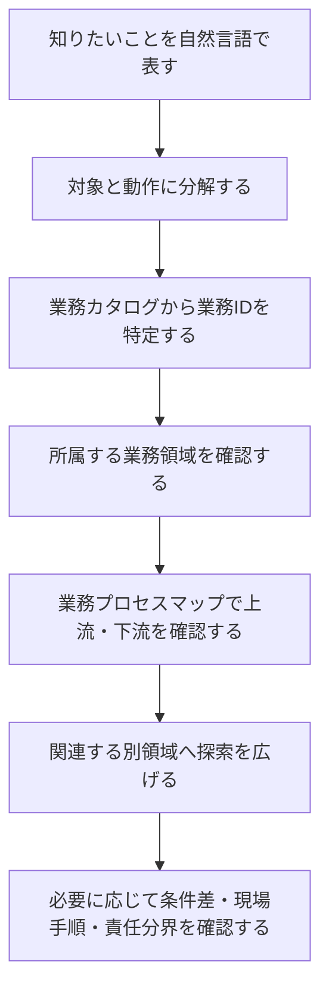
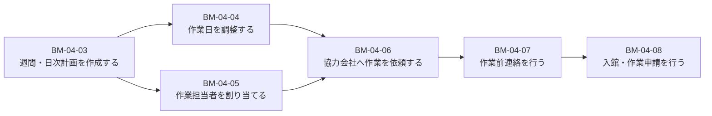

このガイドラインは、最初から最後まで順番に読むだけでなく、**日常的な疑問から対象業務を特定し、その業務の前後や関連領域を調べるためのリファレンス**として使えます。

例えば、次のような疑問を起点にできます。

> 作業の担当者と日程を調整する業務は、どの業務領域に属し、前後にどの業務があるのか。

このページでは、この疑問を例に、業務を探索する標準的な手順を説明します。

## このガイドラインでできること

- ビルメンテナンス業務を18の業務領域から俯瞰する
- 個別業務を業務ID単位で確認する
- 業務プロセスマップから上流・下流の業務をたどる
- 契約、人員、現場作業、報告など、領域をまたぐ関係を確認する
- 建物用途、管理方式、契約階層、責任分界などによる違いを確認する

## 資料ごとの役割

| 資料 | 主な用途 |
|---|---|
| [18の業務領域](../../overview/) | 対象業務が属する大分類を把握する |
| [業務カタログ](../../reference/business-catalog/) | 業務IDと業務内容を確認する |
| [契約から改善まで](../../overview/business-lifecycle/) | 受託から改善までの大きな流れを把握する |
| [12横断プロセス](../../reference/processes/) | 個別業務の上流・下流、分岐、接続を確認する |
| [条件による違い](../../variations/) | 建物用途、常駐・巡回、元請け・再委託、責任分界などを確認する |
| [現場作業手順](../../reference/field-procedures/) | 清掃、設備、警備などの具体的な作業工程を確認する |

## 標準的な探索手順

業務を探すときは、次の順に進めます。

短く表すと、次の流れです。

> キーワード検索 → 動詞分解 → 業務ID → 業務領域 → プロセス → 関連業務 → 詳細資料

## 具体例：担当者と日程を調整する業務を探す

### 1. 疑問を自然言語で表す

> 作業の担当者と日程を調整する業務から、その業務領域や前後関係を知りたい。

この段階では、業務名や業務IDが分からなくても問題ありません。

### 2. 一文を動詞単位に分ける

この疑問には、二つの動作が含まれています。

- 作業日を調整する
- 作業担当者を割り当てる

一つの自然言語表現が、複数の業務IDに分かれることがあります。最初に動詞を分けることで、対象業務を見落としにくくなります。

### 3. 業務カタログから業務IDを特定する

[業務カタログ](../../reference/business-catalog/)で対応する業務を探すと、次の二つが見つかります。

| 業務ID | 業務名 | 内容 |
|---|---|---|
| `BM-04-04` | 作業日を調整する | 顧客、テナント、作業員、協力会社などと日程を調整する |
| `BM-04-05` | 作業担当者を割り当てる | 必要資格、スキル、勤務状況、作業場所を考慮して担当者を決める |

### 4. 所属する業務領域を確認する

どちらも次の領域に属します。

> `BM-04 計画・スケジュール管理`

これにより、対象業務が年間・月間・日次の作業計画や、作業前の調整・手配に関する業務であることが分かります。

### 5. 同じ領域にある近接業務を確認する

同じ領域には、次のような業務があります。

近い番号の業務は探索の手掛かりになります。ただし、番号順がそのまま厳密な処理順を表すとは限りません。

### 6. 業務プロセスマップで上流・下流を確認する

前後関係は、[12横断プロセス](../../reference/processes/)で確認します。

この例では、上流側に次の業務が関係します。

- `BM-02-02 契約業務仕様を管理する`
- `BM-03-07 初期計画を作成する`
- `BM-05-02 保有資格を管理する`
- `BM-05-03 スキル・経験を管理する`
- `BM-05-04 シフトを作成する`

下流側には次の業務があります。

- `BM-04-06 協力会社へ作業を依頼する`
- `BM-04-07 作業前連絡を行う`
- `BM-04-08 入館・作業申請を行う`
- `BM-06`〜`BM-11` の現場作業
- `BM-13 作業結果・報告管理`

全体としては、次のように捉えられます。

### 7. 関連する別領域へ探索を広げる

知りたい内容に応じて、別の領域へ進みます。

| 知りたいこと | 参照する領域・資料 |
|---|---|
| 何を、どの周期で実施するのか | `BM-02 契約管理` |
| 誰が担当可能か、必要資格は何か | `BM-05 人員・協力会社管理` |
| 実際に現場で何をするのか | `BM-06`〜`BM-11`、[現場作業手順](../../reference/field-procedures/) |
| 作業後に何を記録・報告するのか | `BM-13 作業結果・報告管理` |
| 建物や契約によって何が変わるのか | [条件による違い](../../variations/) |

## 探索するときの注意点

:::caution[業務IDの番号順だけで前後関係を判断しない]
業務IDは業務を識別するための番号です。近い番号の業務は関連している場合がありますが、厳密な処理順、並行実施、分岐、差戻しまで保証するものではありません。前後関係は業務プロセスマップで確認してください。
:::

### 同じ言葉でも業務の目的によって異なる

例えば「担当者を割り当てる」という表現でも、目的によって対象業務が変わります。

- 計画した作業へ担当者を割り当てる：`BM-04-05 作業担当者を割り当てる`
- 顧客から受け付けた依頼へ担当者を割り当てる：`BM-12-05 担当者へ割り当てる`

言葉だけではなく、**何を起点に、何のために行う業務か**を確認します。

### 一つの業務が複数プロセスに登場することがある

同じ業務でも、定期作業、不具合対応、顧客依頼、法定点検など、異なる業務プロセスの中で使われる場合があります。対象業務を特定した後は、その業務がどのプロセスに登場するかも確認します。

### このガイドは標準モデルである

このガイドラインは、ビルメンテナンス業務を比較・分析するための共通モデルです。個別物件の契約、法令、体制、設備、時間帯に応じた運用をそのまま規定するものではありません。

## 迷ったときの入口

| 現在分かっていること | 最初に見る資料 |
|---|---|
| 業務名や動作が分かっている | [業務カタログ](../../reference/business-catalog/) |
| 業務名は分からないが、場面や時期が分かる | [契約から改善まで](../../overview/business-lifecycle/) |
| 上流・下流を知りたい | [12横断プロセス](../../reference/processes/) |
| 誰が行うか、誰が判断するかを知りたい | [関係者と役割](../people-and-roles/)、[条件による違い](../../variations/) |
| 現場で何をするか知りたい | [現場作業手順](../../reference/field-procedures/) |
| 建物や契約による違いを知りたい | [条件による違い](../../variations/) |

## まとめ

業務探索の基本は、自然言語の疑問をそのまま一つの業務と決めつけず、動詞ごとに分解することです。その後、業務ID、業務領域、プロセスマップ、関連領域の順に確認します。

> キーワード検索 → 動詞分解 → 業務ID → 業務領域 → プロセス → 関連業務 → 詳細資料

この手順を使うことで、個別の業務だけでなく、その業務が成立する条件、前工程、後工程、関連する担当や資料まで段階的にたどれます。

次は、[ビルメンテナンスとは](../what-is-building-maintenance/)で業務の目的と範囲を確認するか、[業務カタログ](../../reference/business-catalog/)から具体的な業務を探してください。
