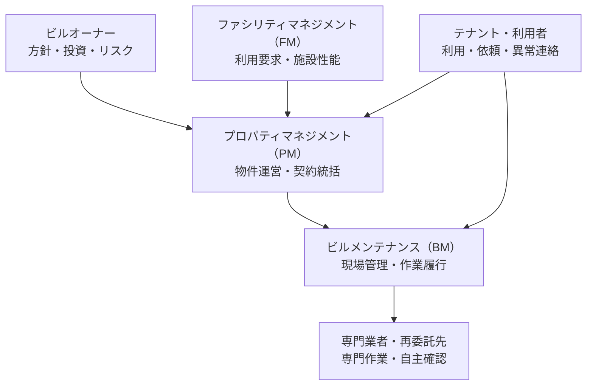
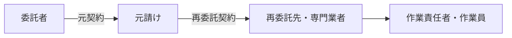

建物の管理には、建物を所有する人、利用する人、運営を調整する人、現場で作業する人など、多くの関係者が参加します。会社名だけでは役割を判断できません。同じ会社が複数の役割を兼ねる場合もあります。

:::note[このページで分かること]
主な関係者が何を重視し、誰が実施・判断・承認を担うのか、元請けと再委託先がどう違うのかを理解できます。
:::

## 建物を中心に関係者を捉える

この図は代表的な関係を簡略化したものです。実際には、オーナーがビルメンテナンス会社へ直接委託する場合、プロパティマネジメント会社がファシリティマネジメントやビルメンテナンスも担う場合、テナントが専有部の業者を別に手配する場合などがあります。

## 主な役割

### ビルオーナー

建物を所有し、保有方針、予算、投資、重大なリスクなどを最終的に判断する立場です。日常のすべてを自ら実施するとは限らず、他社へ管理を委託しても、所有者等に課される法的義務や留保した判断権が当然に移るわけではありません。

### プロパティマネジメント（PM）

個別不動産の運営を、収益、賃貸、予算、契約履行などの観点から統括する機能です。オーナーの方針を具体化し、テナントや委託先を調整し、ビルメンテナンスの成果を契約面から確認します。

### ファシリティマネジメント（FM）

建物を利用する組織の活動を支えるため、施設に必要な性能やサービス水準を考える機能です。営業時間、重要区画、温湿度、事業継続など、利用者側の要求を施設運用へつなげます。

### ビルメンテナンス（BM）

建物や設備の状態と現場品質を管理し、清掃、衛生、設備、警備・防災などの業務を計画・実施・記録する機能です。異常を最初に発見し、権限の範囲で安全確保や一次対応を行い、必要な判断を上位の関係者へ求めることもあります。

### テナント・利用者

建物や区画を利用する人です。設備の不具合、清掃依頼、事故などを連絡し、作業時間や立入りについて調整します。専有部と共用部、賃貸借契約、施設ルールなどにより、依頼先や費用負担が変わります。

## 役割は会社名ではなく機能で見る

| 観点 | 代表的な問い |
|---|---|
| 方針 | どの状態を、どの水準で保つのか |
| 最終決定 | 投資、予算外支出、重大停止を誰が決めるのか |
| 統括 | 複数の会社、工程、期限、費用を誰が調整するのか |
| 実施 | 誰が現場で作業、操作、点検、連絡を行うのか |
| 確認 | 技術基準や品質基準を誰が確認するのか |
| 検収・承認 | 契約上の成果を誰が受領するのか |
| 法的義務 | 法令上の実施、選任、届出、保存などを誰が負うのか |
| 緊急時 | 誰が停止し、誰が利用再開やリスク受容を決めるのか |

「BM会社だからすべての現場判断を任せられる」「PM会社だから必ず検収者である」とは限りません。物件ごと、契約ごと、業務ごとに確認します。

## 元請け・再委託先・専門業者

ビルメンテナンス会社がすべての作業を自社で行うとは限りません。例えば、元請けが建物全体を統括し、消防設備、昇降機、害虫防除などの専門業務を別の会社へ再委託する場合があります。

| 立場 | 主な役割 |
|---|---|
| 委託者 | 求める成果、範囲、条件を定め、成果を受領する |
| 元請け | 委託者との窓口となり、全体計画、会社間調整、成果統合、契約履行を管理する |
| 再委託先 | 受託した専門範囲を自ら管理して実施し、自主確認した結果を元請けへ報告する |
| 専門業者 | 資格、登録、許可、メーカー技術などが必要な仕事を担う。契約上の立場は案件ごとに確認する |

再委託しても、元請けの委託者に対する契約責任や全体統括が当然になくなるわけではありません。また、各社は原則として自社の作業員を自ら指揮します。緊急時の停止や避難などは、安全を優先した例外経路が必要です。

## 一つの出来事を複数の立場から見る

空調設備に異常が見つかった例で考えます。

| 立場 | 代表的な関心と行動 |
|---|---|
| 利用者 | 暑い、音がするなどの状態を連絡する |
| BM | 状態を確認し、安全確保、一次対応、技術的な影響判断を行う |
| 専門業者 | 専門点検、原因調査、修繕案や見積もりを提示する |
| FM | 利用時間、重要区画、業務影響から優先度や代替策を考える |
| PM | 契約範囲、費用、テナント影響、発注や報告を調整する |
| オーナー | 大きな支出、更新、停止継続、残るリスクなどを判断する |

すべての案件でこの順番になるわけではありません。重要なのは、異常の発見者、技術判断者、費用承認者、利用再開の判断者が同じとは限らないことです。

## まとめ

- 建物管理では、所有、利用、統括、現場実施、専門作業の役割が分かれます。
- オーナー、PM、FM、BMは会社の種類ではなく、案件で担う機能として捉えます。
- 実施者、技術確認者、契約上の検収者、法的義務主体、費用決定者を区別します。
- 再委託しても、元請けの統括や元契約上の責任が当然に移るわけではありません。

次は[業務の全体像](../../overview/)で、これらの関係者が契約から実施、報告、改善までどうつながるかを確認します。用語を振り返る場合は[初学者向け用語集](../glossary/)を参照してください。

## さらに詳しく

- [ビルオーナー・PM・FM・BM責任分界プロファイル](https://github.com/tsumasaki-kurageya/property-management-pdm/blob/main/docs/owner-pm-fm-bm-responsibility-profiles.md)
- [ビルメンテナンス契約役割プロファイル](https://github.com/tsumasaki-kurageya/property-management-pdm/blob/main/docs/contract-role-profiles.md)
- [ビルメンテナンス法令義務プロファイル](https://github.com/tsumasaki-kurageya/property-management-pdm/blob/main/docs/statutory-duty-profiles.md)

最終確認日：2026年7月22日。記載状態：分析用原本に基づく標準モデル。個別案件の契約、権限、法的義務を断定するものではありません。
