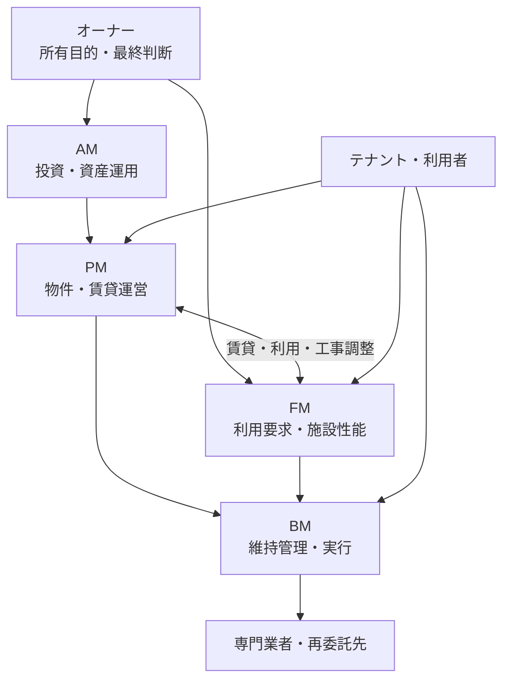

建物の管理には、所有する人、利用する人、運営を調整する人、現場で作業する人など、多くの関係者が参加します。同じ会社が複数の役割を兼ねる場合もあるため、会社名ではなく案件内で担う機能を見ます。

:::note[詳しい業務構造]
オーナー、AM、PM、FM、BMの目的、管理対象、計画期間、KPI・KRI、意思決定、BMとの接続は[所有・運営・維持管理の業務構造](../../management-structure/)で確認できます。
:::

## 主な関係者

| 関係者・機能 | 主に重視すること |
|---|---|
| オーナー | 所有目的、資産価値、資本配分、重大リスク、最終承認 |
| アセットマネジメント（AM） | 資産運用、収益・キャッシュフロー、CAPEX、資産価値、PM統制 |
| プロパティマネジメント（PM） | 個別物件の収益、賃貸借、テナント、予算、委託先履行 |
| ファシリティマネジメント（FM） | 利用組織の事業要求、施設性能、利用者価値、総施設コスト、BCP |
| ビルメンテナンス（BM） | 建物・設備状態、作業履行、現場品質、安全、保全実績 |
| 専門業者・再委託先 | 委託された専門範囲の実施、自主確認、技術報告 |
| テナント・利用者 | 建物・区画の利用、依頼、異常連絡、利用条件の調整 |

## 役割は会社の序列ではない

```mermaid
flowchart TB
    O["オーナー<br/>所有目的・最終判断"]
    A["AM<br/>投資・資産運用"]
    P["PM<br/>物件・賃貸運営"]
    F["FM<br/>利用要求・施設性能"]
    B["BM<br/>維持管理・実行"]
    X["専門業者・再委託先"]
    T["テナント・利用者"]
    O --> A --> P
    O --> F
    P <-->|"賃貸・利用・工事調整"| F
    P --> B
    F --> B
    B --> X
    T --> P
    T --> F
    T --> B
```

これは代表的な機能接続です。AMが存在しない、FMがBMを直接契約する、オーナーとFMが同一組織にある等の構成もあります。特にPMとFMは上下ではなく、目的の異なる並列機能です。

## 実施・判断・責任を分ける

業務ごとに、少なくとも次を分けて確認します。

- 誰が作業するか
- 誰が技術・品質を確認するか
- 誰が契約上の成果を検収するか
- 誰が費用・投資・利用再開を承認するか
- 誰が法令上の義務を負うか
- 誰が残存リスクを受容するか

再委託しても、元請けの契約上の統括責任や、所有者・管理権原者等の法的義務が当然に移るわけではありません。

次は[18の業務領域](../../overview/)でBMの仕事の種類を確認するか、[所有・運営・維持管理の業務構造](../../management-structure/)で上位判断との接続を確認してください。
