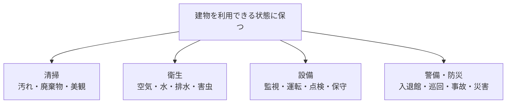
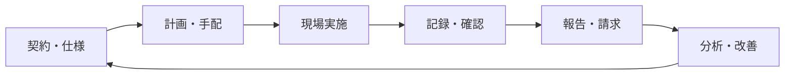
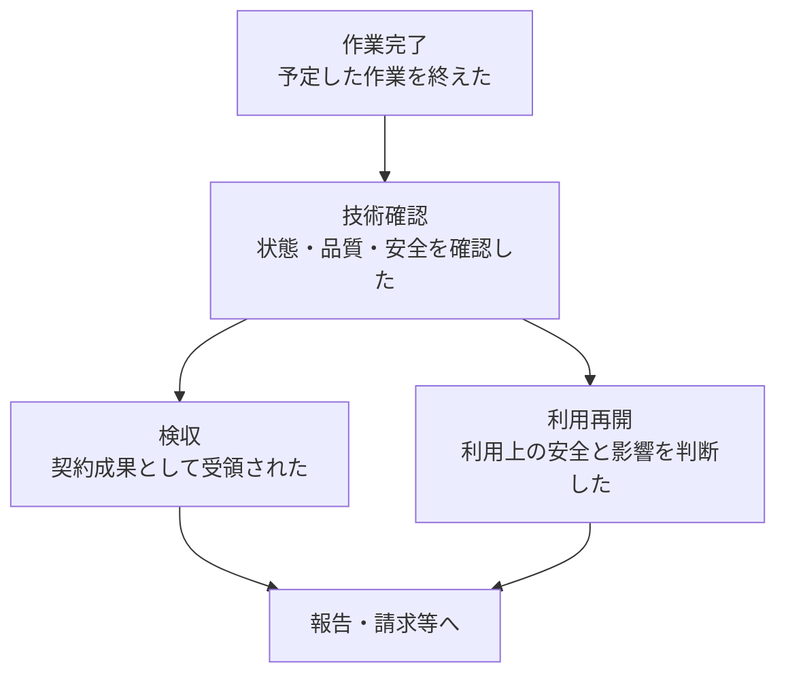

ビルメンテナンスは、建物と設備の状態を把握し、必要な手入れや対応を続けることで、人が建物を安全、衛生的、快適かつ継続的に利用できる状態へ保つ仕事です。「ビルメン」と略されることがあります。

:::note[このページで分かること]
ビルメンテナンスの目的、代表的な現場業務、現場作業を支える周辺業務、似た用語の違いを理解できます。
:::

## なぜ必要なのか

建物は、完成した時点で仕事が終わるものではありません。人が利用し、設備が動き、時間が経過すると、汚れ、消耗、劣化、故障、事故などが生じます。一方で、利用者は日々、照明、空調、給排水、エレベーター、清潔な共用部、入退館管理などが支障なく機能することを期待します。

ビルメンテナンスは、問題が起きた後の修理だけではありません。異常の兆候を早く見つけ、状態の悪化を防ぎ、決められた品質や法令上の条件を守り、結果を記録して次の判断へつなげます。

| 保ちたい状態 | 具体的な意味の例 |
|---|---|
| 安全 | 火災、感電、転倒、不審者などの危険を抑える |
| 衛生 | 空気、水、排水、廃棄物、害虫などを適切に管理する |
| 快適 | 温度、明るさ、清潔さなどを用途や利用状況に合わせる |
| 継続利用 | 設備停止や故障の影響を抑え、必要に応じて復旧する |
| 資産保全 | 劣化や故障の履歴を残し、修繕や更新の判断につなげる |

これらの状態は互いに関係します。例えば空調設備は、快適さだけでなく、室内環境、エネルギー、安全、施設の継続利用にも影響します。

## 現場業務の四つの代表領域

このガイドでは、現場で状態を保つ仕事を、まず次の四つから捉えます。

| 領域 | 主な対象 | 代表的な仕事 |
|---|---|---|
| 清掃管理 | 床、トイレ、共用部、窓、廃棄物など | 日常清掃、定期清掃、消耗品補充、品質確認 |
| 衛生管理 | 空気、水、排水、貯水槽、害虫など | 測定、清掃、検査、防除、記録 |
| 設備運転・点検・保守 | 電気、空調、給排水、昇降機など | 監視、操作、検針、巡回、点検、保守 |
| 警備・防災管理 | 人、鍵、出入口、館内、消防設備など | 受付、入退館管理、巡回、監視、訓練、初動対応 |

これは担当組織を必ず四つに分けるという意味ではありません。一つの会社が複数領域を担うことも、資格や専門性が必要な一部を別会社へ委託することもあります。

## 現場作業だけがビルメンテナンスではない

清掃、点検、巡回などを実施するには、前後に多くの仕事が必要です。

- 契約前には、建物を調査し、対象範囲、頻度、品質、費用を決めます。
- 受託開始時には、建物・設備情報、体制、手順、帳票、連絡経路を準備します。
- 日々の実施前には、計画、人員、資格、協力会社、資材、入館や作業申請を整えます。
- 実施後には、結果と異常を記録し、確認、報告、履歴更新、検収、請求へつなげます。
- 蓄積した実績から、品質、故障傾向、費用、計画などを見直します。

このため本ガイドの業務カタログは、現場作業だけでなく、営業から契約、報告、請求、改善までを対象にしています。

## 似ている用語の違い

### 点検・保守・修繕・工事

| 用語 | このガイドでの捉え方 | 例 |
|---|---|---|
| 点検 | 状態を確認し、正常か、異常があるかを判断する | 空調機の異音、温度、部品の状態を確認する |
| 保守 | 良好な状態を保つため、手入れや調整を行う | 清掃、注油、消耗部品の交換を行う |
| 修繕 | 不具合や劣化を直し、必要な状態へ戻す | 故障したポンプの部品を交換する |
| 工事 | 設備や建物へまとまった変更を加える作業 | 設備更新、配管改修、区画変更を行う |

実際の呼び方や境界は、作業規模、契約、会計処理、資格・許可などによって変わります。名称だけで判断せず、何をどこまで変更する仕事かを確認します。

### 検査・検収・報告

| 用語 | 確かめること | 主な結果 |
|---|---|---|
| 検査 | 技術基準や品質基準を満たすか | 合格、不合格、是正要否 |
| 検収 | 契約上求めた成果を受け取れるか | 受領、差戻し、支払対象の確定 |
| 報告 | 結果、異常、残課題などを相手へ伝えたか | 報告書、速報、受領記録 |

技術的に正常であることと、契約上受領されたことは同じではありません。また、報告書を提出しても、差戻しや未解決事項が残る場合があります。

## 「作業が終わった」だけでは全体は終わらない

設備の修繕を例にすると、少なくとも次の状態を区別します。

- **作業完了**：作業者が予定した作業を終えた状態
- **技術確認**：測定、試運転、外観などから、技術的な条件を確認した状態
- **検収**：発注者などが契約上の成果として受領した状態
- **利用再開**：安全や利用への影響を確認し、停止していた区域や設備を再び使えると判断した状態

誰が各判断を行うかは、作業、契約、権限、建物用途などによって変わります。「完了」という一語だけで済ませず、どの状態まで成立したかを明確にすることが重要です。

## 条件によって仕事は変わる

同じ名称の業務でも、オフィス、病院、ホテル、商業施設などの用途、常駐・巡回などの管理方式、元請け・再委託先などの契約上の立場、設備や法令の適用条件によって、頻度、時間帯、品質基準、判断者、報告先が変わります。

本ガイドが示すのは、個別物件の正解ではなく、違いを比較するための共通の土台です。

## まとめ

- ビルメンテナンスは、建物を安全、衛生的、快適かつ継続的に利用できる状態へ保つ仕事です。
- 清掃、衛生、設備、警備・防災に加え、契約、計画、記録、報告、請求、改善も含みます。
- 点検、保守、修繕、検査、検収などは目的と完了条件が異なります。
- 実際の仕事と責任は、建物や契約などの条件によって変わります。

次は、[関係者と役割](../people-and-roles/)で、誰が方針を決め、調整し、現場で実施するのかを確認します。用語だけを確認したい場合は[初学者向け用語集](../glossary/)を参照してください。

## さらに詳しく

- [ビルメンテナンス業務カタログ](https://github.com/tsumasaki-kurageya/property-management-pdm/blob/main/docs/building-maintenance-business-catalog.md)
- [ビルメンテナンス業務プロセスマップ](https://github.com/tsumasaki-kurageya/property-management-pdm/blob/main/docs/04_mappings/business-process-map.md)
- [全国ビルメンテナンス協会「ビルメンテナンス業界について」](https://www.j-bma.or.jp/aboutbm)
- [国土交通省「建築保全業務共通仕様書」](https://www.mlit.go.jp/gobuild/kijun_hozen_shiyousho.htm)

最終確認日：2026年7月22日。記載状態：分析用原本に基づく標準モデル。個別物件では契約、法令、設備等の確認が必要です。
