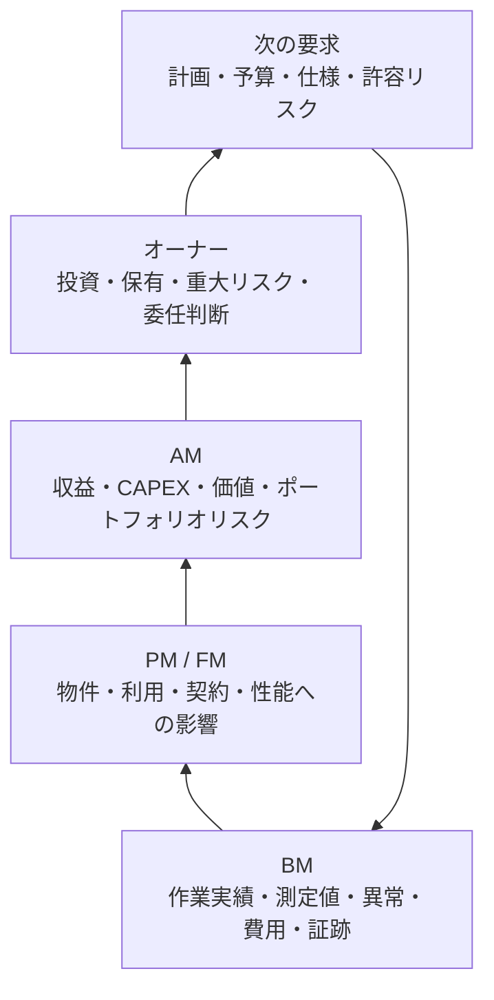

BMの記録は、作業完了を証明するだけではありません。物件運営、施設利用、投資、重大リスクの判断に必要な情報へ変換されます。

## 戻り接続の種別

| 種別 | 意味 | 例 |
|---|---|---|
| `reports` | 事実、実績、状態、費用、異常、証跡を報告する | 点検結果、停止時間、修繕費、法定証跡をPM・FMへ報告する |
| `informs-decision` | 上位の承認、優先順位、予算、契約、リスク判断を支える | 劣化診断と代替案が更新投資判断を支える |
| `aggregates-to-kpi` | 複数のBM実績を上位KPI・KRIへ集計する | 未実施・不適合をRSK-01、停止時間をOPS-07へ集計する |

## 情報が戻る流れ

PMとFMは必ず直列ではありません。賃貸ビルでは貸主側PMと利用側FMへ並行して情報が戻り、自社利用施設ではFMからオーナー・経営機能へ直接戻る場合があります。

## 代表的な集約

| BM情報 | 上位で見る指標・判断 |
|---|---|
| 作業実施、期限、未実施 | OPS-05、OPS-09、RSK-01 |
| 設備停止、復旧時間、再発 | OPS-07、RSK-04、QTY-03 |
| 劣化、健全度、更新需要 | QTY-04、VAL-03、RSK-05、VAL-02 |
| 修繕・更新費用 | FIN-04、FIN-05、FIN-06、FIN-01・FIN-02への影響 |
| 法定不適合、重大是正 | RSK-01、RSK-03、OWN-04・AM-07・PM-08・FM-07の判断 |
| エネルギー、水、廃棄物 | QTY-05、RSK-06、FM-08の改善判断 |
| 技術提案の根拠・選択肢 | QTY-06、PM-07、FM-05、AM-04・AM-05、OWN-03 |

## 次の判断へ戻すために必要なこと

単なる件数や写真だけでなく、対象、影響範囲、基準との差、原因、選択肢、費用、工期、停止、残存リスク、推奨案、再判定期限を揃えます。BM会社の売上・原価と、物件側OPEX・CAPEX・NOI・NCFは別の会計主体・評価目的として区別します。

実際の情報の流れは[代表シナリオ](../../scenarios/)で確認できます。
