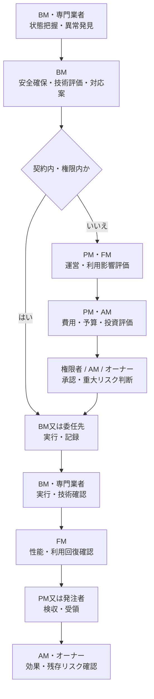

同じ案件に関与していても、異常を発見する人、技術的に評価する人、費用を査定する人、承認する人、作業する人、検収する人は同じとは限りません。

## 分けて管理する責任・権限

| 区分 | 代表的な問い |
|---|---|
| 方針責任 | 目的、要求水準、許容リスクを誰が定めるか |
| 起案責任 | 誰が判断対象を案件化し、選択肢を揃えるか |
| 技術評価責任 | 誰が状態、原因、方式、性能、安全を評価するか |
| 費用査定責任 | 誰が見積、予算、OPEX・CAPEX、投資効果を評価するか |
| 最終決定・承認権 | 誰が実施、延期、見送り、条件を決めるか |
| 発注権限 | 誰が契約・注文により作業を依頼するか |
| 実行責任 | 誰が作業、操作、調整、連絡を実施するか |
| 確認責任 | 誰が技術、品質、安全、利用回復を確認するか |
| 検収・受領権限 | 誰が契約上の成果を受領するか |
| 法的義務 | 法令上、誰が選任、維持、点検、届出、報告等を負うか |
| 残存リスク受容 | 延期・暫定運用後のリスクを誰が受容するか |
| 緊急停止権 / 利用再開判断 | 誰が直ちに止め、誰が再開を決めるか |

## 通常時の標準フロー

差戻し、追加調査、再見積、条件付き承認、見送りがあり得ます。延期・見送り時は、決定者、理由、残存リスク、暫定対策、監視条件、再判定期限を記録します。

## 判断レベル

| レベル | 例 | 標準的な決定機能 |
|---|---|---|
| L0 定型実行 | 承認済み手順での点検・操作・記録 | BM |
| L1 現場裁量 | 設定範囲内の運転調整、軽微な一次対応 | BM責任者 |
| L2 運用変更 | 臨時運転、日程変更、小修繕 | PM又はFMから委任された権限者 |
| L3 予算・契約変更 | 予算外修繕、仕様追加、停止工事 | PM、FM又はAMの権限者 |
| L4 投資・重大リスク | 設備更新、大規模修繕、長期停止、重大リスク受容 | オーナー又は最終委任先 |

## 緊急時

緊急停止と利用再開は別の権限です。BMに緊急停止権があっても、長時間の利用停止、事業再開、対外公表、残存リスク受容を単独で決められることを意味しません。

具体的な役割分担は[3件の代表シナリオ](../../scenarios/)で確認できます。
