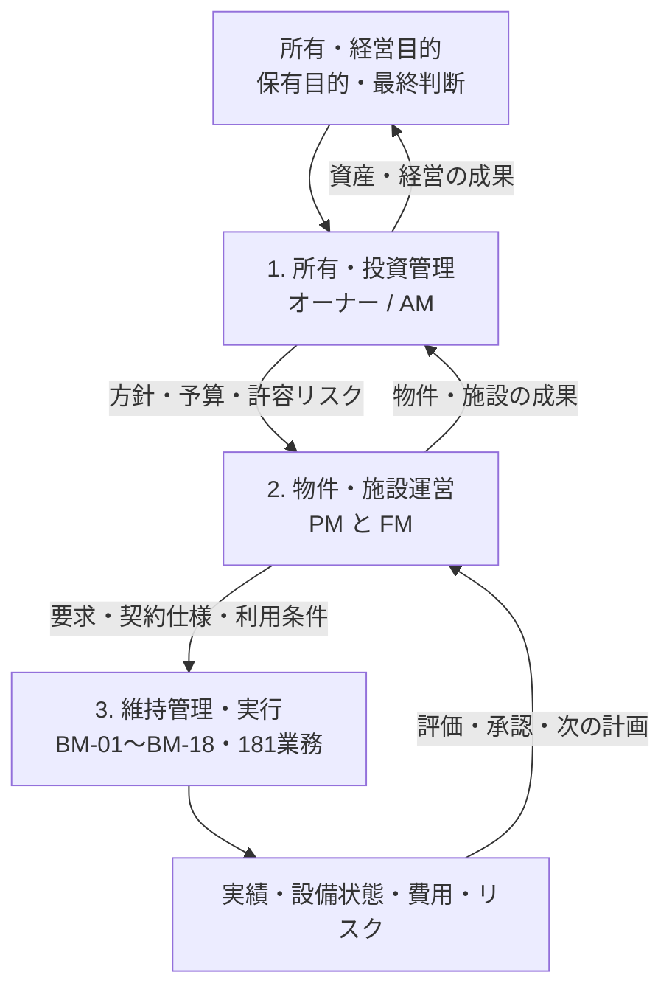

建物に関する同じ出来事でも、役割によって見ている対象と判断の時間軸が異なります。この章では、オーナー、アセットマネジメント（AM）、プロパティマネジメント（PM）、ファシリティマネジメント（FM）、ビルメンテナンス（BM）を、会社名ではなく**案件内で担う業務機能**として整理します。

:::note[この章で分かること]
上位の所有・投資判断が、物件・施設運営を経てBMの計画・実行へ具体化され、BMの実績・設備状態・費用・リスクが次の判断へ戻るまでを追跡できます。
:::

## 業務レイヤーの全体像

### 図の読み方

上から下の矢印は、目的を具体的な要求・予算・制約へ展開する流れです。下から上の矢印は、作業実績や設備状態を、物件運営、施設利用、投資、重大リスクの判断材料へ戻す流れです。

この図は会社の指揮命令系統を固定しません。一つの会社や部署が複数機能を兼ねる場合もあります。特にPMとFMは上下関係ではなく、**PMは物件・賃貸運営、FMは利用組織・施設性能**という異なる目的を持つ並列機能です。

## 三つのレイヤー

| レイヤー | 中心となる問い | 主な管理対象 | 主なページ |
|---|---|---|---|
| [1. 所有・投資管理](./ownership-and-investment/) | なぜ保有し、どこへ投資し、どのリスクを受容するか | ポートフォリオ、資産、資本、重大リスク | [オーナー](./ownership-and-investment/owner/)、[AM](./ownership-and-investment/asset-management/) |
| [2. 物件・施設運営](./property-and-facility-operation/) | 個別物件の収益・契約と、利用組織の施設要求をどう実現するか | 物件、賃貸借、テナント、施設、利用者、サービス | [PM](./property-and-facility-operation/property-management/)、[FM](./property-and-facility-operation/facility-management/) |
| [3. 維持管理・実行](./maintenance-execution/) | 誰が、いつ、どの手順で作業し、何を記録するか | 建物、設備、作業、要員、協力会社、証跡 | [BMの位置付け](./maintenance-execution/building-maintenance/) |

## 管理対象と計画期間

| 機能 | 主な管理対象 | 代表的な期間 |
|---|---|---|
| オーナー | 所有ポートフォリオ、資産、資本、重大リスク | 建物ライフサイクル、保有期間、年度 |
| AM | ポートフォリオ、個別資産、キャッシュフロー、投資案件 | 保有期間、中長期、年度、月次 |
| PM | 個別物件、賃貸借契約、テナント、物件収支、委託先 | 年度、月次、日常運営 |
| FM | 施設群、拠点、スペース、利用者、サービス、総施設コスト | ライフサイクル、中長期、年度、日常 |
| BM | 建物、設備、作業、要員、協力会社、記録 | 年次、月次、週次、日次、作業、緊急時 |

## レイヤー間をどう調べるか

- 誰が起案・評価・承認・実行・確認するかは[意思決定と責任分界](./connections/decision-and-responsibility/)で確認します。
- 上位の方針・要求がBMへどう渡るかは[上位要求からBM業務への接続](./connections/requirements-to-bm/)で確認します。
- BMの実績が上位判断へどう戻るかは[BM実績から上位判断へのフィードバック](./connections/bm-feedback-to-management/)で確認します。
- 同じ出来事を役割別に追う場合は[代表シナリオ](./scenarios/)を使います。
- 全接続をIDで調べる場合は[上位業務とBM業務のリファレンスマップ](../reference/management-to-bm-map/)を参照します。

## 既存ガイドとの境界

この章は、上位方針・判断とBM業務の接続を扱います。BM内部の18領域・181業務と12横断プロセスは移動せず、従来どおり[18の業務領域](../overview/)と[業務カタログ](../reference/business-catalog/)を正本として参照します。

役割の簡潔な入口は[関係者と役割](../introduction/people-and-roles/)、案件条件による分担の変化は[オーナー・PM・FM・BMの責任分界](../variations/responsibility-boundaries/)で確認してください。

## この章の正本

- `docs/management-structure/roles-and-layers.md`
- `docs/management-structure/business-domains-and-kpis.md`
- `docs/management-structure/decision-and-responsibility.md`
- `docs/management-structure/management-to-bm-map.md`

本文はこれらを初学者向けに再構成したものです。業務定義、KPI・KRI、責任分界、接続関係を変更するときは、先に正本を更新します。
