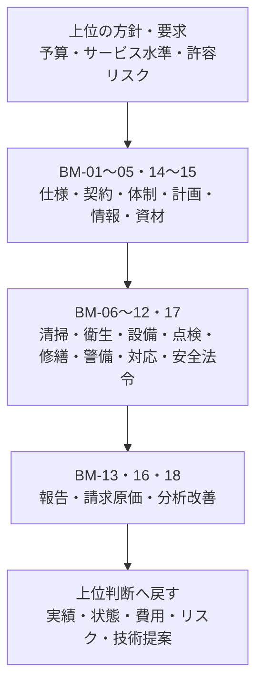

ビルメンテナンス（BM）は、契約仕様、運用条件及び法定基準に基づき、建物・設備の運転、点検、保守、清掃、警備、修繕、記録・報告等を計画・実行・管理する機能です。

BMは現場作業だけではありません。営業、契約、立ち上げ、計画、人員、報告、請求、品質、改善までを含む18領域・181業務が正本です。

## 上位要求を実行可能な仕事へ変える

### 図の読み方

上位の要求は、そのまま作業指示にはなりません。BMが契約仕様、体制、計画、設備情報、資材、安全条件へ分解し、現場で実行します。結果は報告、費用、品質、改善情報として上位へ戻ります。

## 18領域を接続観点で見る

| まとまり | BM領域 | 上位との主な接続 |
|---|---|---|
| 受託内容を定める | BM-01〜BM-03 | PM・FMの要求、AM・オーナーの委任・予算方針 |
| 実施を整える | BM-04、BM-05、BM-14、BM-15 | 利用条件、停止可能時間、資格、台帳、予備品 |
| 建物を維持する | BM-06〜BM-11 | サービス水準、施設性能、法定基準、BCP、修繕承認 |
| 結果をつなぐ | BM-12、BM-13、BM-16〜BM-18 | テナント・利用者、検収、物件費用、KPI・KRI、改善 |

## BMが単独で決めない事項

BMは技術評価、一次対応、作業実行、証跡作成を担えますが、次は契約・権限・法令に応じた上位判断が必要です。

- 予算外投資、契約変更、重大CAPEX
- 長期停止、重大な残存リスク受容
- 管理権原を要する利用再開
- 所有、売却、用途転換
- 法令上の義務主体や行政報告名義の確定

緊急時に人命保護のため停止する権限と、復旧後に利用再開を決める権限も分けます。

## 詳細へ進む

- [18領域・181業務](../../../reference/business-catalog/)
- [12横断プロセス](../../../reference/processes/)
- [上位要求からBM業務への接続](../../connections/requirements-to-bm/)
- [BM実績から上位判断へのフィードバック](../../connections/bm-feedback-to-management/)
