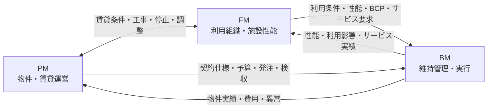

物件・施設運営レイヤーでは、所有・投資方針を、個別物件の運営条件と、施設を利用する組織の要求へ具体化します。

## PMとFMは並列機能

PMとFMは、どちらが常に上位という関係ではありません。

- [PM](./property-management/)は、個別不動産の収益、稼働、賃貸借、テナント、予算、委託先履行を管理します。
- [FM](./facility-management/)は、利用組織の事業要求、施設性能、利用者価値、総施設コスト、BCPを管理します。

賃貸不動産では貸主側PMとテナント側FMが契約境界を挟んで並立し、自社利用施設ではFMの比重が大きく、独立したPMが存在しない場合があります。

## BMへ具体化するもの

| PMからBM | FMからBM |
|---|---|
| 契約仕様、物件予算、作業条件、テナント調整、発注・検収条件 | サービス水準、利用時間、重要区画、施設性能、停止可能時間、BCP条件 |

次は[維持管理・実行レイヤー](../maintenance-execution/)で、これらの条件がBM-01〜BM-18へどう接続するかを確認します。
