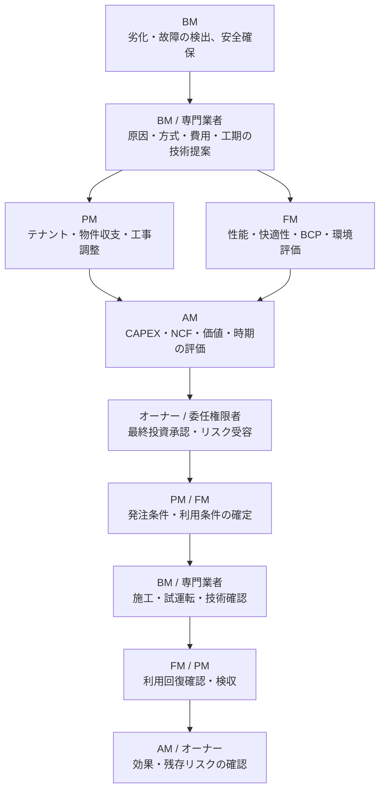

## 1. 何が起きたか

中央熱源又は主要空調設備で故障が増え、応急修理を続けても停止リスクとエネルギー効率の悪化が残っています。BMは、修理継続、主要部品交換、設備更新、暫定運用の選択肢を提示する必要があります。

## 2. 各役割が何を問題と捉えるか

| 役割 | 問い・判断 |
|---|---|
| BM | 原因、劣化、残存寿命、安全、修理可能性、更新方式、工期、停止条件は何か |
| PM | テナント影響、工事調整、物件予算、契約、発注・検収、NOI影響をどう管理するか |
| FM | 快適性、重要区画、事業継続、代替運転、将来性能、環境目標をどう満たすか |
| AM | OPEX・CAPEX、NCF・IRR、資産価値、保有期間、更新繰延リスクをどう評価するか |
| オーナー | 重大投資を承認するか。どの残存リスクと資本配分を受容するか |

## 3. 必要な情報は何か

- 故障・警報・修繕・点検履歴、設備台帳、図面、メーカー情報
- 劣化状態、原因、残存寿命、再発可能性
- 修理、更新、繰延、代替運転の比較
- 費用、OPEX・CAPEX区分、年度配分、工期
- 停止可能時間、テナント・利用部門・重要区画への影響
- 性能、エネルギー、環境目標、保証、保守条件
- 残存リスク、暫定対策、監視条件、再判定期限

## 4. 誰が何を担うか

- **起案・技術評価**：BM・専門業者
- **物件・契約・テナント評価**：PM
- **施設性能・利用・BCP評価**：FM
- **費用・投資効果評価**：AM
- **最終承認・重大リスク受容**：オーナー又は委任された権限者
- **発注・実行**：PM等の発注権限者、BM・専門業者
- **技術確認・利用回復・検収**：BM、FM、PM又は発注者
- **実績報告**：PM・FM・AMを経てオーナー

## 5. 関連する上位業務領域ID

- OWN-03 投資・予算・資本配分承認
- OWN-04 重大リスク・法令・レピュテーション統治
- AM-03 資産収益・キャッシュフロー管理
- AM-04 OPEX・CAPEX配分管理
- AM-05 資産価値・投資効果評価
- PM-04 物件収支・予算管理
- PM-05 物件運営・サービス水準管理
- PM-07 修繕・設備更新・工事統括
- FM-05 施設性能・保全・更新方針
- FM-06 ファシリティ総コスト・調達管理
- FM-07 BCP・安全・セキュリティ・リスク管理
- FM-08 環境・脱炭素・ライフサイクル管理

## 6. 関連するBM業務領域・業務ID

- BM-08 設備運転管理
- BM-09 点検・保守管理
- [BM-10-03 一次対応](../../../reference/business-catalog/bm-10/#bm-10-03)
- [BM-10-04 原因調査](../../../reference/business-catalog/bm-10/#bm-10-04)
- [BM-10-05 修繕方法検討](../../../reference/business-catalog/bm-10/#bm-10-05)
- [BM-10-06 修繕見積もり](../../../reference/business-catalog/bm-10/#bm-10-06)
- [BM-10-07 顧客承認](../../../reference/business-catalog/bm-10/#bm-10-07)
- [BM-10-08〜10 手配・実施・完了検査](../../../reference/business-catalog/bm-10/#bm-10-08)
- [BM-10-11〜13 履歴・再発防止・中長期計画](../../../reference/business-catalog/bm-10/#bm-10-11)
- BM-13 作業結果・報告管理、BM-14 建物・設備情報管理、BM-16 売上・請求・原価管理、BM-17 品質・安全・法令管理、BM-18 分析・改善・経営管理

## 7. 接続種別・接続強度

| 接続 | 種別 | 強度 |
|---|---|---|
| AM・PM・FMの予算、利用、性能条件 → BM | `requires` / `constrains` | 直接又は間接接続 |
| オーナー・AMの更新着手承認 → BM-10-07・09・10 | `approves` | 金額・CAPEX・権限限度による条件付き接続 |
| BMの劣化診断・代替案 → PM・FM・AM・オーナー | `reports` / `informs-decision` | 直接又は段階的な間接接続 |
| 完了後の停止・費用・性能実績 → KPI・KRI | `aggregates-to-kpi` | 集計接続 |

## 8. どの情報が上位へ戻るか

実施方式、実費、工期、停止時間、試運転結果、性能・エネルギー改善、テナント・利用影響、未解消事項、保証、更新後の保全条件、残存リスクを戻します。

## 9. KPI・KRIと次回判断

- FIN-01 物件NOI、FIN-02 物件NCF、FIN-05 CAPEX実行・予算達成率
- VAL-02 投資・更新の価値寄与、VAL-03 更新・修繕バックログ
- OPS-07 設備・施設停止時間
- QTY-05 エネルギー原単位・削減率、QTY-06 技術提案の実行可能性
- RSK-04 重要設備・サービス停止リスク、RSK-05 更新繰延・CAPEX不足リスク

次回は、更新効果、故障再発、保全方式、次年度CAPEX、同型設備の横展開、保有・売却判断への影響を評価します。
