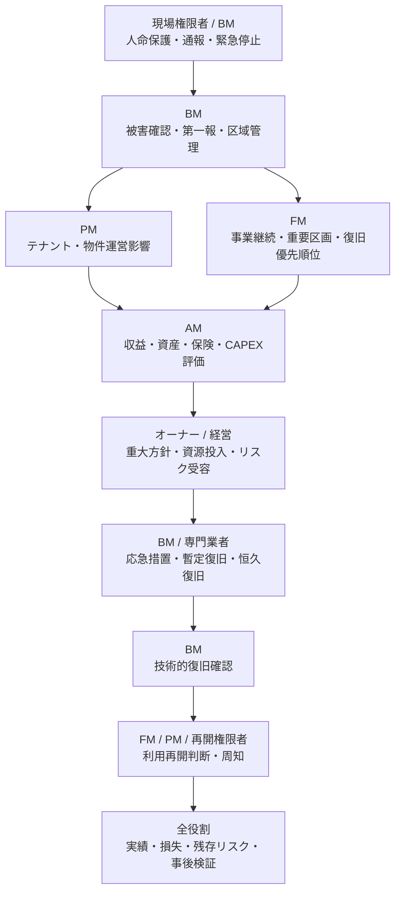

## 1. 何が起きたか

地震、火災、風水害等により、建物・設備・区画の一部が利用できない可能性があります。人命保護と被害拡大防止を優先しながら、暫定復旧、利用再開、恒久復旧、資源投入の方針を決めます。

## 2. 各役割が何を問題と捉えるか

| 役割 | 問い・判断 |
|---|---|
| BM | 人命保護、安全確保、被害範囲、設備状態、暫定復旧、技術的な再開条件は何か |
| PM | テナント、賃貸運営、物件収支、保険、連絡、工事・発注への影響は何か |
| FM | 重要業務、重要区画、代替手段、RTO、利用者安全、復旧優先順位は何か |
| AM | 収益、資産価値、CAPEX、保険、ポートフォリオリスクへの影響は何か |
| オーナー | 重大リスク、対外方針、復旧投資、長期停止、残存リスクをどう判断するか |

## 3. 必要な情報は何か

- 人員安否、火災・漏水・構造・設備等の被害範囲
- 緊急停止、立入制限、二次災害、行政・消防・警察等への連絡
- 重要設備・サービス、単一障害点、予備品、専門業者の確保
- テナント・利用部門・重要業務への影響、代替拠点・代替手段
- 暫定復旧と恒久復旧の方式、時間、費用、資材、要員
- 保険、契約、費用負担、対外説明、行政報告
- 技術的復旧、利用再開、検収、残存リスクの各条件

## 4. 誰が何を担うか

緊急停止、安全確保、技術的復旧、利用再開、契約上の検収は別の状態です。現場が設備を復旧しても、事業・テナント・管理権原上の再開条件が満たされているとは限りません。

## 5. 関連する上位業務領域ID

- OWN-03 投資・予算・資本配分承認
- OWN-04 重大リスク・法令・レピュテーション統治
- AM-04 OPEX・CAPEX配分管理
- AM-07 ポートフォリオ・リスク管理
- PM-03 テナントリレーション・入退去管理
- PM-05 物件運営・サービス水準管理
- PM-07 修繕・設備更新・工事統括
- PM-08 物件情報・報告・リスク管理
- FM-05 施設性能・保全・更新方針
- FM-07 BCP・安全・セキュリティ・リスク管理

## 6. 関連するBM業務領域・業務ID

- BM-08 設備運転管理、BM-10 不具合・修繕管理
- [BM-11-06 事故・事件対応](../../../reference/business-catalog/bm-11/#bm-11-06)
- [BM-11-09 災害時対応](../../../reference/business-catalog/bm-11/#bm-11-09)
- [BM-11-10 警備・防災記録報告](../../../reference/business-catalog/bm-11/#bm-11-10)
- BM-12 テナント・顧客対応、BM-13 作業結果・報告管理
- BM-14 建物・設備情報管理、BM-15 資材・在庫・購買管理
- [BM-17-07 事故・ヒヤリハット管理](../../../reference/business-catalog/bm-17/#bm-17-07)
- [BM-17-11 作業区域の設定・解除](../../../reference/business-catalog/bm-17/#bm-17-11)
- BM-18 分析・改善・経営管理

## 7. 接続種別・接続強度

| 接続 | 種別 | 強度 |
|---|---|---|
| BCP、優先区画、緊急手順 → BM-03・04・08・10・11・17 | `requires` / `constrains` | 平常時からの直接接続 |
| 緊急停止・応急措置 | `executes` | 異常時の直接接続 |
| 長期停止、復旧投資、残存リスク受容 | `approves` | 重大度・権限による条件付き接続 |
| 被害・復旧・利用影響 → PM・FM・AM・オーナー | `reports` / `informs-decision` | 直接又は段階的接続 |
| 停止時間、復旧目標、損失、是正課題 → KPI・KRI | `aggregates-to-kpi` | 集計接続 |

## 8. どの情報が上位へ戻るか

人的・物的被害、停止範囲、復旧時刻、利用不能時間、暫定措置、恒久復旧費、保険・契約影響、テナント・事業影響、再開条件、残存リスク、再発防止・BCP課題を戻します。

## 9. KPI・KRIと次回判断

- OPS-07 設備・施設停止時間
- USR-05 事業・業務影響時間
- RSK-02 事故・労働災害・ヒヤリハット
- RSK-03 重大リスク是正滞留
- RSK-04 重要設備・サービス停止リスク
- RSK-07 BCP訓練・復旧目標達成度
- FIN-05 CAPEX実行・予算達成率、VAL-03 更新・修繕バックログ

次回は、BCP、緊急連絡、権限・代行順位、予備品、冗長化、保険、復旧業者、訓練シナリオ、RTO等の見直しへつなげます。
