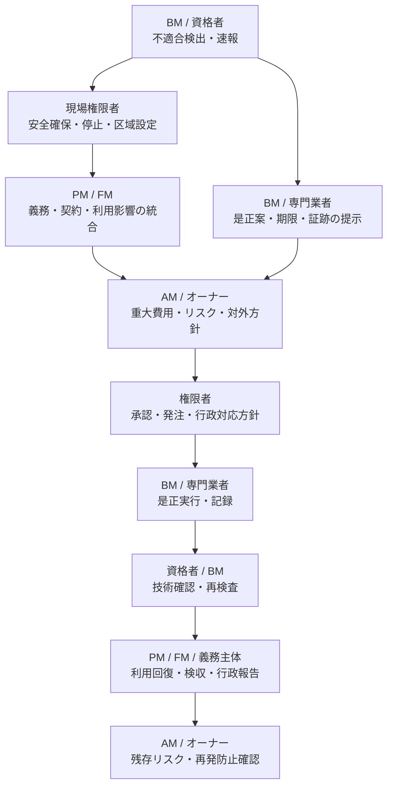

## 1. 何が起きたか

法定点検で、設備又は建物に基準不適合が見つかりました。人命・安全への影響、是正期限、行政報告、利用制限の要否を確認し、暫定措置と恒久是正を管理する必要があります。

## 2. 各役割が何を問題と捉えるか

| 役割 | 問い・判断 |
|---|---|
| BM | 不適合の事実、重大度、安全確保、技術的な是正方法、証跡は何か |
| PM | 義務・契約境界、テナント影響、発注、期限、行政・顧客報告をどう統括するか |
| FM | 人命、利用継続、事業影響、代替策、利用者周知をどう管理するか |
| AM | 是正費用、CAPEX、資産価値、保険、ポートフォリオリスクへの影響は何か |
| オーナー | 重大法令・安全・信用リスクにどう対応し、残存リスクを受容できるか |

## 3. 必要な情報は何か

- 適用法令・条例、対象建物・設備、義務主体、実施者、資格者
- 点検結果、判定基準、不適合箇所、重大度、写真、測定値
- 是正期限、行政報告・届出、保存すべき証跡
- 緊急停止、利用制限、作業区域、代替運用の必要性
- 暫定措置と恒久是正の内容、費用、工期、残存リスク
- 契約上の発注・検収、費用負担、報告先
- 完了確認、行政受理、再検査、再発防止

## 4. 誰が何を担うか

法的義務主体と、点検・是正を実施するBM・専門業者は区別します。委託しても所有者、管理権原者、占有者、設置者等に課される義務が当然に移るとは限りません。

## 5. 関連する上位業務領域ID

- OWN-04 重大リスク・法令・レピュテーション統治
- OWN-06 委任先ガバナンス・説明責任
- AM-04 OPEX・CAPEX配分管理
- AM-07 ポートフォリオ・リスク管理
- PM-05 物件運営・サービス水準管理
- PM-06 BM・専門業者の調達・契約・評価
- PM-08 物件情報・報告・リスク管理
- FM-05 施設性能・保全・更新方針
- FM-07 BCP・安全・セキュリティ・リスク管理

## 6. 関連するBM業務領域・業務ID

- BM-04 計画・スケジュール管理、BM-09 点検・保守管理
- [BM-10-03 一次対応](../../../reference/business-catalog/bm-10/#bm-10-03)
- BM-10-05〜10 修繕方法、見積、承認、手配、実施、完了検査
- [BM-17-03 不適合管理](../../../reference/business-catalog/bm-17/#bm-17-03)
- [BM-17-04 是正措置管理](../../../reference/business-catalog/bm-17/#bm-17-04)
- [BM-17-08 法令・点検義務管理](../../../reference/business-catalog/bm-17/#bm-17-08)
- [BM-17-09 証跡・報告書保存](../../../reference/business-catalog/bm-17/#bm-17-09)
- [BM-17-10 監査対応](../../../reference/business-catalog/bm-17/#bm-17-10)
- [BM-17-11 作業区域の設定・解除](../../../reference/business-catalog/bm-17/#bm-17-11)
- BM-13 作業結果・報告管理、BM-14 建物・設備情報管理、BM-18 分析・改善・経営管理

## 7. 接続種別・接続強度

| 接続 | 種別 | 強度 |
|---|---|---|
| OWN-04・PM・FMの法令、安全、利用条件 → BM-09・BM-17 | `requires` | 直接接続 |
| 是正期限、停止、費用、暫定運用条件 → BM-10・BM-17 | `constrains` | 直接又は条件付き接続 |
| 重大是正・残存リスクの承認 → BM-10-07・BM-17-04 | `approves` | 重大度・権限による条件付き接続 |
| BMの不適合・証跡・是正状況 → 全上位役割 | `reports` / `informs-decision` | 直接又は段階的接続 |
| 未実施・不適合・滞留 → KRI | `aggregates-to-kpi` | 集計接続 |

## 8. どの情報が上位へ戻るか

不適合の事実、義務主体・報告名義、重大度、暫定措置、是正期限、進捗、費用、行政報告・受理、再検査、完了証跡、残存リスク、再発防止を戻します。

## 9. KPI・KRIと次回判断

- RSK-01 法定・契約上の未実施／不適合
- RSK-03 重大リスク是正滞留
- OPS-05 作業実施率・期限遵守率
- OPS-09 委託先SLA・契約履行率
- QTY-01 作業品質・不適合率、QTY-06 技術提案の実行可能性
- RSK-08 委任・ガバナンス有効性

次回は、同種設備への横展開、点検周期・判定基準、契約・報告経路、予算予備費、監査対象、再発防止の完了を見直します。
