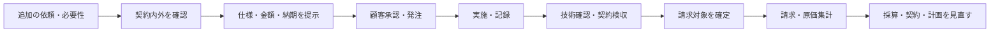
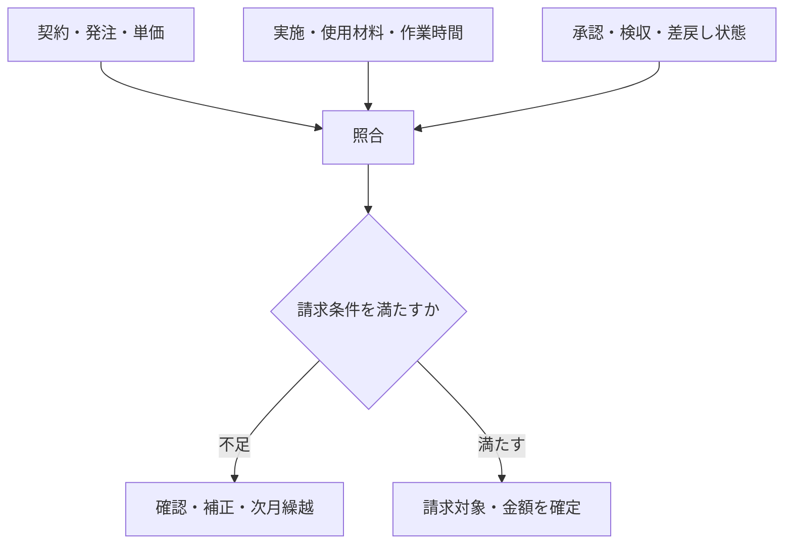

作業が終わっても、すぐ請求できるとは限りません。契約内の月額業務か、回数・数量で精算する業務か、別途承認された追加作業かを区別し、承認済みの実績と契約条件を照合して請求対象を確定します。

:::note[このページで分かること]
追加作業の事前承認、作業完了と検収の違い、請求対象の確定、協力会社請求の検収、原価・採算を次の改善へ戻す流れを理解できます。
:::

## 依頼から請求までをつなぐ

緊急時は、被害拡大防止の一次対応を費用承認より先に行うことがあります。その場合も、誰のどの権限でどこまで実施したか、恒久対応は別承認が必要かを記録します。

## 追加作業で確認すること

| 段階 | 主な確認 |
|---|---|
| 受付 | 依頼内容、対象、緊急度、希望期限 |
| 範囲判定 | 契約内外、基本料金・単価への包含、除外条件 |
| 見積・承認 | 方法、数量、金額、納期、影響、承認権限 |
| 実施 | 承認済み範囲、変更、使用材料、時間、証跡 |
| 検査・検収 | 技術・品質適合、顧客受領、条件付き事項 |
| 請求 | 請求条件、対象月、税・単価、既請求との重複 |

作業中に範囲や数量が変わった場合、現場判断だけで増額せず、緊急性と権限に応じた変更承認を得ます。

## 三つの完了を分ける

1. **技術的完了**：予定した作業と試験を終え、品質・安全を確認した。
2. **契約上の完了**：発注者が成果物と条件を確認し、検収した。
3. **請求可能**：契約上の請求条件と承認済み実績が揃い、対象金額を確定した。

技術的に正常でも完成図書が不足して検収できないことがあります。検収済みでも、締め日や請求書様式などの条件が残る場合があります。

## 請求対象を確定する

請求対象の確定では、実施済みだが未承認の作業、承認済みだが未実施の作業、月額に含まれる作業、すでに請求した作業を区別します。請求漏れだけでなく、重複請求や契約外請求も防ぎます。

## 協力会社の請求と原価

協力会社からの請求は、発注内容、実施記録、検収結果、材料・数量と照合します。顧客への売上と協力会社への支払は別の条件で動く場合があるため、どちらも個別に追跡します。

原価には、労務費、材料費、外注費、交通費などを含めます。予算と実績の差、繰り返す追加作業、再作業、緊急対応の負荷は、次の計画、業務仕様、契約更新条件を見直す材料になります。

## 関連する重要業務

**BM-16-02 請求対象を確定する**は、作業完了と請求可能状態を分け、契約条件・実績・承認を照合する統制点です。

主な業務ID：BM-01-05〜07、BM-02-03〜06、BM-10-06〜10、BM-16-01〜10、BM-18-06〜08。

## まとめ

- 追加作業は、契約内外と権限を確認し、原則として仕様・金額・納期の承認後に実施します。
- 技術的完了、契約検収、請求可能は別々の状態です。
- 売上・原価・品質の実績は、次の計画、仕様、契約更新へ戻します。

次は[点検異常から修繕・引渡しまで](../incidents/abnormality-to-restoration/)で、予定外の不具合が発生したときの流れを見ます。

## さらに詳しく

- [業務カタログ BM-16](https://github.com/tsumasaki-kurageya/property-management-pdm/blob/main/docs/building-maintenance-business-catalog.md#bm-16-売上請求原価管理)
- [重要業務分析：BM-16-02](https://github.com/tsumasaki-kurageya/property-management-pdm/blob/main/docs/04_mappings/critical-business-analysis.md#414-bm-16-02-請求対象を確定する)

最終確認日：2026年7月22日。記載状態：標準モデル。検収・請求条件、承認額、原価範囲は契約・会社によって異なります。
