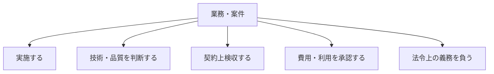

契約は、金額と期間だけを定めるものではありません。対象業務、品質、周期、報告、追加作業、再委託、異常時対応を定め、誰が実施し、誰が判断し、誰が成果を受け取るかを明確にします。

:::note[このページで分かること]
業務仕様を契約条件へ引き継ぐ方法と、ビルオーナー、PM、FM、BM、専門業者などの責任を業務ごとに確認する理由を理解できます。
:::

## 契約で確定する主な事項

| 区分 | 主な内容 |
|---|---|
| 対象 | 建物、区域、設備、業務、除外範囲 |
| 実施条件 | 方法、周期、時間帯、資格、品質基準 |
| 成果・報告 | 記録、報告書、提出期限、検収条件、保存 |
| 費用 | 月額、単価、追加作業、材料、時間外、支払条件 |
| 役割 | 実施、手配、確認、承認、法的義務、緊急判断 |
| 変更・終了 | 変更手続き、更新、解約、資料・鍵・案件の引渡し |

契約書本文、仕様書、見積内訳、役割分担表など複数の文書に分かれることがあります。文書間で対象や用語が食い違わないよう、どれが正本で、変更時にどこを更新するかも確認します。

## 一つの業務に複数の責任がある

例えば法定点検を専門業者が実施し、BM会社が日程・証跡を管理し、建物所有者等が法的義務を負い、顧客側担当者が報告書を受領する場合があります。作業を委託したからといって、法令上の義務や最終判断が自動的に移るとは限りません。

## 責任分界を業務単位で確認する

肩書だけで役割を決めず、少なくとも次の問いを業務・場面ごとに確認します。

- 誰が実作業、調査、点検を行うか
- 誰が技術・品質上の妥当性を判断するか
- 誰が作業開始、変更、追加費用を承認するか
- 誰が契約上の成果として検収するか
- 誰が設備停止、区域解除、利用再開を判断するか
- 誰が法令上の義務を負い、行政報告を行うか
- 不在時や夜間は、誰が代行しどこまで決められるか

役割は建物や契約によって異なります。同じ「BM」でも、元請けとして統括する場合と、限定された専門作業を再委託で担う場合では責任が変わります。

## 契約内・契約外をどう扱うか

依頼された作業が契約外の場合でも、危険があれば安全確保や速報を先に行うことがあります。ただし、恒久修繕や追加清掃などの実施は、範囲、金額、納期、影響を提示し、権限者の承認を得てから進めるのが基本です。

| 状態 | 次の行動 |
|---|---|
| 契約内で実施条件も成立 | 計画・指示へ進む |
| 契約内だが条件不足 | 情報・人員・申請等を補う |
| 契約外で緊急性なし | 見積・承認後に追加作業化する |
| 契約外だが危険あり | 権限内で安全確保・速報し、恒久対応を上申する |

## 契約変更・更新・終了

対象設備、作業周期、単価、報告方法などが変わった場合は、現場への口頭指示だけで済ませず契約変更として記録します。更新時には、実績、原価、品質、苦情、故障傾向、顧客要求を基に条件を見直します。

契約終了時は、報告書や台帳だけでなく、継続中の異常・修繕案件、鍵、物品、権限、保証情報、次回期限も引き渡します。終了日を迎えただけでは、責任移管が成立したとは限りません。

## 関連する重要業務

**BM-17-08 法令・点検義務を管理する**は、新規受託や変更時に、対象法令、義務主体、実施者、資格、期限、報告、保存を対応付けます。契約と法令上の責任を混同しないための統制点です。

主な業務ID：BM-02-01〜07、BM-17-08、BM-18-07。

## まとめ

- 契約は、対象、品質、費用だけでなく、判断・承認・例外時の境界を定めます。
- 実施者、技術判断者、検収者、利用判断者、法的義務主体は分けて確認します。
- 変更・更新・終了では、文書だけでなく未解決事項の責任も引き継ぎます。

次は[管理体制の構築と業務立ち上げ](./startup/)で、契約を実際の運用へ変える準備を見ます。

## さらに詳しく

- [責任主体プロファイル](https://github.com/tsumasaki-kurageya/property-management-pdm/blob/main/docs/owner-pm-fm-bm-responsibility-profiles.md)
- [契約役割プロファイル](https://github.com/tsumasaki-kurageya/property-management-pdm/blob/main/docs/contract-role-profiles.md)
- [法定業務プロファイル](https://github.com/tsumasaki-kurageya/property-management-pdm/blob/main/docs/statutory-duty-profiles.md)

最終確認日：2026年7月22日。記載状態：標準モデル。個別契約や施設への法令適用を判断するものではありません。
