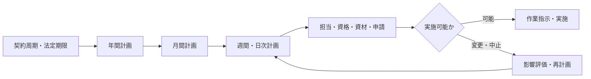
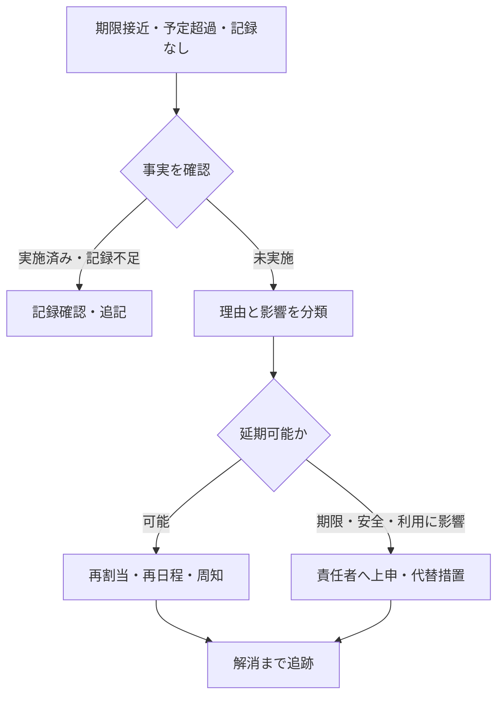

清掃、点検、訓練などの予定は、年間計画に載せただけでは実施できません。月間、週間、日次へ具体化し、担当者、資格、資材、入館・作業申請、テナントへの周知などの条件を揃えます。

:::note[このページで分かること]
計画の時間粒度、担当割当と実施条件、延期・中止・未実施を追跡して再計画する方法を理解できます。
:::

## 計画を実行可能な指示へ変える

## 時間粒度ごとの役割

| 粒度 | 主に決めること | 主な制約 |
|---|---|---|
| 年間 | 周期、法定期限、季節作業、大規模停止 | 契約、法令、予算、休館日 |
| 月間 | 実施月、日程候補、担当、協力会社 | 要員、テナント、資材、他工事 |
| 週間・日次 | 時刻、順序、場所、具体的な作業者 | 入館、鍵、天候、当日の設備状態 |

予定を細かくすると、新しい制約が見つかります。上位計画と日次予定を対応付け、日程変更しても元の期限や回数が消えないようにします。

## 担当割当と実施条件

担当者を決めるときは、空いている人を当てるだけでなく、必要資格、経験、立会い、移動時間、勤務、同時作業を確認します。協力会社へ依頼する場合は、対象、仕様、日時、提出物、指示・連絡・検収窓口を伝えます。

作業前には次を揃えます。

- 作業指示、最新版の手順・図面・過去記録
- 入館申請、作業届、火気・停電・断水等の許可
- 利用者・テナントへの周知と影響調整
- 資材、工具、校正済み測定器、保護具
- 異常時の停止条件、連絡先、判断権限

## 変更は元の計画を消さない

天候、設備状態、欠員、入館制約、顧客都合、緊急対応によって、延期、中止、担当変更、範囲変更が起きます。変更時は、新しい予定だけでなく、変更理由、影響、承認、周知、元の期限を残します。

## 未実施を管理状態へ移す

「実施記録がない」と「作業していない」は区別します。確認後、本当に未実施なら次を決めます。

- 理由と、契約・法定期限・利用者への影響
- 再実施できる期限と担当者
- 代替措置や監視強化の必要性
- 顧客承認、行政・上位責任者への連絡の要否
- 元の計画と再計画の対応関係

未実施案件は、実施して解消するか、責任者・期限・暫定措置を持つ状態へ移るまで完了ではありません。

## 法定業務では実施後も続く

法定点検は、資格、対象、周期を確認して実施し、判定、必要な行政報告、補正、保存まで追跡します。「現地点検済み」と「法令上必要な手続き完了」は同じとは限りません。

## 関連する重要業務

- **BM-04-10 作業遅延・未実施を管理する**：例外を検知し、影響評価と再計画を行う。
- **BM-09-04 法定点検を実施する**：資格、周期、義務主体、報告・保存へ接続する。
- **BM-17-08 法令・点検義務を管理する**：年間計画の根拠となる義務と期限を確定する。

主な業務ID：BM-04-01〜10、BM-05-02〜08、BM-09-04・09、BM-17-08〜10。

## まとめ

- 年間計画は、月間・日次へ展開し、実施条件が揃って作業指示になります。
- 計画変更では、元の期限、理由、影響、承認、周知を残します。
- 未実施は放置せず、再計画または担当・期限・暫定措置を持つ状態へ移します。

次は[作業記録の確認・承認・月次報告](./records-approval-and-reporting/)で、実施結果を顧客へ渡せる情報に変える流れを見ます。

## さらに詳しく

- [業務プロセスマップ P03](https://github.com/tsumasaki-kurageya/property-management-pdm/blob/main/docs/04_mappings/business-process-map.md)
- [重要業務分析：BM-04-10・BM-09-04](https://github.com/tsumasaki-kurageya/property-management-pdm/blob/main/docs/04_mappings/critical-business-analysis.md)

最終確認日：2026年7月22日。記載状態：標準モデル。計画粒度、変更承認、期限は契約・法令・管理方式に依存します。
