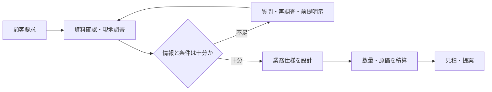

ビルメンテナンスの受託は、顧客から希望を聞いて金額を出すだけでは始められません。建物の用途、面積、設備、利用時間、既存運用、法令条件を確認し、何をどの水準・周期・体制で行うかを業務仕様として定めます。

:::note[このページで分かること]
顧客要求と現場条件を、契約・立ち上げ・品質確認に使える業務仕様へ変換し、数量と原価から見積を作る流れを理解できます。
:::

## 要求を実施可能な仕事へ変える

顧客が表現する「きれいにする」「設備を管理する」といった要求は、そのままでは作業範囲や完了条件になりません。対象、除外範囲、方法、周期、時間帯、品質基準、報告内容、異常時対応まで具体化します。

## 現地調査で確認すること

| 観点 | 例 | 後工程への影響 |
|---|---|---|
| 建物・利用 | 用途、面積、稼働時間、入居者動線 | 作業時間、品質、安全、周知 |
| 設備 | 種類、数量、型式、劣化、停止可否 | 点検内容、資格、部品、修繕 |
| 作業条件 | 入館、鍵、電源・水、搬入、保管場所 | 人員、申請、資材、所要時間 |
| 既存運用 | 図面、台帳、履歴、手順、苦情 | 引継ぎ、初期課題、改善範囲 |
| 法令・契約 | 用途・規模・設備、責任主体、再委託条件 | 周期、資格、報告、証跡 |

現地調査で確認できなかった事項は、未確認のまま暗黙に見積へ含めず、前提条件、除外条件、追加調査事項として残します。

## 業務仕様が決めるもの

業務仕様は、作業者向けの手順書より上位にある「受託する仕事の定義」です。主に次を定めます。

- 対象となる建物、区域、設備、業務
- 作業方法、周期、実施時間、必要資格
- 品質・判定基準と、記録・報告内容
- 顧客、元請け、再委託先などの責任分界
- 通常時と異常時の連絡・承認経路
- 契約に含まれない作業と追加費用の扱い

業務仕様は、見積、契約、管理体制、年間計画、結果確認、請求の共通前提になります。解釈が分かれる表現を残すと、各工程で異なる期待が生まれます。

## 数量・原価・価格を分ける

| 段階 | 主に算出するもの | 例 |
|---|---|---|
| 数量積算 | 作業量 | 面積、設備数、回数、人数、時間 |
| 原価見積 | 実施に要する費用 | 労務、材料、外注、交通、管理費 |
| 見積価格 | 顧客へ提示する条件 | 基本料金、追加単価、期間、支払条件 |

単価だけを先に決めると、仕様変更が数量・原価・価格のどこへ影響したか追えなくなります。提案後に条件が変わった場合は、仕様と積算を対応させて改訂します。

## この段階で止めるべき場合

- 対象範囲や完了基準を一意に解釈できない
- 必要な図面、設備情報、現場条件が不足している
- 必要資格、要員、協力会社を確保できる見込みがない
- 法令上の義務主体や委託可能範囲を確認できない
- 顧客要求と予算・時間・安全条件が両立しない

情報不足を仮定で埋めて契約へ進むのではなく、質問、再調査、代替案、前提条件の明示によって解消します。

## 関連する重要業務

**BM-01-04 業務仕様を設計する**は、14の重要業務の最初に位置します。ここで定めた対象・品質・責任・例外条件が、後続工程の判断基準になります。

主な業務ID：BM-01-01〜08、BM-17-08。

## まとめ

- 現地調査は、顧客要求だけでは見えない実施条件を確認する仕事です。
- 業務仕様は、見積書の説明ではなく、契約から品質確認までをつなぐ基準です。
- 情報不足や実施不能条件が残る場合は、見積・契約確定へ進みません。

次は[契約と責任分界](./contracts-and-responsibilities/)で、仕様を契約条件と役割へ落とし込む方法を見ます。

## さらに詳しく

- [業務カタログ BM-01](https://github.com/tsumasaki-kurageya/property-management-pdm/blob/main/docs/building-maintenance-business-catalog.md#bm-01-営業提案)
- [重要業務分析：BM-01-04](https://github.com/tsumasaki-kurageya/property-management-pdm/blob/main/docs/04_mappings/critical-business-analysis.md#41-bm-01-04-業務仕様を設計する)

最終確認日：2026年7月22日。記載状態：標準モデル。調査範囲、見積方法、契約前の役割は案件によって異なります。
