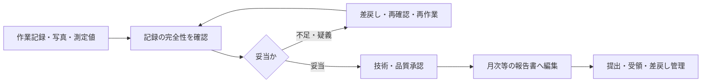

現場作業の結果は、口頭の完了連絡だけでは後工程に使えません。実施内容、時刻、測定値、写真、異常、未実施を記録し、技術・品質上の妥当性を確認して、顧客向けの報告へまとめます。

:::note[このページで分かること]
記録、確認、承認、顧客報告、受領の違いと、記録不足・異常値を差し戻す理由、速報と月次報告を分ける考え方を理解できます。
:::

## 現場の事実を確認可能な成果へ変える

## 確認する内容

| 観点 | 確認例 | 不備時の対応例 |
|---|---|---|
| 完全性 | 必須項目、対象、時刻、担当、写真が揃う | 追記、現場再確認 |
| 整合性 | 計画、対象設備、単位、前後記録と合う | 入力訂正、原因確認 |
| 技術・品質 | 測定値や仕上がりが基準内である | 二次判定、再作業、異常化 |
| 実施状況 | 未実施・中止・追加作業が識別される | 再計画、承認確認 |
| 証跡 | 資格、署名、写真、報告先、保存条件を満たす | 補正、追加資料 |

形式が揃っていても、異常値を正常としてよいとは限りません。反対に、異常値が入力誤りの場合もあります。記録確認と技術判断を分け、必要な判断者へ渡します。

## 承認と検収は違う

内部の承認は、記録や技術・品質が妥当で、顧客へ提出できるかを判断するものです。契約上の検収は、顧客や発注者が成果を受領できるかを判断します。提出しただけでは、受領、検収、差戻し対応まで終わったとは限りません。

## 月次報告がまとめるもの

- 計画した作業の実施・未実施・変更状況
- 清掃、設備、点検、警備などの結果と主要指標
- 異常、不具合、苦情、事故と対応状況
- 継続案件、利用制限、次月へ持ち越す課題
- 修繕・改善の提案、顧客判断が必要な事項
- 法定点検・報告の実施・提出・補正状態

月次報告は、各記録の単純な束ではありません。顧客が建物の状態、契約履行、未解決事項、必要な判断を把握できる粒度へ整理します。ただし、未確定情報を確定事実のようにまとめません。

## 速報と詳細報告を分ける

|  | 速報・上申 | 詳細・定期報告 |
|---|---|---|
| 目的 | 安全確保と対応開始 | 経緯、原因、結果、再発防止の共有 |
| 時期 | 異常認知後、必要な初動と並行 | 情報確認・初動後、期限に従う |
| 内容 | 確認済み事実、影響、緊急度、一次対応、必要判断 | 時系列、原因、恒久対応、費用、残課題 |
| 完了 | 対応責任者が受領し、次の行動が決まる | 提出先が受領し、差戻し・補正を追跡できる |

高緊急度の異常を月次報告まで待つことはできません。一方、速報時点で原因を断定せず、事実と推測を分け、更新報で情報を補います。

## 関連する重要業務

- **BM-13-05 作業記録を確認する**：証跡不足、未実施、異常値を後工程前に検出する。
- **BM-13-11 異常を速報・上申する**：定期報告を待たず、対応責任者への引渡しを成立させる。

主な業務ID：BM-13-01〜11、BM-14-07〜10、BM-17-09〜10。

## まとめ

- 作業実施、記録、内部承認、顧客提出、受領・検収は別の状態です。
- 不備は差し戻し、追記・再確認・再作業のどれが必要かを判断します。
- 異常速報は対応開始のため、月次報告は確認済みの全体像を共有するために行います。

次は[追加作業・検収・請求・原価管理](../additional-work-billing-and-costs/)で、承認済みの実績を金額へつなぐ流れを見ます。

## さらに詳しく

- [業務カタログ BM-13](https://github.com/tsumasaki-kurageya/property-management-pdm/blob/main/docs/building-maintenance-business-catalog.md#bm-13-作業結果報告管理)
- [重要業務分析：BM-13-05・BM-13-11](https://github.com/tsumasaki-kurageya/property-management-pdm/blob/main/docs/04_mappings/critical-business-analysis.md)

最終確認日：2026年7月22日。記載状態：標準モデル。報告様式、承認者、提出周期は契約・法令・顧客指定に依存します。
