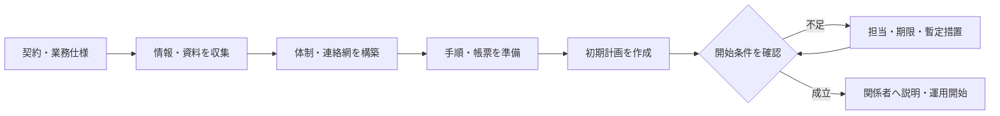

契約が締結されても、現場はすぐには動き始められません。建物・設備情報を集め、責任者と実施者を決め、通常時・異常時の手順、記録様式、初期計画を準備し、関係者が受け取ったことを確認します。

:::note[このページで分かること]
「契約済み」と「運用開始可能」の違い、立ち上げで揃える情報と体制、不足事項を残したまま開始する場合の管理方法を理解できます。
:::

## 契約を運用可能な状態へ変える

## 立ち上げで揃えるもの

| 分類 | 主な内容 | 不足した場合の影響 |
|---|---|---|
| 建物・設備情報 | 用途、区画、設備台帳、図面、系統、メーカー資料 | 対象漏れ、誤操作、積算差異 |
| 過去の記録 | 点検、故障、修繕、苦情、法定報告 | 継続課題や次回期限の見落とし |
| 体制 | 責任者、担当者、資格者、協力会社、代行者 | 判断・連絡・実施の空白 |
| 手順 | 定常作業、異常、報告、承認、緊急時 | 担当者ごとの判断ばらつき |
| 帳票 | 点検表、作業報告、月報、事故報告 | 証跡不足、顧客報告の不整合 |
| 計画 | 年間・初月予定、法定期限、訓練、定期作業 | 未実施、期限超過、要員競合 |

## 管理体制は名簿ではない

体制表には、名前を並べるだけでなく、通常時・不在時・緊急時に誰が何を判断できるかを示します。

- 受託責任者と現場責任者
- 各業務の実施者、技術確認者、承認者
- 法定業務の義務主体、資格者、報告担当
- 協力会社への指示・連絡・検収窓口
- 夜間休日の受付、オンコール、代行者
- 顧客側の連絡、費用承認、利用判断の権限者

連絡先を配布しただけでは体制は成立しません。担当者が役割を受諾し、連絡経路を確認し、不在時の代行まで決まっている必要があります。

## 開始判定で確認すること

1. 契約仕様と対象一覧に解釈のずれがない。
2. 必要資格、人数、勤務・待機体制を確保している。
3. 図面、台帳、鍵、権限、資材などが使用可能である。
4. 通常時・異常時の連絡と承認経路が受領されている。
5. 初月・年間の作業と法定期限が計画されている。
6. 記録・報告・保存の様式と提出先が決まっている。
7. 既存の未解決案件と暫定措置を引き継いでいる。

不足があっても運用を開始せざるを得ない場合は、不足事項、影響、暫定措置、解消担当、期限、開始承認者を明示します。「後で揃える」だけでは管理状態になりません。

## 引継ぎは受領で成立する

既存会社や前担当から資料を受け取っても、内容が揃い、次の担当が未解決事項を理解したとは限りません。引継ぎでは、設備状態、警報、継続案件、予定、鍵・物品、権限、次の行動を照合します。

受領できない事項は責任移管済みとせず、元の担当と新しい担当のどちらが、いつまで何を行うかを決めます。この考え方は、日々の勤務交代や担当変更にも共通します。

## 関連する重要業務

- **BM-03-04 管理体制を構築する**：実施・判断・連絡責任を確定する。
- **BM-05-10 勤務・担当を引き継ぐ**：情報と未解決事項の責任移管を成立させる。
- **BM-17-08 法令・点検義務を管理する**：物件別の義務、期限、資格、報告を初期計画へつなぐ。

主な業務ID：BM-03-01〜08、BM-05-01〜10、BM-14-01〜10、BM-17-08。

## まとめ

- 業務立ち上げは、契約を実施可能な情報・体制・手順・計画へ変換する工程です。
- 体制は役割受諾、代行者、緊急経路まで決まって成立します。
- 不足事項は、担当・期限・暫定措置・承認を持つ管理状態へ移します。

次は[計画・割当・変更・未実施管理](./planning-and-unperformed-work/)で、開始後の仕事を予定どおり進める方法を見ます。

## さらに詳しく

- [業務カタログ BM-03](https://github.com/tsumasaki-kurageya/property-management-pdm/blob/main/docs/building-maintenance-business-catalog.md#bm-03-業務立ち上げ)
- [重要業務分析：BM-03-04・BM-05-10](https://github.com/tsumasaki-kurageya/property-management-pdm/blob/main/docs/04_mappings/critical-business-analysis.md)

最終確認日：2026年7月22日。記載状態：標準モデル。立ち上げ期間と開始判定者は契約・物件によって異なります。
