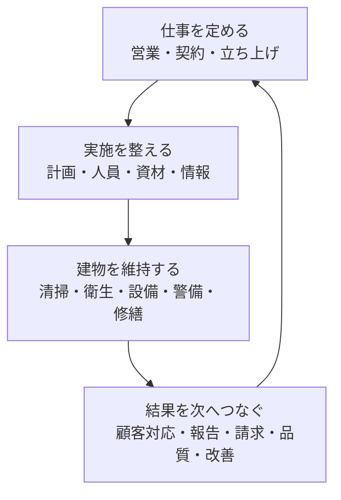

ビルメンテナンスの仕事は、清掃、設備点検、警備などの現場作業だけではありません。仕事を受注する前の調査や提案から、契約、計画、実施、報告、請求、改善までがつながっています。

:::note[このページで分かること]
178の業務を18領域に分ける理由と、領域別の一覧だけでは見えない仕事のつながりを理解できます。
:::

## 二つの見方を使い分ける

このガイドでは、同じ仕事を二つの角度から見ます。

| 見方 | 答えられる問い | 例 |
|---|---|---|
| 業務領域 | どの種類の仕事があるか | 清掃、設備運転、顧客対応、請求 |
| 横断プロセス | 一つの出来事が、どの仕事を通って完了するか | 異常を発見し、安全確保、修繕、報告へ進む |

業務領域は、本の目次のようなものです。個々の仕事を探しやすくします。一方、横断プロセスは物語の流れに近く、複数領域をまたいで仕事がどう進むかを示します。

例えば、空調機の不具合への対応は「不具合・修繕管理」だけでは終わりません。設備監視で異常を知り、顧客へ速報し、人員や部品を手配し、修繕結果を記録し、場合によっては追加費用を請求します。

## 18領域の全体像

18領域は、初学者が役割をつかみやすいよう、次の四つのまとまりとして読めます。このまとまりは理解のための整理であり、会社の部門構成を示すものではありません。

### 図の読み方

仕事は、受託内容を**定める**、実施条件を**整える**、建物を**維持する**、結果を次の判断へ**つなぐ**という四つのまとまりで循環します。矢印は部門間の指揮命令ではなく、仕様、計画、作業結果、報告、実績、改善事項の引渡しを表します。

図の根拠：BM-01〜BM-18。主な成果物は契約仕様、台帳、計画、作業記録、報告書、請求・原価情報、改善案です。18領域の内訳は直後の表で文章として確認できます。

### 仕事を定める

| ID | 業務領域 | 主な役割 |
|---|---|---|
| BM-01 | 営業・提案 | 要求と現場条件を調べ、仕様、数量、費用を提案する |
| BM-02 | 契約管理 | 受託範囲、品質、周期、金額、更新条件を確定する |
| BM-03 | 業務立ち上げ | 建物情報、体制、手順、帳票、初期計画を整える |

### 実施を整える

| ID | 業務領域 | 主な役割 |
|---|---|---|
| BM-04 | 計画・スケジュール管理 | 年間、月間、日次の予定と変更を管理する |
| BM-05 | 人員・協力会社管理 | 配置、資格、シフト、再委託、引継ぎを管理する |
| BM-14 | 建物・設備情報管理 | 建物、設備、図面、仕様、履歴を台帳として保つ |
| BM-15 | 資材・在庫・購買管理 | 消耗品、部品、工具、発注、在庫を管理する |

### 建物を維持する

| ID | 業務領域 | 主な役割 |
|---|---|---|
| BM-06 | 清掃管理 | 日常・定期・特別清掃と清掃品質を管理する |
| BM-07 | 衛生管理 | 空気、水、排水、貯水槽、害虫などを管理する |
| BM-08 | 設備運転管理 | 設備の監視、操作、検針、日常運転を行う |
| BM-09 | 点検・保守管理 | 日常・定期・法定点検と保守を管理する |
| BM-10 | 不具合・修繕管理 | 異常の評価、応急処置、修繕、復旧を管理する |
| BM-11 | 警備・防災管理 | 受付、入退館、巡回、事故・災害対応を行う |

### 結果を次へつなぐ

| ID | 業務領域 | 主な役割 |
|---|---|---|
| BM-12 | テナント・顧客対応 | 問い合わせ、依頼、苦情、周知を管理する |
| BM-13 | 作業結果・報告管理 | 現場記録を確認し、報告書として提出する |
| BM-16 | 売上・請求・原価管理 | 実績から請求、仕入れ、原価、採算を確定する |
| BM-17 | 品質・安全・法令管理 | 品質、安全、法令義務、監査、是正を管理する |
| BM-18 | 分析・改善・経営管理 | 実績と傾向を分析し、計画や契約を見直す |

## 領域は部門や担当者と一対一ではない

一つの担当者が複数領域を担うことも、一つの領域を複数会社で分担することもあります。例えば、現場責任者が設備運転、作業報告、人員調整を兼ねる場合があります。逆に点検・保守の中でも、昇降機や消防設備のように専門業者が担う範囲があります。

領域名から担当者を決めつけず、実際には次を分けて確認します。

- 誰が作業するか
- 誰が技術・品質を確認するか
- 誰が契約上の成果を受け取るか
- 誰が費用や利用再開を判断するか
- 誰が法令上の義務を負うか

## 178業務はどこで見るか

18領域の内側には178の業務があります。本文では全件を列挙せず、仕事の目的とつながりを理解するために代表的な業務だけを扱います。特定業務を探す場合は、[業務カタログの原本](https://github.com/tsumasaki-kurageya/property-management-pdm/blob/main/docs/building-maintenance-business-catalog.md)を参照してください。

次は[契約から改善まで](./business-lifecycle/)で、領域をまたいで仕事がどのように進むかを見ます。

## まとめ

- ビルメンテナンス会社の仕事は、18領域・178業務として整理できます。
- 18領域は仕事の種類を探すため、横断プロセスは仕事のつながりを追うために使います。
- 現場作業の前後には、契約、計画、情報、人員、報告、請求、改善などがあります。
- 業務領域と会社の部門・担当者は一対一とは限りません。

## さらに詳しく

- [18領域・178業務をIDや名称から調べる](./reference/business-catalog/)
- [12横断プロセスで業務の接続を調べる](./reference/processes/)
- [ビルメンテナンス業務カタログ](https://github.com/tsumasaki-kurageya/property-management-pdm/blob/main/docs/building-maintenance-business-catalog.md)
- [ビルメンテナンス業務プロセスマップ](https://github.com/tsumasaki-kurageya/property-management-pdm/blob/main/docs/04_mappings/business-process-map.md)

最終確認日：2026年7月22日。記載状態：分析用原本に基づく標準モデル。実際の分担と順序は、建物、契約、管理方式等によって変わります。
