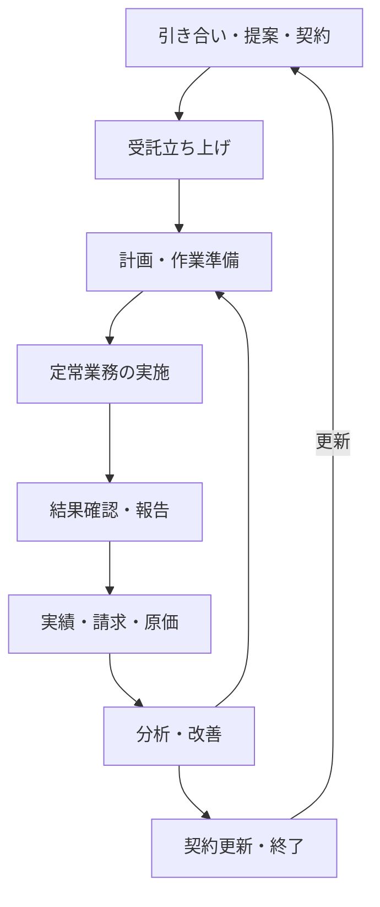
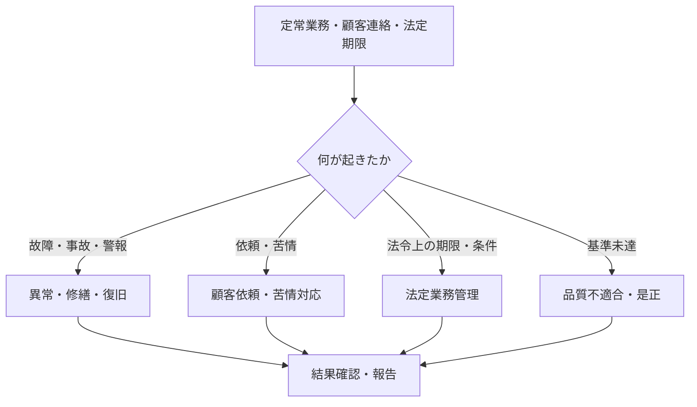

ビルメンテナンス業務は、現場で作業するところから突然始まるわけではありません。何を、どの水準で、誰が、いつ実施するかを契約と計画で定め、実施結果を次の判断へ渡し続けます。

:::note[このページで分かること]
契約前から日常運用、異常対応、報告、請求、改善、契約更新・終了までの基本的な流れと、12の横断プロセスの読み方を理解できます。
:::

## 業務は直線ではなく循環する

上図は正常に進んだ代表経路です。実際には、作業中の異常、品質不良、顧客からの依頼、法定期限などから別の経路が始まります。

## 基本経路を七つの場面で捉える

### 1. 要求と受託範囲を定める

問い合わせや入札を受けると、建物用途、規模、設備、利用時間、既存の運用などを調査します。その結果から、作業範囲、頻度、品質、報告方法、費用などを提案し、合意した内容を契約へ落とします。

主な引渡しは、契約仕様、金額、周期、品質条件、開始日、責任分界です。見積書を提出しただけでは、受託範囲が確定したことにはなりません。

### 2. 運用を開始できる状態へ整える

契約後は、建物・設備・図面・履歴を集め、台帳へ登録します。同時に、責任者、担当者、資格者、協力会社、緊急連絡体制、手順、帳票、初期計画を用意します。

情報や資格者が不足している場合は、「立ち上げ完了」とせず、不足事項、担当、期限を残して管理します。

### 3. 実施可能な作業へ具体化する

契約や法定周期を年間計画にし、月間、週間、日次の予定へ分解します。担当者、協力会社、資材、工具、入館申請、作業区域、安全対策まで揃って、初めて現場へ渡せる作業指示になります。

予定日が決まったことと、安全に実施できる条件が整ったことは別です。

### 4. 作業し、結果か異常を渡す

清掃、衛生、設備運転、点検・保守、警備・防災などの業務を実施し、測定値、写真、作業内容、異常、未実施理由を記録します。

異常がなければ結果確認へ進みます。異常があれば、定期報告を待たず、安全確保と速報を行い、異常対応へ分岐します。

### 5. 結果を確認し、相手へ伝える

作業者の記録を管理者が確認し、未入力、異常値、証跡不足、未実施があれば差し戻します。その後、技術・品質上の確認を経て、顧客向け報告書へまとめ、提出と受領を追跡します。

作業実施、記録、技術確認、顧客提出、顧客受領は、それぞれ別の状態です。

### 6. 実績を金額と評価へつなげる

承認済みの定例作業、追加作業、修繕などを契約条件と照合し、顧客への請求額と協力会社への支払対象を確定します。あわせて労務、材料、外注費などを集計し、物件や契約の採算を確認します。

作業をしたことだけで請求できるとは限りません。契約で定めた検収や証跡などの条件を満たす必要があります。

### 7. 次の計画・契約へ反映する

実施率、品質、故障、人員、費用、採算などを振り返り、清掃方法、保全方式、作業計画、契約条件、修繕・更新候補を見直します。契約を終了する場合は、台帳、鍵、証跡、未完了案件、保管責任などを次の担当へ引き渡します。

分析結果を示したことと、改善案が承認され、実際の計画や仕様へ反映されたことも別です。

## 基本経路から分岐する四つのプロセス

| プロセス | 主な開始契機 | 主な終わり方 |
|---|---|---|
| 異常・修繕・復旧 | 警報、点検異常、事故、顧客連絡 | 技術的復旧または条件付き引渡しが成立する |
| 顧客依頼・苦情対応 | 問い合わせ、作業依頼、苦情 | 回答・対応結果が通知され、完了を追跡できる |
| 法定業務管理 | 適用条件、法定期限、法改正 | 必要な報告・届出・証跡保存が完了する |
| 品質不適合・是正 | 品質検査、苦情、監査、事故 | 是正結果を確認し、再発防止へつなぐ |

これらは完全に独立しているわけではありません。例えば、顧客の苦情から清掃品質の不適合が見つかり、再清掃と再検査を行う場合があります。

## 12の横断プロセス

分析用原本では、業務の流れを次の12本で表しています。

| ID | 横断プロセス | 読むと分かること |
|---|---|---|
| P01 | 引き合い・提案・契約 | 要求を受託範囲へ確定するまで |
| P02 | 受託立ち上げ | 運用開始に必要な情報と体制 |
| P03 | 計画・作業準備 | 予定を実施可能な作業指示へする条件 |
| P04 | 定常業務の実施 | 各現場領域の共通した入口と出口 |
| P05 | 結果確認・報告 | 現場記録を確認し、報告・履歴へ渡すまで |
| P06 | 異常・修繕・復旧 | 異常認知から安全確保、修繕、引渡しまで |
| P07 | 顧客依頼・苦情対応 | 受付、割当、対応、回答、完了追跡 |
| P08 | 法定業務管理 | 適用判定、資格、期限、行政報告、保存 |
| P09 | 品質不適合・是正 | 基準未達の登録、是正、再検査、再発防止 |
| P10 | 実績・請求・原価 | 承認済み実績から請求・原価確定まで |
| P11 | 分析・改善 | 傾向を計画・仕様・契約の変更へつなぐまで |
| P12 | 契約更新・終了 | 更新条件の確定または終了・引継ぎまで |

## プロセスは五つの要素で読む

| 要素 | 確認する問い |
|---|---|
| 開始契機 | 何が起きたら、この流れを始めるのか |
| 業務 | 誰が何を行うのか |
| 判断 | 何を基準に次の経路を選ぶのか |
| 成果物・状態 | 次の担当へ何を渡せばよいのか |
| 接続先 | 次はどのプロセスへ進むのか |

単に作業の順番だけを見るのではなく、引渡しに必要な情報と成立条件を見るのがポイントです。例えば、計画から現場実施への引渡しでは、対象、日時、担当だけでなく、資格、安全、申請条件が確認されている必要があります。

## まとめ

- ビルメンテナンス業務は、契約前から改善・更新まで循環します。
- 正常経路だけでなく、異常、依頼・苦情、法定業務、品質不適合の分岐があります。
- 12の横断プロセスは、18領域をまたぐ仕事のつながりを示します。
- 流れを読むときは、開始契機、判断、成果物、完了状態、接続先を確認します。

次は[業務の時間軸と完了状態](../completion-states/)で、日次・月次・年次の仕事がどう重なり、「終わった」をどう区別するかを確認します。

## さらに詳しく

- [ビルメンテナンス業務プロセスマップ](https://github.com/tsumasaki-kurageya/property-management-pdm/blob/main/docs/04_mappings/business-process-map.md)
- [ビルメンテナンス業務カタログ](https://github.com/tsumasaki-kurageya/property-management-pdm/blob/main/docs/building-maintenance-business-catalog.md)

最終確認日：2026年7月22日。記載状態：分析用原本に基づく標準モデル。実際の順序、主体、承認者は契約や建物条件等によって変わります。
