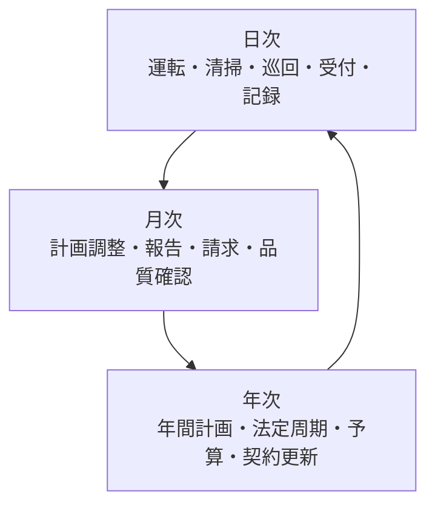
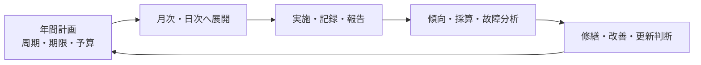
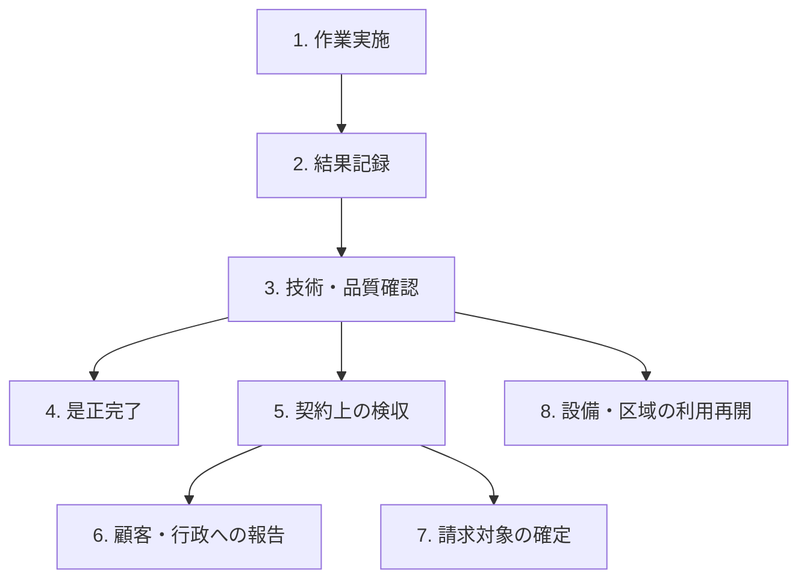

ビルメンテナンスの現場では、毎日の運転や清掃と、月ごとの報告、年ごとの点検・契約更新が同時に進みます。また「作業が終わった」と言っても、記録、確認、報告、検収などが残っている場合があります。

:::note[このページで分かること]
代表的な1日・1か月・1年の業務サイクルと、業務を正しく引き渡すために区別すべき完了状態を理解できます。
:::

## 三つの時間軸が重なっている

日次、月次、年次は別々に完結するものではありません。毎日の記録が月次報告や請求の根拠になり、月ごとの傾向が翌年の計画や予算へつながります。年次計画は再び日々の作業予定へ分解されます。

## 代表的な一日

常駐管理のある建物を例にした代表像です。すべての現場がこの順序・体制になるわけではありません。

| 場面 | 主な仕事 | 次へ渡すもの |
|---|---|---|
| 勤務開始・交代 | 未完了事項、警報、鍵、作業予定、注意事項を引き継ぐ | 引継ぎ記録、当日の優先事項 |
| 始業時 | 設備状態、当日作業、入館・安全条件を確認する | 実施可能な作業指示 |
| 日中 | 設備監視、巡回、検針、清掃、受付、点検を行う | 測定値、写真、作業記録 |
| 随時 | 警報、依頼、苦情、事故へ一次対応する | 速報、影響、緊急度、対応責任者 |
| 作業後 | 結果と異常を記録し、管理者が確認する | 承認または差戻し記録 |
| 勤務終了・交代 | 継続案件、利用制限、未実施、物品を引き継ぐ | 次勤務が受領した記録 |

巡回管理では、移動、訪問順、遠隔からの受付、鍵・資料の持ち出しなどが加わります。夜間無人になる建物では、遠隔監視から駆け付ける条件と連絡経路が重要になります。

## 代表的な一か月

| 時期 | 主な仕事 | 見るべき状態 |
|---|---|---|
| 月初・計画時 | 年間計画から当月作業を展開し、人員・協力会社を調整する | 日程、担当、資格、資材、申請が揃ったか |
| 月中 | 定常業務、定期作業、追加依頼、異常対応を進める | 未実施、遅延、異常、是正が残っていないか |
| 月末・締め | 記録、写真、測定値、報告対象を確認する | 証跡不足や差戻しが解消したか |
| 報告・請求 | 顧客報告を提出し、契約条件と実績を照合する | 受領・検収と請求条件が成立したか |
| 振り返り | 品質、故障、苦情、人員、費用の傾向を見る | 次月計画へ反映する事項が決まったか |

月末にまとめて確認すると、証跡不足や未実施が手遅れになる場合があります。そのため実際には、日々の確認と締め時の集約を組み合わせます。

## 代表的な一年

| 観点 | 年間で行う主な仕事 |
|---|---|
| 計画 | 契約周期、法定期限、季節、休館日などを年間計画へ置く |
| 体制 | 必要な資格、教育、要員、協力会社、緊急体制を確認する |
| 設備・品質 | 定期・法定点検、大規模な清掃、品質評価を行う |
| 費用 | 予算と実績、修繕費、外注費、採算を確認する |
| 改善 | 故障傾向や苦情から、保全方法、仕様、計画を見直す |
| 契約 | 更新条件を検討するか、終了・引継ぎを準備する |

法定業務の周期は必ずしも「年1回」ではありません。建物用途、規模、設備、地域、法令等によって対象と期限が変わるため、個別に確認します。

## 予定された仕事と都度発生する仕事

| 種類 | 主な開始契機 | 例 | 管理上のポイント |
|---|---|---|---|
| 計画業務 | 契約周期、年間計画、法定期限 | 日常清掃、定期点検、測定、訓練 | 期限、未実施、日程変更を追跡する |
| 都度発生業務 | 警報、依頼、苦情、事故、故障 | 緊急点検、応急処置、追加清掃 | 緊急度、担当、回答期限、残るリスクを追跡する |

都度発生業務が入ると、予定作業を延期する場合があります。延期した仕事が消えないよう、未実施理由と再計画を残します。反対に、繰り返し発生する依頼や故障は、次の計画業務や改善対象へ変えることがあります。

## 「完了」を一語で済ませない

この図は八つの状態の違いを示すもので、すべての案件が同じ順番ですべてを通るという意味ではありません。例えば、法定報告が不要な日常清掃もあれば、緊急時に技術確認を待たず区域を閉鎖する場合もあります。

| 状態 | 成立したといえる条件の例 | 主な確認者の例 |
|---|---|---|
| 作業実施 | 予定した行為を終えた | 作業者・作業責任者 |
| 結果記録 | 内容、時刻、測定値、写真、異常等が残った | 作業者 |
| 技術・品質確認 | 基準を満たすか、異常や残課題がないかを確認した | 技術責任者・品質確認者 |
| 是正完了 | 不適合を直し、再確認で有効性を確かめた | 品質確認者・管理者 |
| 契約上の検収 | 発注した成果として受領できると判断した | 委託者・発注者 |
| 顧客・行政への報告 | 必要な相手へ提出し、受領・補正状態を追跡できる | 報告責任者・受領者 |
| 請求対象の確定 | 契約上の請求条件と承認済み実績が揃った | 契約・請求担当 |
| 利用再開 | 安全と利用影響を確認し、設備・区域を再び使えると判断した | 権限を持つ運用・施設責任者 |

確認者は代表例です。同じ人が複数を兼ねる場合も、複数会社に分かれる場合もあります。

## なぜ状態を分けるのか

設備修繕を例にすると、部品交換が終わっても、試運転が未実施なら技術的な確認は終わっていません。試運転で正常でも、発注者の検収や利用者への周知が残ることがあります。区域の安全確認ができなければ、設備が動いても利用再開できない場合があります。

状態を分けると、次のことが明確になります。

- 今どこまで終わり、何が残っているか
- 誰の判断を待っているか
- 次の担当へ何を渡すべきか
- 報告や請求を始めてよいか
- 利用者へ「復旧した」と伝えてよいか

## まとめ

- 日次、月次、年次の業務はつながり、互いの入力になります。
- 計画業務と都度発生業務は開始契機が異なり、両方を同時に管理します。
- 「完了」は、実施、記録、確認、是正、検収、報告、請求、利用再開に分けて考えます。
- 同じ人が複数状態を確認する場合でも、何を確認したかは区別します。

次は[現場の業務](../../field-work/)で、日常の清掃、衛生、設備、警備・防災がどのように進むかを見ます。[契約から改善まで](../business-lifecycle/)へ戻ることもできます。

## さらに詳しく

- [ビルメンテナンス業務プロセスマップ](https://github.com/tsumasaki-kurageya/property-management-pdm/blob/main/docs/04_mappings/business-process-map.md)
- [重要業務分析](https://github.com/tsumasaki-kurageya/property-management-pdm/blob/main/docs/04_mappings/critical-business-analysis.md)
- [管理方式プロファイル](https://github.com/tsumasaki-kurageya/property-management-pdm/blob/main/docs/management-operation-profiles.md)

最終確認日：2026年7月22日。記載状態：分析用原本に基づく標準モデル。時間軸、体制、確認者、必要な状態は個別条件によって変わります。
