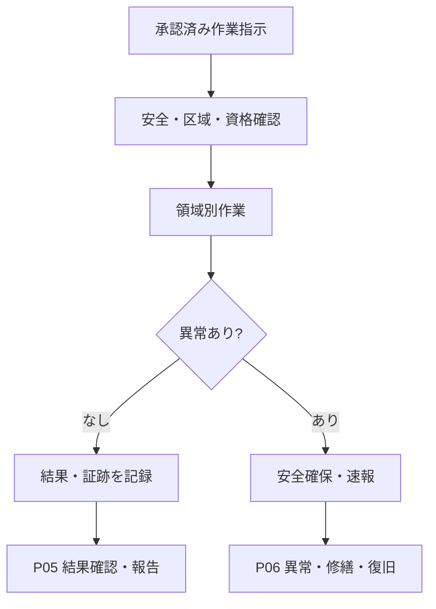

:::note[このページの位置づけ]
分析用原本から自動生成した表示用ページです。内容を変更するときは[原本](https://github.com/tsumasaki-kurageya/property-management-pdm/blob/main/docs/04_mappings/business-process-map.md)を更新してください。最終生成確認日：2026-07-23。
:::
# P04 定常業務の実施

### 8.1 共通入口・出口

### 8.2 領域別の主な流れ

| 領域 | 計画・条件 | 実施 | 記録・判定 | 主な分岐 |
|---|---|---|---|---|
| 清掃 | BM-06-01、02、04 | BM-06-03、05〜07 | BM-06-08、09 | 不良はP09、方法見直しはP11 |
| 衛生 | BM-07-01 | BM-07-02、04〜10 | BM-07-03、11 | 基準逸脱はP06又はP09、法定対象はP08 |
| 設備運転 | BM-08-01 | BM-08-02〜05、08 | BM-08-06、09 | 警報はBM-08-07からP06 |
| 点検・保守 | BM-09-01 | BM-09-02〜04、07、08 | BM-09-05、06、10 | 異常はP06、未実施はP03、法定対象はP08 |
| 警備・防災 | BM-11-01 | BM-11-02〜05、07、08 | BM-11-10 | 事故・事件・災害はBM-11-06、09からP06 |

勤務交代時はBM-05-10で未完了事項、異常、物品及び対応責任を引き継ぐ。作業終了だけではP05の結果確認、P09の是正又は施設利用再開まで完了したことにならない。

[12横断プロセスへ戻る](../) · [流れを本文で学ぶ](/overview/business-lifecycle/)
