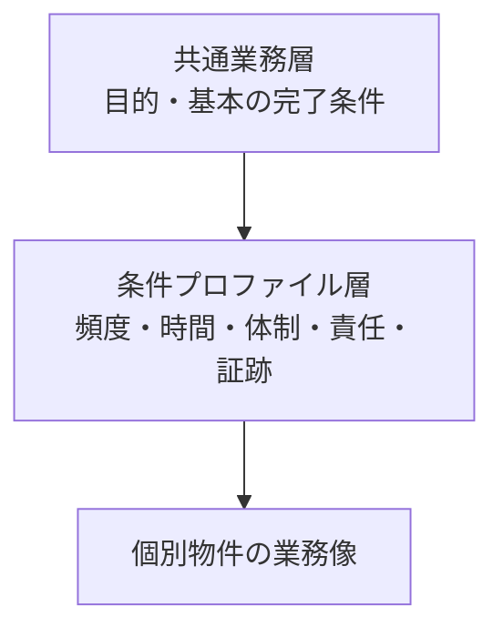

ビルメンテナンスには、多くの物件に共通する仕事があります。一方、同じ「設備点検」でも、オフィスと病院、常駐現場と巡回現場、元請けと専門業者では、実施時間、判断権限、連絡経路、必要な証跡が変わります。

:::note[この章で分かること]
共通業務を保ったまま物件ごとの差を表す方法と、用途、管理方式、契約、責任、法令を混同せずに重ねる方法を理解できます。
:::

## 共通業務と条件差の二層で考える

このサイトの業務カタログは、178業務を共通業務として整理しています。物件ごとに別の業務カタログを作るのではなく、次の属性を条件プロファイルで補正します。

| 変わる属性 | 確認すること |
|---|---|
| 適用 | その業務が必要か、設備・規模等の条件付きか |
| 頻度・時間 | いつ、どの周期で、どの時間帯なら実施できるか |
| 品質・初動 | どの水準を守り、異常時にどれだけ早く動くか |
| 体制・権限 | 誰が実施し、判断し、承認するか |
| 連絡・証跡 | 誰へ何を伝え、何を記録・保存するか |

## 五つの条件軸

| 条件軸 | 主な問い | 次のページ |
|---|---|---|
| 建物用途 | 誰が、いつ、どのように建物を使うか | [建物用途による違い](./variations/building-use/) |
| 管理方式 | 現場にいつ人がいて、異常をどう検知するか | [常駐・巡回・遠隔監視](./variations/management-methods/) |
| 契約階層 | 誰が顧客と契約し、誰へ仕事を委ねるか | [元請け・再委託先・専門業者](./variations/contract-layers/) |
| 責任・機能 | 誰が所有、経営、利用、現場管理を担うか | [オーナー・PM・FM・BM](./variations/responsibility-boundaries/) |
| 法令 | 何が適用され、誰が義務を負うか | [法令業務の考え方](./variations/statutory-duties/) |

これらは代替関係ではありません。一つの物件にすべての軸が同時に存在します。例えば「病院だから常駐」「BMだから法的義務を負う」と肩書だけで決めず、各軸を個別に確認します。

## この章を読むときの注意

この章の比較は、業務分析用の標準モデルです。実際の役割、周期、資格、報告先、権限は、個別契約、設備、物件体制、最新の法令・条例、所管行政庁の判断で確認します。

次は[建物用途による違い](./variations/building-use/)で、建物の使われ方が現場業務へ与える影響を見ます。

## さらに詳しく

- [ビルメンテナンス業務カタログ](https://github.com/tsumasaki-kurageya/property-management-pdm/blob/main/docs/building-maintenance-business-catalog.md)
- [建物用途別プロファイル](https://github.com/tsumasaki-kurageya/property-management-pdm/blob/main/docs/building-use-profiles.md)
- [管理方式プロファイル](https://github.com/tsumasaki-kurageya/property-management-pdm/blob/main/docs/management-operation-profiles.md)

最終確認日：2026年7月23日。記載状態：標準モデル。
