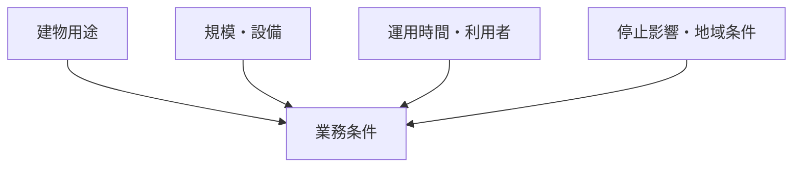

用途による違いは、業務の有無だけではありません。利用者、運用時間、設備、停止影響が変わるため、同じ共通業務でも頻度、実施可能時間、品質、初動、調整先、証跡が変わります。

## 代表用途の比較

| 用途 | 業務差の中心 | 特に変わる点 |
|---|---|---|
| オフィス | 執務とテナント業務を妨げない | 始業前・夜間作業、テナント調整、温冷感対応 |
| 商業施設 | 来館者安全と店舗営業を両立する | 営業中清掃、厨房・廃棄物、群集、売場閉鎖判断 |
| ホテル | 24時間の宿泊機能を維持する | 静穏、給湯、客室入室、迅速な苦情対応 |
| 病院・医療 | 診療継続と患者安全を優先する | 区域別手順、感染対策、重要設備の停止調整 |
| 学校 | 児童・生徒の安全と授業を守る | 授業外作業、長期休業、工具・薬剤の隔離 |
| 共同住宅 | 24時間の生活と権利境界を尊重する | 共用・専有の区分、居住者周知、緊急入室 |
| 物流・工場 | 操業と作業安全を両立する | 車両・荷役動線、設備分界、作業許可、停止枠 |
| データセンター | 電源・冷却の高可用性を守る | 冗長性、変更管理、厳格な入退室、即時連絡 |
| 公共・文化 | 催事変動と不特定多数の安全に対応する | 催事連動、群集、休館日、専門区域との分界 |

### 表の読み方

用途ごとの優劣ではなく、共通業務の頻度、実施可能時間、品質基準、停止影響、調整先、必要証跡が変わる点を比較します。例えば同じ設備点検でも、病院では診療継続、ホテルでは宿泊機能、データセンターでは電源・冷却の冗長性が停止判断の中心になります。用途だけで条件を確定せず、規模、設備、利用者、運用時間を重ねます。

表の根拠：BM-03〜04、BM-06〜14、BM-17。主な成果物は用途・区画情報、業務仕様、実施時間帯、品質・停止基準、周知計画、作業・異常記録です。

この比較は強弱の順位ではありません。例えば清掃はどの用途でも行われますが、商業施設では営業中の随時対応、病院では区域別手順、データセンターでは防じんと機器リスクが中心になります。

## 用途名だけでは決まらない

同じオフィスでも、単独利用か複数テナントか、24時間運用か、受変電や非常電源を持つかで業務は変わります。用途分類は法令上の用途区分を代替せず、法令の適用判定は別に行います。

## 複合用途は区画と共用設備を分ける

複合用途施設では、建物全体へ一つの用途ラベルを付けて終わりにしません。

1. 棟・階・区画ごとに用途を割り当てる
2. 区画ごとの清掃、入退室、作業時間、品質を決める
3. 受変電、中央監視、防災、搬送など共用設備の影響先を確認する
4. 共用設備は、停止影響や安全要求が大きい用途を考慮して条件を決める

主な関連業務：BM-03〜04、BM-06〜11、BM-12〜14、BM-17。

次は[常駐・巡回・遠隔監視](./management-methods/)で、人の配置と異常検知の違いを見ます。

## さらに詳しく

- [建物用途別プロファイル](https://github.com/tsumasaki-kurageya/property-management-pdm/blob/main/docs/building-use-profiles.md)
- [業務カタログ](https://github.com/tsumasaki-kurageya/property-management-pdm/blob/main/docs/building-maintenance-business-catalog.md)

最終確認日：2026年7月23日。記載状態：標準モデル。用途だけで個別物件の業務を確定するものではありません。
