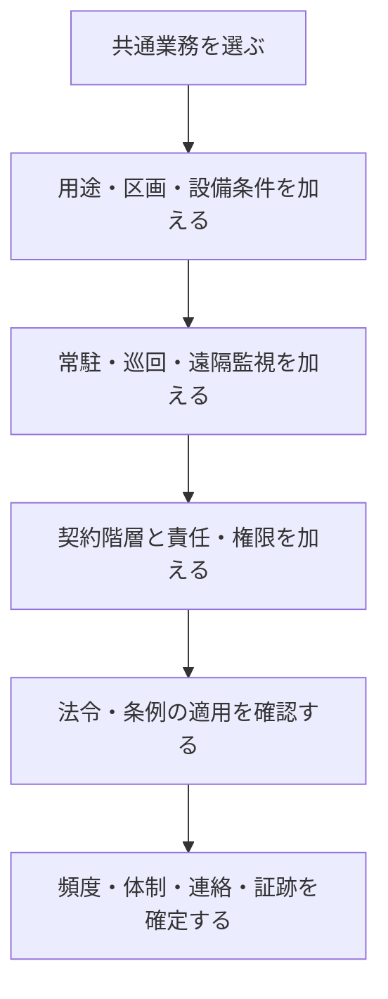

個別物件の業務像は、どれか一つのプロファイルを選ぶだけでは作れません。共通業務を土台に、互いに独立した条件を順番に重ね、矛盾や空白を確認します。

## 重ね合わせの手順

1. 対象建物、棟、階、区画、設備を特定する
2. 業務カタログから対象となる共通業務を選ぶ
3. 用途と運用時間から、作業時間・品質・初動要求を補正する
4. 管理方式から、検知・受付・出動・引継ぎを補正する
5. 契約階層から、指示・実施・受入・顧客報告経路を補正する
6. 四つの責任主体と、承認上限・代行者を割り当てる
7. 最新の法令・条例から、適用、資格、周期、報告、保存を確認する
8. 条件同士の矛盾、担当空白、重複、例外時の経路をレビューする

## 例：複合用途施設の受変電設備

| 条件 | 業務へ与える差 |
|---|---|
| 用途 | 商業区画、ホテル、オフィスで停止可能時間と周知先が異なる |
| 設備 | 共通受変電設備の停止が複数用途へ波及する |
| 管理方式 | 日中常駐、夜間遠隔監視なら時間帯で初動者が変わる |
| 契約 | 元請けBMが統括し、専門業者が点検を実施する |
| 責任 | 技術判断、停止承認、費用承認、利用再開判断が分かれる |
| 法令 | 選任体制、保安規程、点検・記録等の適用を個別確認する |

この例では「設備点検を実施する」だけでは不十分です。用途別周知、切替・復旧手順、夜間の連絡、専門業者の受入、停止と再開の承認、法令上の記録まで接続して初めて物件の業務像になります。

## 最後に確認する五つの空白

- 実施者はいるが、結果の判断者がいない
- 異常を検知できるが、現場へ行く人がいない
- 作業は終わるが、顧客検収・利用再開の経路がない
- 契約には入っているが、法令上の義務主体・報告者が不明
- 平常時は回るが、不在、通信断、災害、期限超過の代替経路がない

個別物件へ適用するときは、プロファイルをコピーして標準手順とみなすのではなく、差分を合意し、契約・計画・台帳・連絡表・手順へ反映します。

ここまでで初学者向け本文は一巡です。詳細な業務IDや分析表は[リファレンス](../../reference/)から確認できます。

## さらに詳しく

- [建物用途別プロファイル](https://github.com/tsumasaki-kurageya/property-management-pdm/blob/main/docs/building-use-profiles.md)
- [管理方式プロファイル](https://github.com/tsumasaki-kurageya/property-management-pdm/blob/main/docs/management-operation-profiles.md)
- [契約役割プロファイル](https://github.com/tsumasaki-kurageya/property-management-pdm/blob/main/docs/contract-role-profiles.md)
- [責任主体プロファイル](https://github.com/tsumasaki-kurageya/property-management-pdm/blob/main/docs/owner-pm-fm-bm-responsibility-profiles.md)
- [法令義務プロファイル](https://github.com/tsumasaki-kurageya/property-management-pdm/blob/main/docs/statutory-duty-profiles.md)

最終確認日：2026年7月23日。記載状態：標準モデル。個別物件へ適用する際は契約・現場・最新法令の確認が必要です。
