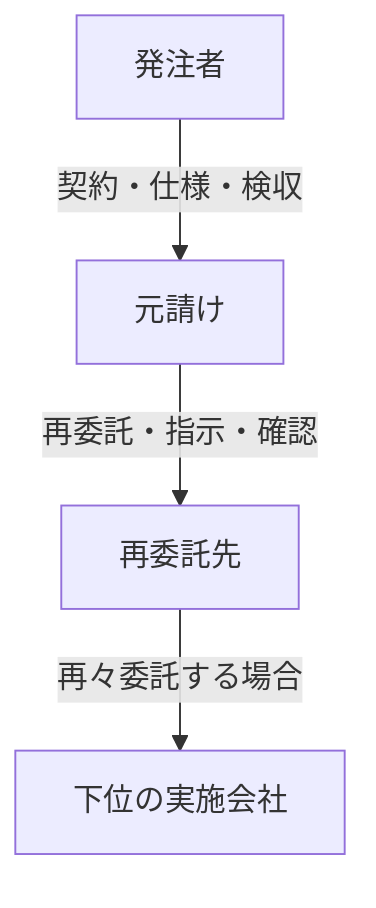

同じ作業を行う会社でも、顧客と直接契約する元請けか、元請けから仕事を受ける再委託先かで、契約上の責任と連絡経路が変わります。専門業者は技術上の役割を表す言葉であり、元請けにも再委託先にもなり得ます。

## 契約階層の基本形

| 観点 | 元請け | 再委託先・専門業者 |
|---|---|---|
| 主な役割 | 契約全体の統括、顧客窓口、業務間調整 | 委ねられた範囲の専門的・現場的な実施 |
| 指示 | 発注者要求を作業条件へ変換する | 指示・仕様・現場条件を確認して実施する |
| 品質 | 全体品質、受入、是正、顧客報告 | 自社作業の技術品質、自己点検、速報 |
| 変更 | 契約・追加費用・顧客承認を調整する | 勝手に範囲を広げず変更を申し出る |
| 異常 | 全体影響を把握し顧客へ統合報告する | 安全確保、事実・影響・応急措置を速報する |
| 証跡 | 複数社の記録を案件・報告へ統合する | 作業者、資格、測定値、写真等を提出する |

## 直接連絡と契約経路を分ける

緊急時に再委託先が発注者や施設利用者へ直接連絡することはあります。ただし、直接連絡を認める条件、伝えてよい内容、元請けへの同時連絡、作業変更や費用承認の権限を事前に決めます。

現場で直接会話したことが、契約変更や追加作業の承認になったとは限りません。安全のための初動と、恒久対応・費用の承認を分けます。

## 三段階の確認

1. 再委託先が自社作業を自己点検する
2. 元請けが仕様適合と証跡を確認する
3. 発注者側が契約上の成果を検収する

技術上の完了、元請けの受入、顧客検収は別の状態です。再々委託がある場合も、承認された階層、資格、保険、情報管理、事故報告経路を追跡できるようにします。

主な関連業務：BM-02-04、BM-03-04〜05、BM-05-07〜10、BM-13、BM-17-10。

次は[オーナー・PM・FM・BM](./responsibility-boundaries/)で、契約会社ではなく機能・責任の分け方を見ます。

## さらに詳しく

- [契約役割プロファイル](https://github.com/tsumasaki-kurageya/property-management-pdm/blob/main/docs/contract-role-profiles.md)
- [契約と責任分界](../operations/contracts-and-responsibilities/)

最終確認日：2026年7月23日。記載状態：標準モデル。実際の階層・権限は個別契約で確認します。
