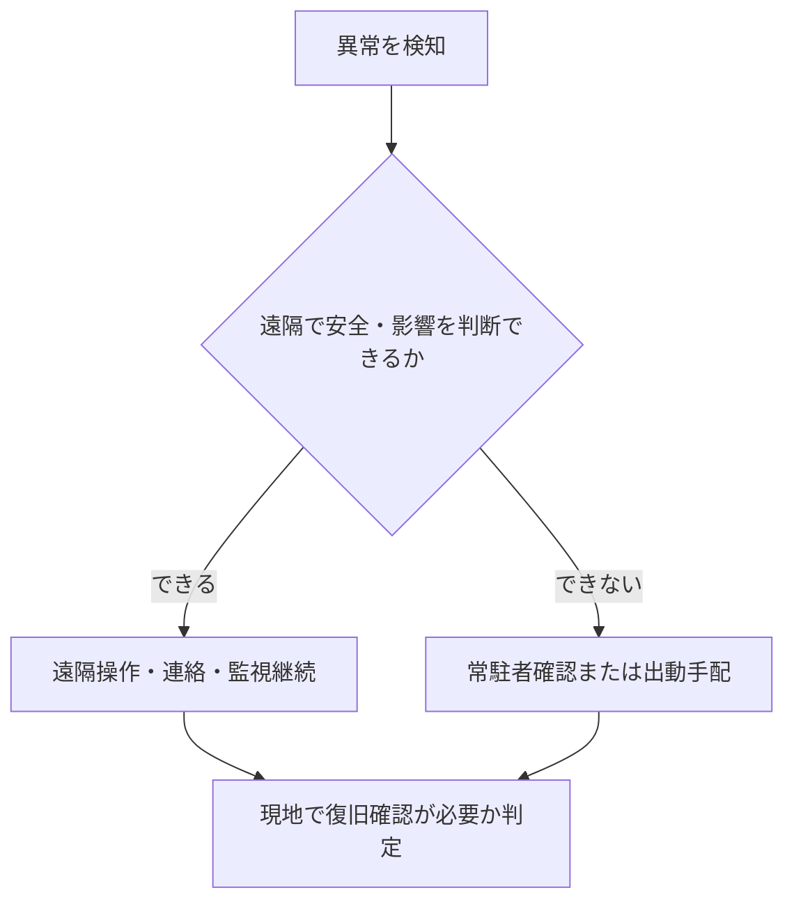

管理方式は「人がいるか」だけの違いではありません。異常をどう検知し、誰が判断し、現場へ何分で到着し、不在時間をどう補うかという運用設計です。

## 三方式の基本差

| 観点 | 常駐 | 巡回 | 遠隔監視 |
|---|---|---|---|
| 現地配置 | 契約時間帯に継続配置 | 計画した日時に訪問 | 監視拠点から継続・時間帯監視 |
| 主な検知 | 目視、巡回、申告、警報 | 訪問時の点検、事前申告 | センサー、中央監視、通報 |
| 初動 | 現場確認を始めやすい | 電話判断後に出動 | 遠隔確認、連絡、必要時出動 |
| 強み | 即応、現場文脈、継続的な調整 | 複数物件で専門性を共有 | 連続監視、広域集約、記録 |
| 主な弱点 | 不在時間、要員固定、属人化 | 訪問間隔、移動、到着遅延 | 現物確認不能、通信・監視障害 |
| 重要な証跡 | 日誌、引継ぎ、巡回・操作記録 | 訪問、到着、持越し、次回期限 | 警報、受信、判断、連絡、出動 |

### 表の読み方

三方式の違いは、人がいる場所だけではなく、検知手段、現場確認までの時間、判断可能な範囲、引継ぎ、障害時の代替経路に現れます。常駐は現場文脈と即応、巡回は複数物件での専門性共有、遠隔監視は継続監視と広域集約に強みがあります。一方、どの方式でも不在時間、移動、通信断、専門要員不在を補う設計が必要です。

表の根拠：BM-05-04〜06・10、BM-08-03〜07、BM-10-01〜03、BM-11、BM-13-11。主な成果物はシフト・訪問計画、日誌・引継ぎ、警報受信、判断・連絡、出動・到着、現場確認記録です。

遠隔監視は現場作業の代替ではありません。現物確認、隔離、応急処置、復旧確認が必要な異常には、出動者と到着目標が必要です。

## 異常対応のつながり

常駐でも全専門要員が常にいるとは限らず、巡回でも警備・監視だけ24時間の場合があります。そのため、物件全体を一語で分類せず、時間帯、業務領域、設備ごとに組み合わせます。

## 複合方式で決めること

- 日中、夜間、休日ごとの一次受付者
- 警報種別ごとの遠隔判断範囲と禁止操作
- 現場確認が必要になる条件
- 出動者、代替者、鍵、入館手段、到着目標
- 常駐・巡回・監視拠点間の案件引継ぎ
- 通信断、監視停止、交通障害時の代替手段

主な関連業務：BM-05-04〜06、BM-08-03〜07、BM-10-01〜03、BM-11、BM-13。

次は[元請け・再委託先・専門業者](../contract-layers/)で、契約階層による役割差を見ます。

## さらに詳しく

- [管理方式プロファイル](https://github.com/tsumasaki-kurageya/property-management-pdm/blob/main/docs/management-operation-profiles.md)
- [点検異常から修繕・引渡しまで](../../incidents/abnormality-to-restoration/)

最終確認日：2026年7月23日。記載状態：標準モデル。方式名だけで到着時間や対応範囲を保証するものではありません。
