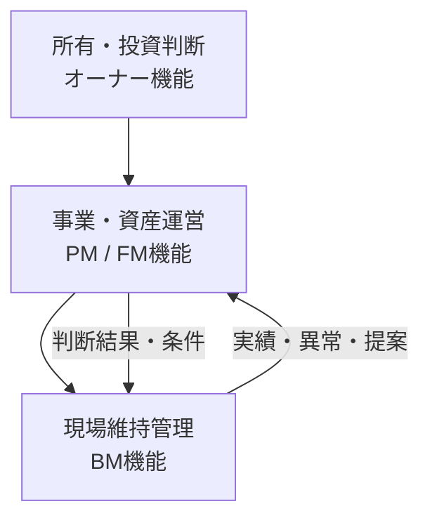

オーナー、PM、FM、BMは、常に四つの別会社を指すわけではありません。一社や一部門が複数機能を兼ねることもあります。会社名や肩書ではなく、その案件で担う機能と権限を確認します。

## 四つの機能層

| 機能 | 主な関心 | 代表的な判断 |
|---|---|---|
| オーナー | 所有責任、資産価値、投資、法的義務 | 大規模修繕、予算、保有方針、義務履行体制 |
| PM | 賃貸・収支・契約・テナント運営 | 予算配分、テナント調整、発注・検収 |
| FM | 利用組織の事業・働き方・施設戦略 | 利用要件、事業継続、環境・サービス水準 |
| BM | 日常の運転、点検、清掃、警備、異常対応 | 現場操作、一次対応、技術提案、実施記録 |

これは上下関係を固定する図ではなく、情報と判断の接続を示しています。自社所有・自社利用ではPMとFMが同一部門に近づき、賃貸ビルではオーナー、PM、テナント側FMが別になる場合があります。

## 提案・決定・実施を分ける

設備不具合では、BMが原因と選択肢を技術提案し、PMやFMが営業・利用影響を整理し、予算権限者が修繕を決定し、BMまたは専門業者が実施することがあります。BMが発見したことと、BMに投資判断権限があることは同じではありません。

責任分界表では、少なくとも次を業務ごとに確認します。

- 平常時の運転条件を誰が決めるか
- 不具合の技術評価と優先度を誰が決めるか
- 費用、停止、利用再開を誰が承認するか
- 法令上の義務と行政報告を誰が担うか
- 台帳・証跡の正本を誰が保有するか
- 夜間や不在時に誰がどこまで代行できるか

委託により作業や管理実務を移しても、所有者・管理権原者等に課される法令上の責任が当然に移転するとは限りません。

主な関連業務：BM-02、BM-10、BM-12〜14、BM-16〜18。

次は[法令業務の考え方](../statutory-duties/)で、法令上の義務を日常業務へ具体化する流れを見ます。

## さらに詳しく

- [オーナー・PM・FM・BM責任分界プロファイル](https://github.com/tsumasaki-kurageya/property-management-pdm/blob/main/docs/owner-pm-fm-bm-responsibility-profiles.md)
- [関係者と役割](../../introduction/people-and-roles/)

最終確認日：2026年7月23日。記載状態：標準モデル。一律の組織図・役割分担を示すものではありません。
