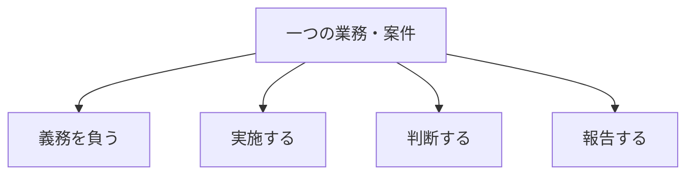

「担当は誰か」という一問だけでは、責任分界は明確になりません。一つの法定点検や修繕案件にも、義務を負う人、作業する人、結果を判断する人、報告する人が関わります。

## 四つの主体

| 主体 | 問い | 代表例 |
|---|---|---|
| 義務主体 | 法令・契約上、履行を確保する責任は誰にあるか | 所有者、管理権原者、契約当事者等 |
| 実施主体 | 点検、作業、測定、一次対応を誰が行うか | BM担当者、再委託先、有資格者 |
| 判断主体 | 合否、優先度、停止、是正、利用再開を誰が決めるか | 技術責任者、施設責任者、予算権限者 |
| 報告主体 | 顧客、利用者、行政へ誰が提出・説明するか | 元請け、管理者、届出名義人等 |

同じ組織が複数主体を担っても構いません。重要なのは兼務を見えるようにし、担当者不在時の代行、権限上限、次のエスカレーション先を定めることです。

## 場面ごとに判断主体を分ける

「判断」も一つではありません。

- 技術上、作業や設備が正常か
- 安全上、区域を開放できるか
- 契約上、成果を検収できるか
- 費用上、追加作業を発注できるか
- 施設利用上、営業・診療・居住を再開できるか
- 法令上、報告・是正が完了したか

例えば専門業者が復旧を技術確認しても、施設利用の再開は利用部門や施設責任者が判断する場合があります。「復旧済み」という一語で複数の判断をまとめないことが大切です。

## 責任分担表に必要な項目

業務ID・案件、四主体、承認上限、不在時代行、期限、連絡先、必要証跡を一行で追えるようにします。平常時だけでなく、異常、未実施、期限超過、契約外作業についても決めます。

次は[複数条件の重ね合わせ](../combining-conditions/)で、ここまでの条件を一つの物件へ統合します。

## さらに詳しく

- [オーナー・PM・FM・BM責任分界プロファイル](https://github.com/tsumasaki-kurageya/property-management-pdm/blob/main/docs/owner-pm-fm-bm-responsibility-profiles.md)
- [契約役割プロファイル](https://github.com/tsumasaki-kurageya/property-management-pdm/blob/main/docs/contract-role-profiles.md)
- [業務の時間軸と完了状態](../../overview/completion-states/)

最終確認日：2026年7月23日。記載状態：標準モデル。
