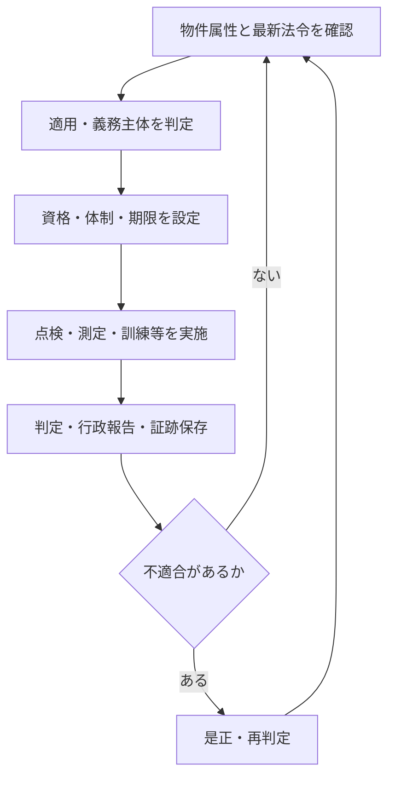

法令業務は「法定点検を行う」だけでは完了しません。物件への適用を判定し、義務主体、資格・体制、周期、報告先、保存期間を定め、不適合を是正するまでを一つの管理サイクルとして扱います。

## 義務を業務へ変える流れ

## 点検と行政報告を分ける

| 管理対象 | 確認すること |
|---|---|
| 適用条件 | 用途、規模、設備、収容人員、地域、指定 |
| 義務主体 | 所有者、管理権原者、占有者等のどこに義務があるか |
| 実施 | 誰が、どの資格・方法・周期で行うか |
| 判定 | 合否、不良、要是正を誰が判断するか |
| 報告 | 誰が、どの様式・期限で、どこへ提出するか |
| 是正 | 不適合を誰が承認・発注し、再確認するか |
| 保存 | 何を正本として、誰が、どこに、いつまで保管するか |

点検周期と行政への報告周期が同じとは限りません。実施済みでも、報告未提出、是正未完了、証跡未保存であれば、法令対応全体は完了していません。

## 代表的な法令領域

建築基準、消防、建築物衛生、水道、電気保安、フロン、浄化槽、労働安全衛生、省エネルギー、廃棄物・有害物質などが建物管理へ接続します。ただし、適用条件、名称、周期、資格、報告先は制度・物件ごとに異なります。

:::caution[個別物件では最新情報を確認]
このページは法的助言や適用判定ではありません。最新の法令・告示・条例、所管行政庁の案内、契約、設備情報を確認し、必要に応じて有資格者・専門家へ照会してください。
:::

委託先や有資格者が点検を実施しても、法令上の義務主体が当然に委託先へ移るとは限りません。契約上の受託範囲と法令上の責任を別欄で管理します。

主な関連業務：BM-04、BM-07、BM-09、BM-11、BM-13〜14、BM-17-08。

次は[四つの責任主体](./responsibility-types/)で、義務、実施、判断、報告を分けて確認します。

## さらに詳しく

- [法令義務プロファイル](https://github.com/tsumasaki-kurageya/property-management-pdm/blob/main/docs/statutory-duty-profiles.md)
- [点検・保守管理](../field-work/inspection-and-maintenance/)

最終確認日：2026年7月23日。記載状態：標準モデル。個別物件の法令適用を判断するものではありません。
